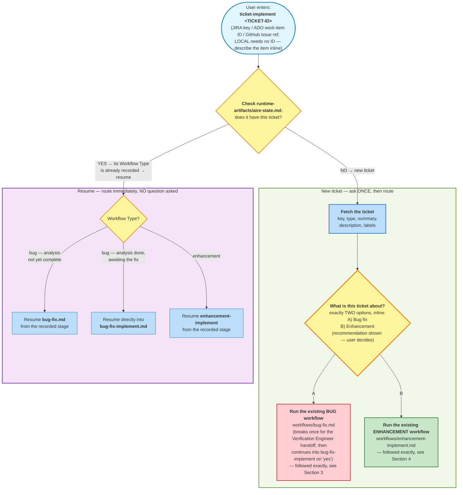
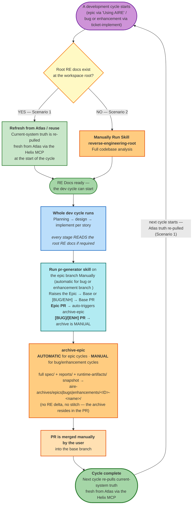
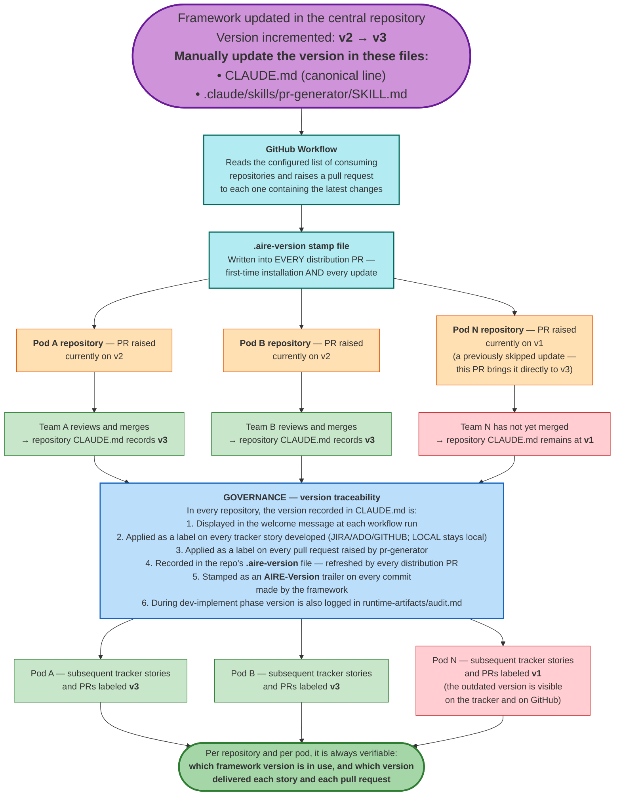

# AIRE Workflow — End-to-End Flows

## Index

1. [Greenfield End-to-End Flow — From Idea to Epic Release](#1-greenfield-end-to-end-flow--from-idea-to-epic-release)
2. [Brownfield End-to-End Flow — From Idea to Epic Release](#2-brownfield-end-to-end-flow--from-idea-to-epic-release)
3. [Bug End-to-End Flow — From Defect Ticket to Merged Fix](#3-bug-end-to-end-flow--from-defect-ticket-to-merged-fix)
4. [Enhancement End-to-End Flow — From Enhancement Ticket to Merged Change](#4-enhancement-end-to-end-flow--from-enhancement-ticket-to-merged-change)
5. [Unified Ticket Router — `ticket-implement` Routes to Bug or Enhancement](#5-unified-ticket-router--ticket-implement-routes-to-bug-or-enhancement)
6. [Verification Engineer Bug Lifecycle — From the Verification Engineer Raising the Bug to Ready for Testing](#6-verification-engineer-bug-lifecycle--from-the-verification-engineer-raising-the-bug-to-ready-for-testing)
7. [Verification Engineer Toolkit — Which Skill to Use When](#7-verification-engineer-toolkit--which-skill-to-use-when)
8. [Reverse Engineering Docs Lifecycle — How the Docs Always Stay Fresh](#8-reverse-engineering-docs-lifecycle--how-the-docs-always-stay-fresh)
9. [Distribution & Governance](#9-distribution--governance)
10. [AI Defect Ratio Detection — Line-Level Provenance Flow](#10-ai-defect-ratio-detection--line-level-provenance-flow)
11. [How Code Gets Evaluated — End to End](#11-how-code-gets-evaluated--end-to-end)


---

# 1. Greenfield End-to-End Flow — From Idea to Epic Release

> Complete lifecycle:

```mermaid
flowchart TD
    %% ═══════════════════════════════════════════════════
    %% PHASE 0: IDEATION — Before the AIRE Workflow
    %% ═══════════════════════════════════════════════════

    IDEA([" The User has an idea"])
    IDEA --> INTAKE["<b>The User runs the intent-intake skill (manual)</b><br/>The framework gathers six baseline fields that justify an Epic:<br/>the intended outcome, its measure of success, the success signal,<br/>what is out of scope, the known constraints, and the confidence level."]
    INTAKE -->|"The framework creates the Epic in the user-selected tracker"| REFINE["<b>The User runs the intent-refinement skill (manual)</b><br/>The framework elaborates the Epic to full detail:<br/>measurable criteria, constraints, domain context,<br/>quality expectations, and risks."]
    REFINE -->|"The framework updates the Epic in the user-selected tracker"| JIRA_EPIC_FINAL["The Epic is now fully detailed in the user-selected tracker<br/>and is ready to build."]

    %% ═══════════════════════════════════════════════════
    %% PHASE 1: PLANNING — Planning & Architecture
    %% ═══════════════════════════════════════════════════

    JIRA_EPIC_FINAL --> TRIGGER["<b>The User starts the framework</b><br/>by typing <b>using aire implement &lt;EPIC KEY / ID&gt;</b><br/>(a JIRA key, an ADO work-item ID, or a GitHub issue reference;<br/>for Local no ID is needed — the User describes the Epic inline).<br/>The Epic can also come from Atlas when the Helix MCP is configured,<br/>by typing <b>using aire implement the Epic from the solution document through Helix MCP</b>."]

    TRIGGER --> WD["<b>Workspace Detection</b><br/>The framework confirms this is a greenfield workspace (no existing code).<br/>It fetches the Epic content into <b>epic-brief.md</b> so every later stage<br/>works from the same Epic, and records the chosen tracker<br/>in <b>runtime-artifacts/aire-state.md</b>."]
    WD --> BRANCH["<b>The framework creates the Epic branch</b><br/>named <b>epic/&lt;epic-number&gt;-&lt;epic-title&gt;</b>.<br/>It records the base branch and the Epic branch<br/>in <b>runtime-artifacts/aire-state.md</b>. All work happens on this branch."]

    BRANCH --> RA["<b>Requirements Analysis</b><br/>The framework reads <b>epic-brief.md</b> (which defines what to build),<br/>chooses the appropriate depth (minimal, standard, or comprehensive),<br/>and writes any open decisions as clarifying questions for the User.<br/>The optional extensions are also offered here."]
    RA --> RA_GATE{"The User answers<br/>every clarifying question."}
    RA_GATE -->|"A decision is still unclear"| RA_FOLLOW["The framework asks follow-up questions<br/>and resolves them before continuing."]
    RA_FOLLOW --> RA_GATE
    RA_GATE -->|"All decisions are clear"| RA_GEN["The framework writes <b>requirements.md</b>,<br/>which explains what the system must do, how well it must operate,<br/>and how each requirement will be traced.<br/>The mandatory security baseline and the chosen extensions are recorded."]
    RA_GEN --> RA_APPROVE{"The User reviews <b>requirements.md</b>.<br/>The framework continues only after<br/>the User approves the complete requirements."}
    RA_APPROVE -->|"Changes requested"| RA
    RA_APPROVE -->|"Approved"| RA_COMMIT["The framework commits the planning artifacts on the Epic branch<br/>and pushes them. No Epic pull request is raised here."]

    %% ═══════════════════════════════════════════════════
    %% USER STORIES
    %% ═══════════════════════════════════════════════════

    RA_COMMIT --> US_GEN["<b>User Story Generation</b><br/>The framework creates <b>stories.md</b> and <b>personas.md</b>.<br/>Every story records its outcome, acceptance criteria, and linked requirements,<br/>and the Story Tracker is populated (Status: Ready for Development)."]

    US_GEN --> GATE1{"<b>GATE 1 — Story Set Approval</b><br/>The framework announces the complete story set and confirms<br/>that every approved requirement is covered by at least one story.<br/>The User chooses: Request Changes, or Approve &amp; Continue."}
    GATE1 -->|"Request Changes"| US_GEN
    GATE1 -->|"Approve &amp; Continue"| PUSH_JIRA["<b>User Stories — Part 3: Push to the tracker</b><br/>The framework confirms the project / repo / org, creates each story<br/>in the user-selected tracker, moves it to Ready for Development,<br/>links it to the Parent Epic, and writes the tracker IDs back to stories.md.<br/>(For Local, nothing leaves the workspace.)"]
    PUSH_JIRA -->|"The framework creates each story and links it to the Epic"| JIRA_STORIES[("The user-selected tracker now holds N stories,<br/>each linked to the Parent Epic.")]

    %% ═══════════════════════════════════════════════════
    %% DEPENDENCY GRAPH + WORKFLOW PLANNING
    %% ═══════════════════════════════════════════════════

    PUSH_JIRA --> DG["<b>Dependency Graph</b><br/>The framework works out how the stories depend on one another,<br/>writes <b>dependency-graph.yml</b>, adds a Mermaid graph<br/>to runtime-artifacts/aire-state.md, and shows which stories<br/>can begin immediately in parallel."]
    DG --> WP["<b>Workflow Planning</b><br/>The framework decides which design stages this Epic needs<br/>and which can be skipped, records the reasons in <b>executions.md</b>,<br/>and produces a Mermaid visualization of the plan."]
    WP --> IMPLEMENTATION

    %% ═══════════════════════════════════════════════════
    %% IMPLEMENTATION PHASE — DESIGN (System-Level, Single Pass)
    %% ═══════════════════════════════════════════════════

    IMPLEMENTATION["<b>IMPLEMENTATION PHASE — System-Level Design</b><br/>The framework runs the selected design stages once for the whole system.<br/>No code is generated here. Every selected stage asks focused questions,<br/>writes its document, and waits for the User to approve it before continuing."]
    IMPLEMENTATION --> FD["<b>Functional Design</b> (only when required)<br/>The domain model, business rules, validation, data flows,<br/>integrations, and edge cases, written to <b>functional-design.md</b>."]
    FD --> NFR_R["<b>NFR Requirements</b> (only when required)<br/>How fast, secure, reliable, available, and scalable the system must be,<br/>recorded as measurable expectations in <b>nfr.md</b>."]
    NFR_R --> NFR_D["<b>NFR Design</b> (only when required)<br/>How those quality expectations will be achieved —<br/>resilience, scaling, performance, security, and recovery — added to <b>nfr.md</b>."]
    NFR_D --> INFRA["<b>Infrastructure Design</b> (only when required)<br/>Where and how the solution runs — environments, hosting, storage,<br/>messaging, networking, monitoring — written to <b>infrastructure-design.md</b>."]

    INFRA --> ARCHDOC["<b>Architecture, rubrics, and CI pipeline</b><br/>The framework combines the approved design documents into one system design,<br/><b>spec/plans/architecture.md</b>, and from it derives the evaluation rubrics<br/>used to score the delivered code — the architecture rubric and an<br/>OWASP-based security rubric. It then generates the automated evaluation<br/>pipeline from this repo's own stack and quality thresholds.<br/>The framework presents the CI setup instructions and waits for the User<br/>to choose <b>proceed</b> or <b>skip</b>."]
    ARCHDOC --> SMOKE["<b>Epic-level pre-handoff smoke test</b> (automatic)<br/>A zero-diff scratch pull request proves the CI environment is viable —<br/>not the delta-scoped gate logic. Its watch loop is unbounded and ends only<br/>when the self-repair agent itself stops producing a new run.<br/>On success the scratch PR is merged and deleted; on exhaustion it is left open<br/>and the Development Handoff does not happen."]
    SMOKE --> STOP[" <b>MANDATORY STOP — Development Handoff</b><br/>The design artifacts are committed and pushed on the Epic branch (automatic).<br/>The framework announces how many stories were created, which are ready to start,<br/>and which design stages ran or were skipped.<br/><br/><b>Developer: pull the Epic branch, then type dev-implement</b> (once per story).<br/><b>Verification Engineer: pull the Epic branch, then type /ve-implement &lt;story&gt;</b> (once per story).<br/>Both tracks run in parallel from here — the Verification Engineer never waits for code."]

    %% ═══════════════════════════════════════════════════
    %% DEV-IMPLEMENT — Per-Story Code Generation
    %% ═══════════════════════════════════════════════════

    STOP -->|"The Developer types <b>dev-implement</b><br/>(once per story)"| SS

    SS{"<b>Story Selection &amp; Doability check</b><br/>The framework shows the stories that are ready and the Developer picks one<br/>by story ID or tracker ID. It then checks that every prerequisite story's PR<br/>is merged into the Epic branch. The framework never merges a prerequisite itself,<br/>even one that is already approved."}
    SS -->|"No — a prerequisite is still unmerged"| BLOCK["The framework lists the outstanding prerequisites<br/>with their live PR status, and shows which stories are ready instead."]
    BLOCK --> SS
    SS -->|"Yes — the story is doable"| INDEV["<b>The story moves to In Development</b><br/>The framework updates the Story Tracker and start date, auto-transitions the<br/>tracker item to In Development, and adds the AIRE version label<br/>(on JIRA / ADO / GitHub; Local updates only the local tracker).<br/>The version is read live from CLAUDE.md."]

    INDEV --> SBR["<b>The framework creates the story branch</b><br/>named <b>story/&lt;N.M&gt;-&lt;story-title&gt;</b>,<br/>cut from the Epic branch and never from base."]

    SBR --> BASE["<b>Baseline capture</b> (automatic, before any code is written)<br/>The framework runs the entire repository test suite on the story branch<br/>and records the current results in <b>baseline-regression.log</b>.<br/>Only new problems introduced by this story will count for self-repair."]

    BASE --> PLAN["<b>Code Generation — Part 1: Plan</b><br/>The framework analyzes the story and its acceptance criteria<br/>and lays out the implementation steps: structure, logic, API, tests, and docs."]
    PLAN --> SPECB["<b>Behavior specification</b> — a single file,<br/><b>spec/behavior/story-N.M.feature</b>.<br/>One scenario per acceptance criterion, tagged @AC-n, written BEFORE the code<br/>because it is the contract."]
    SPECB --> GEN["<b>Code Generation — Part 2: Generate</b><br/>The framework executes each plan step, writing all application code into <b>src/</b><br/>and all tests into <b>tests/</b> (nothing goes into spec/),<br/>and marks each step complete as it finishes."]

    GEN --> COV{"<b>Unit tests and coverage</b><br/>The framework generates the tests, runs them, and measures coverage<br/>on the new and changed code. The threshold is <b>at least 90%</b>.<br/>The run logs and a machine-readable coverage report are captured as evidence."}
    COV -->|"a test fails, or coverage is below 90% —<br/>the framework self-heals and reruns, up to 3 times"| COVFIX["<b>The framework fixes the code</b><br/>It diagnoses the root cause and corrects the implementation,<br/>adding tests only for paths that are genuinely untested.<br/>It never deletes or weakens a test to go green."]
    COVFIX --> COVRUN["The framework re-runs the unit tests<br/>and re-measures coverage on the changed code."]
    COVRUN --> COV

    COV -->|"green and at least 90%"| BEHV{"<b>Behavioral tests (Gherkin)</b><br/>The framework runs every scenario in this story's .feature file<br/>through tests/behavior/steps/. All scenarios must pass<br/>and every @AC tag must execute."}
    BEHV -->|"a scenario fails"| BEHVFIX["The framework self-heals<br/>and reruns, up to 3 times."]
    BEHVFIX --> BEHV

    BEHV -->|"all green"| API_TESTS{"<b>API and contract tests</b> (when the story touches an API layer)<br/>Changed interfaces must return correct results and status codes,<br/>enforce access, reject invalid requests,<br/>and preserve the agreed response structure."}
    API_TESTS -->|"a check fails"| APIFIX["The framework self-heals<br/>and reruns, up to 3 times."]
    APIFIX --> API_TESTS

    API_TESTS -->|"all green (or not applicable)"| REG["<b>Full regression vs the baseline</b> (automatic)<br/>The framework re-runs the entire suite and compares it with the baseline.<br/>Any new failure was introduced by this story and is self-healed,<br/>up to 3 times."]

    REG --> STATIC["<b>Static quality evaluation (D1–D7)</b><br/>The framework checks coding mistakes, type compatibility, security patterns,<br/>dependency vulnerabilities, software licences, complexity, and exposed secrets,<br/>compared against the baseline. Unacceptable new findings are self-healed,<br/>up to 3 times."]

    STATIC --> ACR["<b>Automated code review</b> (always runs — never asked)<br/>A read-only review that checks the implementation against every acceptance<br/>criterion and linked requirement, the mandatory security baseline (16 rules),<br/>and the two blocking judge gates that score the code against the architecture<br/>rubric and the security rubric. A versioned report is written."]
    ACR -->|"a judge gate is below the minimum"| ACRFIX["The framework self-heals the cited criteria<br/>and re-reviews, up to 3 times."]
    ACRFIX --> ACR

    ACR --> RDG{"<b>Verdict routing — automatic</b><br/>Is the review clean, or are there findings?"}
    RDG -->|"Findings — no question is asked"| REM["<b>Automatic remediation loop</b><br/>The framework fixes every in-scope critical and high finding without confirmation:<br/>fix, unit test, green, then re-run the full regression against the baseline,<br/>and annotates the report with each resolution."]
    REM --> REM_DECIDE{"The framework re-reviews<br/>automatically."}
    REM_DECIDE -->|"loop until the verdict is clean, up to 3 rounds"| ACR

    RDG -->|"Clean — the framework proceeds automatically"| SCORECARD["<b>Evaluation scorecard</b><br/>Once every evaluation has passed, the framework writes <b>eval.json</b><br/>and <b>eval-summary.md</b> with the results and supporting evidence."]
    SCORECARD --> COMMIT["<b>The framework commits the story branch</b><br/>git add and commit on the story branch."]

    COMMIT --> PREFLIGHT{"<b>CI preflight gate</b><br/>The framework runs CI's own entrypoints in a clean room<br/>(install, build, coverage, and the static evals) against the committed diff —<br/>zero missing tools, zero undeclared dependencies, and no skipped root."}
    PREFLIGHT -->|"Fail"| PREFIX["The framework fixes the declaration<br/>(this story's manifest fragment or the repo's dependency declaration,<br/>never the gate) and self-heals, up to 3 times."]
    PREFIX --> PREFLIGHT
    PREFLIGHT -->|"Clean"| STORY_PR["<b>The framework raises the story pull request</b> (via pr-generator)<br/>It pushes the story branch and opens a PR into the Epic branch,<br/>adding the 'ai-generated' label and the AIRE version label.<br/>The scorecard and review evidence travel with the PR."]
    STORY_PR --> GH_STORY[("GitHub: the story PR<br/>targets the Epic branch.")]

    STORY_PR --> CI_EVAL["<b>Continuous integration evaluation</b><br/>The same evaluations run again in a clean environment.<br/>If any evaluation fails, the framework self-heals and reruns the pipeline,<br/>up to 3 times."]
    CI_EVAL --> PR_REV["<b>Automatic PR review</b><br/>The framework posts its review on the story PR."]

    PR_REV --> RFD["<b>The story stays In Development</b> after the PR is raised.<br/>The framework records the end date and PR link<br/>and adds a tracker comment with the PR link."]

    %% ═══════════════════════════════════════════════════
    %% MERGE + NEXT STORY LOOP
    %% ═══════════════════════════════════════════════════

    RFD --> MERGE_STORY["<b>The User merges the story PR</b> into the Epic branch.<br/>This is required before any dependent story<br/>can pass the Doability check."]

    MERGE_STORY -.-> SYNC
    MERGE_STORY --> MORE{"Are there more stories<br/>to implement?"}
    MORE -->|"Yes — the Developer types<br/>dev-implement again"| MCHK["<b>Live prerequisite check</b> (the Doability check, per pick)<br/>Only for the prerequisites of the story being picked:<br/>is that prerequisite's PR merged into the Epic branch?<br/>If yes, proceed. If not merged (even if approved), stop with the reason.<br/>The framework never merges it itself."]
    MCHK --> SS
    MORE -->|"No — all stories are done"| ALL_DONE

    %% ═══════════════════════════════════════════════════
    %% Verification Engineer PARALLEL TRACK — starts as soon as stories exist,
    %% does NOT wait for dev. Not an Implementation stage.
    %% ═══════════════════════════════════════════════════

    STOP -.->|"The Verification Engineer works in parallel —<br/>never waiting for the Developer's code"| veBT["<b>The Verification Engineer types /ve-implement &lt;story&gt;</b> on the Epic branch.<br/>The framework cuts a branch <b>ve/&lt;story-TICKET-ID&gt;-&lt;story-title&gt;</b> from the latest Epic branch.<br/>Without reading application source code, it reads the story's acceptance criteria<br/>(tracker item, requirements, and design) and writes manual test steps into<br/>spec/test-plans/&lt;story&gt;/ — integration, e2e, API, contract, security, and performance —<br/>with every acceptance criterion covered. A test-plan summary is produced."]
    veBT --> VE_APPROVAL{"The User reviews the manual test plans.<br/>The framework continues only after the User confirms<br/>that the planned tests provide sufficient coverage."}
    VE_APPROVAL -->|"Changes requested"| veBT
    VE_APPROVAL -->|"Approved"| VE_PR["<b>The framework raises the test-plan pull request</b><br/>into the Epic branch, labeled 'ai-generated' and with the AIRE version label,<br/>and logs it in runtime-artifacts/audit.md."]
    VE_PR -.-> SYNC

    ALL_DONE["All stories are developed<br/>and all story PRs are merged into the Epic branch (manual merge)."]

    ALL_DONE --> SYNC["<b>The Verification Engineer runs /ve-list-work</b> on the Epic branch.<br/>The framework pulls the latest Epic branch and lists every story whose PR has merged<br/>but is still In Development. The Verification Engineer executes the manual test steps<br/>generated by /ve-implement, then runs /ve-list-work again and takes one decision per story:<br/><b>&lt;story&gt; approve</b> or <b>&lt;story&gt; reject</b> (for example, PROJ-102 approve, PROJ-103 reject).<br/><br/><b>Approve</b> → a 'Verification Engineer approved the story' comment, the ve-approved label,<br/>and a move to Ready for Testing.<br/><b>Reject</b> → a 'Verification Engineer rejected the story' comment, the ve-rejected label,<br/>and the story deliberately stays In Development (the defect is logged with /raise-defect).<br/><br/>Both outcomes are logged in runtime-artifacts/audit.md. When every story in the Epic<br/>is approved, the framework offers to move the Parent Epic to Ready for Testing."]

    SYNC --> EPIC_PR["<b>The User runs pr-generator</b> on the Epic branch,<br/>once the Epic branch holds all the merged stories,<br/>to raise or update the Epic pull request into the base branch."]
    EPIC_PR --> GH_EPIC_FINAL[("GitHub: the Epic PR targets the base branch<br/>and includes all story code.")]

    EPIC_PR --> ARCHIVE["<b>archive-epic runs (automatic) on the Epic branch</b><br/>The framework archives spec/, reports/, and runtime-artifacts/ into<br/>aire-archives/epics/&lt;EPIC-ID&gt;-name/ (no reverse-engineering delta, no stitch),<br/>then commits and pushes on the Epic branch of the open Epic PR."]

    ARCHIVE --> MERGE_EPIC["<b>The User merges the Epic PR</b> into the base branch.<br/>This is a human decision."]

    MERGE_EPIC --> DONE(["<b>EPIC COMPLETE</b>"])

    %% ═══════════════════════════════════════════════════
    %% STYLING
    %% ═══════════════════════════════════════════════════

    %% Ideation (lavender)
    style IDEA fill:#EDE7F6,stroke:#5E35B1,stroke-width:2px
    style INTAKE fill:#D1C4E9,stroke:#5E35B1,stroke-width:2px
    style REFINE fill:#D1C4E9,stroke:#5E35B1,stroke-width:2px
    style JIRA_EPIC_FINAL fill:#B39DDB,stroke:#5E35B1,stroke-width:2px


    %% Trigger
    style TRIGGER fill:#CE93D8,stroke:#6A1B9A,stroke-width:3px

    %% Planning (blue)
    style WD fill:#BBDEFB,stroke:#1565C0,stroke-width:2px
    style BRANCH fill:#BBDEFB,stroke:#1565C0,stroke-width:2px
    style RA fill:#BBDEFB,stroke:#1565C0,stroke-width:2px
    style RA_GEN fill:#BBDEFB,stroke:#1565C0
    style RA_FOLLOW fill:#BBDEFB,stroke:#1565C0
    style RA_COMMIT fill:#90CAF9,stroke:#1565C0,stroke-width:2px
    style US_GEN fill:#BBDEFB,stroke:#1565C0,stroke-width:2px
    style PUSH_JIRA fill:#BBDEFB,stroke:#1565C0,stroke-width:2px
    style DG fill:#BBDEFB,stroke:#1565C0,stroke-width:2px
    style WP fill:#BBDEFB,stroke:#1565C0,stroke-width:2px

    %% Gates (amber)
    style GATE1 fill:#FFF9C4,stroke:#F57F17,stroke-width:3px
    style RA_GATE fill:#FFF9C4,stroke:#F57F17
    style RA_APPROVE fill:#FFF9C4,stroke:#F57F17
    style VE_APPROVAL fill:#FFF9C4,stroke:#F57F17,stroke-width:2px

    %% Implementation design (purple)
    style IMPLEMENTATION fill:#F3E5F5,stroke:#6A1B9A,stroke-width:2px
    style FD fill:#E1BEE7,stroke:#6A1B9A
    style NFR_R fill:#E1BEE7,stroke:#6A1B9A
    style NFR_D fill:#E1BEE7,stroke:#6A1B9A
    style INFRA fill:#E1BEE7,stroke:#6A1B9A

    %% STOP gate (red)
    style STOP fill:#FFCDD2,stroke:#C62828,stroke-width:3px

    %% dev-implement (green)
    style SS fill:#FFF9C4,stroke:#F57F17,stroke-width:2px
    style BLOCK fill:#FFCDD2,stroke:#C62828
    style INDEV fill:#C8E6C9,stroke:#2E7D32,stroke-width:2px
    style SBR fill:#C8E6C9,stroke:#2E7D32,stroke-width:2px
    style PLAN fill:#C8E6C9,stroke:#2E7D32,stroke-width:2px
    style GEN fill:#A5D6A7,stroke:#2E7D32,stroke-width:2px
    style BASE fill:#A5D6A7,stroke:#2E7D32,stroke-width:2px

    style COV fill:#BBDEFB,stroke:#1565C0,stroke-width:2px
    style COVFIX fill:#FFE082,stroke:#FF6F00,stroke-width:3px
    style COVRUN fill:#FFF9C4,stroke:#F57F17
    style BEHVFIX fill:#FFE082,stroke:#FF6F00
    style APIFIX fill:#FFE082,stroke:#FF6F00
    style ACRFIX fill:#FFE082,stroke:#FF6F00
    style PREFIX fill:#FFE082,stroke:#FF6F00
    style BEHV fill:#C5E1A5,stroke:#33691E,stroke-width:3px
    style API_TESTS fill:#C5E1A5,stroke:#33691E,stroke-width:2px
    style STATIC fill:#B3E5FC,stroke:#0277BD,stroke-width:2px
    style SPECB fill:#D1C4E9,stroke:#4527A0,stroke-width:3px
    style ARCHDOC fill:#B39DDB,stroke:#4527A0,stroke-width:3px
    style SMOKE fill:#FFAB91,stroke:#BF360C,stroke-width:3px
    style REG fill:#A5D6A7,stroke:#2E7D32,stroke-width:2px
    style SCORECARD fill:#D8ECEA,stroke:#356C68,stroke-width:2px
    style CI_EVAL fill:#D8ECEA,stroke:#356C68,stroke-width:2px

    %% Code Review (light blue)
    style ACR fill:#B3E5FC,stroke:#0277BD,stroke-width:2px
    style REM fill:#B3E5FC,stroke:#0277BD
    style PR_REV fill:#B3E5FC,stroke:#0277BD

    %% Decision gates in dev-implement
    style RDG fill:#FFF9C4,stroke:#F57F17,stroke-width:2px
    style REM_DECIDE fill:#FFF9C4,stroke:#F57F17

    %% PR + commit (cyan)
    style COMMIT fill:#E0F7FA,stroke:#00695C,stroke-width:2px
    style PREFLIGHT fill:#FFF9C4,stroke:#F57F17,stroke-width:3px
    style STORY_PR fill:#B2EBF2,stroke:#00695C,stroke-width:2px
    style RFD fill:#C8E6C9,stroke:#2E7D32,stroke-width:2px
    style MERGE_STORY fill:#B2EBF2,stroke:#00695C,stroke-width:2px

    %% Post-epic (orange/amber)
    style ALL_DONE fill:#FFF3E0,stroke:#E65100,stroke-width:2px
    style SYNC fill:#B2DFDB,stroke:#00695C,stroke-width:2px
    style EPIC_PR fill:#FFE0B2,stroke:#E65100,stroke-width:2px
    style ARCHIVE fill:#FFCC80,stroke:#E65100,stroke-width:2px
    style MERGE_EPIC fill:#FFE0B2,stroke:#E65100,stroke-width:2px
    style DONE fill:#A5D6A7,stroke:#2E7D32,stroke-width:3px

    %% External systems
    style GH_STORY fill:#FFF9C4,stroke:#F57F17
    style GH_EPIC_FINAL fill:#FFF9C4,stroke:#F57F17
    style JIRA_STORIES fill:#FFF9C4,stroke:#F57F17

    %% More decision + Verification Engineer track
    style MORE fill:#FFF9C4,stroke:#F57F17,stroke-width:2px
    style MCHK fill:#C8E6C9,stroke:#2E7D32,stroke-width:2px
    style veBT fill:#B2DFDB,stroke:#00695C,stroke-width:2px
    style VE_PR fill:#B2DFDB,stroke:#00695C,stroke-width:2px
```
# 2. Brownfield End-to-End Flow — From Idea to Epic Release

> Complete lifecycle

```mermaid
flowchart TD
    %% ═══════════════════════════════════════════════════
    %% PHASE 0: IDEATION + REVERSE ENGINEERING (Independent)
    %% ═══════════════════════════════════════════════════

    IDEA([" The User has an idea"])
    IDEA --> INTAKE["<b>The User runs the intent-intake skill (manual)</b><br/>The framework gathers six baseline fields that justify an Epic:<br/>the intended outcome, its measure of success, the success signal,<br/>what is out of scope, the known constraints, and the confidence level."]
    INTAKE -->|"The framework creates the Epic in the user-selected tracker"| REFINE["<b>The User runs the intent-refinement skill (manual)</b><br/>The framework elaborates the Epic to full detail:<br/>measurable criteria, constraints, domain context,<br/>quality expectations, and risks."]
    REFINE -->|"The framework updates the Epic in the user-selected tracker"| JIRA_EPIC_FINAL["The Epic is now fully detailed in the user-selected tracker<br/>and is ready to build."]

    %% Reverse Engineering — Independent, done ONCE for the repo
    RRE["<b>The User runs reverse-engineering-root once</b> (manual, on the base branch)<br/>The framework generates the reverse-engineering artifacts for the whole repository —<br/>business overview, architecture, code structure, APIs, component inventory,<br/>technology stack, and dependencies. Every future Epic reuses these artifacts.<br/>When Atlas is connected, the current-system truth is pulled from Atlas instead of re-derived."]

    %% ═══════════════════════════════════════════════════
    %% PHASE 1: PLANNING — Planning & Architecture
    %% ═══════════════════════════════════════════════════

    JIRA_EPIC_FINAL --> TRIGGER["<b>The User starts the framework</b><br/>by typing <b>using aire implement &lt;EPIC KEY / ID&gt;</b><br/>(a JIRA key, an ADO work-item ID, or a GitHub issue reference;<br/>for Local no ID is needed — the User describes the Epic inline).<br/>The Epic can also come from Atlas when the Helix MCP is configured,<br/>by typing<br/><b>using aire implement the Epic from</b><br/><b>the solution document through Helix MCP</b>."]

    TRIGGER --> WD["<b>Workspace Detection</b><br/>The framework finds existing code, so this is a brownfield workspace.<br/>It ensures spec/context-project/ exists, reuses the reverse-engineering artifacts<br/>if they are already present, fetches the Epic content into <b>epic-brief.md</b>,<br/>and records the chosen tracker in runtime-artifacts/aire-state.md."]
    RRE -.->|"The reverse-engineering artifacts are already<br/>in the workspace (generated once)"| WD

    WD -->|"When the Epic changes an existing system"| ATLAS_CUR["<b>Atlas provides the current-system truth through the Helix MCP.</b><br/>The framework saves the current architecture, components, interfaces,<br/>dependencies, and data flows in <b>deep-dive.md</b> and the supporting<br/>current-system documents. This is a read-only input and is never edited to fit a plan."]

    WD --> CTX{"<b>Are there any context-project documents to use?</b><br/>The framework asks the User once, and records the answer<br/>as ## Context Project in runtime-artifacts/aire-state.md.<br/>A) Yes — the User pastes the exact path.<br/>B) No — continue."}
    ATLAS_CUR --> CTX
    CTX -->|"A) Yes — the path is read as current-system context"| CREF
    CTX -->|"B) No"| CREF
    CREF{"<b>Are there any reference materials for the new work?</b><br/>The framework asks the User once, and records the answer<br/>as ## Context References in runtime-artifacts/aire-state.md.<br/>These may be UX wireframes, design mockups, or API specs<br/>placed under spec/context-project/new-references/.<br/>A) Yes — the User pastes the path(s).  B) No — continue."}
    CREF -->|"A) Yes — the paths are read as guidance for the new work"| BRANCH
    CREF -->|"B) No"| BRANCH
    BRANCH["<b>The framework creates the Epic branch</b><br/>named <b>epic/&lt;epic-number&gt;-&lt;epic-title&gt;</b>.<br/>It records the base branch and the Epic branch<br/>in runtime-artifacts/aire-state.md. All work happens on this branch."]

    BRANCH --> RA["<b>Requirements Analysis</b><br/>The framework reads <b>epic-brief.md</b> (which defines what to build)<br/>alongside the reverse-engineering artifacts and the Atlas current-system truth,<br/>chooses the appropriate depth, and writes any open decisions<br/>as clarifying questions. The optional extensions are also offered here."]
    RA --> RA_GATE{"The User answers<br/>every clarifying question."}
    RA_GATE -->|"A decision is still unclear"| RA_FOLLOW["The framework asks follow-up questions<br/>and resolves them before continuing."]
    RA_FOLLOW --> RA_GATE
    RA_GATE -->|"All decisions are clear"| RA_GEN["The framework writes <b>requirements.md</b>,<br/>which explains what the system must do, how well it must operate,<br/>and how each requirement will be traced.<br/>The mandatory security baseline and the chosen extensions are recorded."]
    RA_GEN --> RA_APPROVE{"The User reviews <b>requirements.md</b>.<br/>The framework continues only after<br/>the User approves the complete requirements."}
    RA_APPROVE -->|"Changes requested"| RA
    RA_APPROVE -->|"Approved"| RA_COMMIT["The framework commits the planning artifacts on the Epic branch<br/>and pushes them. No Epic pull request is raised here."]

    %% ═══════════════════════════════════════════════════
    %% USER STORIES
    %% ═══════════════════════════════════════════════════

    RA_COMMIT --> US_GEN["<b>User Story Generation</b><br/>The framework creates <b>stories.md</b> and <b>personas.md</b>.<br/>Every story records its outcome, acceptance criteria, and linked requirements,<br/>and the Story Tracker is populated (Status: Ready for Development)."]

    US_GEN --> GATE1{"<b>GATE 1 — Story Set Approval</b><br/>The framework announces the complete story set and confirms<br/>that every approved requirement is covered by at least one story.<br/>The User chooses: Request Changes, or Approve &amp; Continue."}
    GATE1 -->|"Request Changes"| US_GEN
    GATE1 -->|"Approve &amp; Continue"| PUSH_JIRA["<b>User Stories — Part 3: Push to the tracker</b><br/>The framework confirms the project / repo / org, creates each story<br/>in the user-selected tracker, moves it to Ready for Development,<br/>links it to the Parent Epic, and writes the tracker IDs back to stories.md.<br/>(For Local, nothing leaves the workspace.)"]
    PUSH_JIRA -->|"The framework creates each story and links it to the Epic"| JIRA_STORIES[("The user-selected tracker now holds N stories,<br/>each linked to the Parent Epic.")]

    %% ═══════════════════════════════════════════════════
    %% DEPENDENCY GRAPH + WORKFLOW PLANNING
    %% ═══════════════════════════════════════════════════

    PUSH_JIRA --> DG["<b>Dependency Graph</b><br/>The framework works out how the stories depend on one another,<br/>writes <b>dependency-graph.yml</b>, adds a Mermaid graph<br/>to runtime-artifacts/aire-state.md, and shows which stories<br/>can begin immediately in parallel."]
    DG --> WP["<b>Workflow Planning</b><br/>The framework decides which design stages this Epic needs<br/>and which can be skipped, records the reasons in <b>executions.md</b>,<br/>and produces a Mermaid visualization of the plan."]
    WP --> IMPLEMENTATION

    %% ═══════════════════════════════════════════════════
    %% IMPLEMENTATION PHASE — DESIGN (System-Level, Single Pass)
    %% ═══════════════════════════════════════════════════

    IMPLEMENTATION["<b>IMPLEMENTATION PHASE — System-Level Design</b><br/>The framework runs the selected design stages once for the whole system.<br/>No code is generated here. On brownfield the existing architecture is the starting state,<br/>and each design records the delta from it. Every selected stage asks focused questions,<br/>writes its document, and waits for the User to approve it before continuing."]
    IMPLEMENTATION --> FD["<b>Functional Design</b> (only when required)<br/>The domain model, business rules, validation, data flows,<br/>integrations, and edge cases, written to <b>functional-design.md</b>."]
    FD --> NFR_R["<b>NFR Requirements</b> (only when required)<br/>How fast, secure, reliable, available, and scalable the system must be,<br/>recorded as measurable expectations in <b>nfr.md</b>."]
    NFR_R --> NFR_D["<b>NFR Design</b> (only when required)<br/>How those quality expectations will be achieved —<br/>resilience, scaling, performance, security, and recovery — added to <b>nfr.md</b>."]
    NFR_D --> INFRA["<b>Infrastructure Design</b> (only when required)<br/>Where and how the solution runs — environments, hosting, storage,<br/>messaging, networking, monitoring — written to <b>infrastructure-design.md</b>."]

    INFRA --> ARCHDOC["<b>Architecture, rubrics, and CI pipeline</b><br/>The framework combines the approved design documents into one system design,<br/><b>spec/plans/architecture.md</b>, and from it derives the evaluation rubrics<br/>used to score the delivered code — the architecture rubric and an<br/>OWASP-based security rubric. It then generates the automated evaluation<br/>pipeline from this repo's own stack and quality thresholds.<br/>The framework presents the CI setup instructions and waits for the User<br/>to choose <b>proceed</b> or <b>skip</b>."]
    ARCHDOC --> SMOKE["<b>Epic-level pre-handoff smoke test</b> (automatic)<br/>A zero-diff scratch pull request proves the CI environment is viable —<br/>not the delta-scoped gate logic. Its watch loop is unbounded and ends only<br/>when the self-repair agent itself stops producing a new run.<br/>On success the scratch PR is merged and deleted; on exhaustion it is left open<br/>and the Development Handoff does not happen."]
    SMOKE --> STOP[" <b>MANDATORY STOP — Development Handoff</b><br/>The design artifacts are committed and pushed on the Epic branch (automatic).<br/>The framework announces how many stories were created, which are ready to start,<br/>and which design stages ran or were skipped.<br/><br/><b>Developer: pull the Epic branch, then type dev-implement</b> (once per story).<br/><b>Verification Engineer: pull the Epic branch, then type /ve-implement &lt;story&gt;</b> (once per story).<br/>Both tracks run in parallel from here — the Verification Engineer never waits for code."]

    %% ═══════════════════════════════════════════════════
    %% DEV-IMPLEMENT — Per-Story Code Generation
    %% ═══════════════════════════════════════════════════

    STOP -->|"The Developer types <b>dev-implement</b><br/>(once per story)"| SS

    SS{"<b>Story Selection &amp; Doability check</b><br/>The framework shows the stories that are ready and the Developer picks one<br/>by story ID or tracker ID. It then checks that every prerequisite story's PR<br/>is merged into the Epic branch. The framework never merges a prerequisite itself,<br/>even one that is already approved."}
    SS -->|"No — a prerequisite is still unmerged"| BLOCK["The framework lists the outstanding prerequisites<br/>and shows which stories are ready instead."]
    BLOCK --> SS
    SS -->|"Yes — the story is doable"| INDEV["<b>The story moves to In Development</b><br/>The framework updates the Story Tracker and start date, auto-transitions the<br/>tracker item to In Development, and adds the AIRE version label<br/>(on JIRA / ADO / GitHub; Local updates only the local tracker).<br/>The version is read live from CLAUDE.md."]

    INDEV --> SBR["<b>The framework creates the story branch</b><br/>fetch and checkout the Epic branch, pull fast-forward only,<br/>then create <b>story/&lt;N.M&gt;-&lt;kebab-title&gt;</b>,<br/>cut from the Epic branch and never from base."]

    SBR --> BASE["<b>Baseline capture</b> (automatic, before any code is written)<br/>The framework runs the entire repository test suite on the story branch<br/>and records the current results in <b>baseline-regression.log</b>.<br/>Only new problems introduced by this story will count for self-repair."]

    BASE --> PLAN["<b>Code Generation — Part 1: Plan</b><br/>The framework analyzes the story and its acceptance criteria<br/>and lays out the implementation steps: structure, logic, API, tests, and docs."]
    PLAN --> SPECB["<b>Behavior specification</b> — a single file,<br/><b>spec/behavior/story-N.M.feature</b>.<br/>One scenario per acceptance criterion, tagged @AC-n, written BEFORE the code<br/>because it is the contract."]
    SPECB --> GEN["<b>Code Generation — Part 2: Generate</b><br/>The framework executes each plan step, writing all application code into <b>src/</b><br/>and all tests into <b>tests/</b> (nothing goes into spec/),<br/>and marks each step complete as it finishes."]

    GEN --> COV{"<b>Unit tests and coverage</b><br/>The framework generates the tests, runs them, and measures coverage<br/>on the new and changed code. The threshold is <b>at least 90%</b>.<br/>The run logs and a machine-readable coverage report are captured as evidence."}
    COV -->|"a test fails, or coverage is below 90% —<br/>the framework self-heals and reruns, up to 3 times"| COVFIX["<b>The framework fixes the code</b><br/>It diagnoses the root cause and corrects the implementation,<br/>adding tests only for paths that are genuinely untested.<br/>It never deletes or weakens a test to go green."]
    COVFIX --> COVRUN["The framework re-runs the unit tests<br/>and re-measures coverage on the changed code."]
    COVRUN --> COV

    COV -->|"green and at least 90%"| BEHV{"<b>Behavioral tests (Gherkin)</b><br/>The framework runs every scenario in this story's .feature file<br/>through tests/behavior/steps/. All scenarios must pass<br/>and every @AC tag must execute."}
    BEHV -->|"a scenario fails"| BEHVFIX["The framework self-heals<br/>and reruns, up to 3 times."]
    BEHVFIX --> BEHV

    BEHV -->|"all green"| API_TESTS{"<b>API and contract tests</b> (when the story touches an API layer)<br/>Changed interfaces must return correct results and status codes,<br/>enforce access, reject invalid requests,<br/>and preserve the agreed response structure."}
    API_TESTS -->|"a check fails"| APIFIX["The framework self-heals<br/>and reruns, up to 3 times."]
    APIFIX --> API_TESTS

    API_TESTS -->|"all green (or not applicable)"| REG["<b>Full regression vs the baseline</b> (automatic)<br/>The framework re-runs the entire suite and compares it with the baseline.<br/>Any new failure was introduced by this story and is self-healed,<br/>up to 3 times."]

    REG --> STATIC["<b>Static quality evaluation (D1–D7)</b><br/>The framework checks coding mistakes, type compatibility, security patterns,<br/>dependency vulnerabilities, software licences, complexity, and exposed secrets,<br/>compared against the baseline. Unacceptable new findings are self-healed,<br/>up to 3 times."]

    STATIC --> ACR["<b>Automated code review</b> (always runs — never asked)<br/>A read-only review that checks the implementation against every acceptance<br/>criterion and linked requirement, the mandatory security baseline (16 rules),<br/>and the two blocking judge gates that score the code against the architecture<br/>rubric and the security rubric. A versioned report is written."]
    ACR -->|"a judge gate is below the minimum"| ACRFIX["The framework self-heals the cited criteria<br/>and re-reviews, up to 3 times."]
    ACRFIX --> ACR

    ACR --> RDG{"<b>Verdict routing — automatic</b><br/>Is the review clean, or are there findings?"}
    RDG -->|"Findings — no question is asked"| REM["<b>Automatic remediation loop</b><br/>The framework fixes every in-scope critical and high finding without confirmation:<br/>fix, unit test, green, then re-run the full regression against the baseline,<br/>and annotates the report with each resolution."]
    REM --> REM_DECIDE{"The framework re-reviews<br/>automatically."}
    REM_DECIDE -->|"loop until the verdict is clean, up to 3 rounds"| ACR

    RDG -->|"Clean — the framework proceeds automatically"| SCORECARD["<b>Evaluation scorecard</b><br/>Once every evaluation has passed, the framework writes <b>eval.json</b><br/>and <b>eval-summary.md</b> with the results and supporting evidence."]
    SCORECARD --> COMMIT["<b>The framework commits the story branch</b><br/>git add and commit on the story branch."]

    COMMIT --> PREFLIGHT{"<b>CI preflight gate</b><br/>The framework runs CI's own entrypoints in a clean room<br/>(install, build, coverage, and the static evals) against the committed diff —<br/>zero missing tools, zero undeclared dependencies, and no skipped root."}
    PREFLIGHT -->|"Fail"| PREFIX["The framework fixes the declaration<br/>(this story's manifest fragment or the repo's dependency declaration,<br/>never the gate) and self-heals, up to 3 times."]
    PREFIX --> PREFLIGHT
    PREFLIGHT -->|"Clean"| STORY_PR["<b>The framework raises the story pull request</b> (via pr-generator)<br/>It pushes the story branch and opens a PR into the Epic branch,<br/>adding the 'ai-generated' label and the AIRE version label.<br/>The scorecard and review evidence travel with the PR."]
    STORY_PR --> GH_STORY[("GitHub: the story PR<br/>targets the Epic branch.")]

    STORY_PR --> CI_EVAL["<b>Continuous integration evaluation</b><br/>The same evaluations run again in a clean environment.<br/>If any evaluation fails, the framework self-heals and reruns the pipeline,<br/>up to 3 times."]
    CI_EVAL --> PR_REV["<b>Automatic PR review</b><br/>The framework posts its review on the story PR."]

    PR_REV --> RFD["<b>The story stays In Development</b> after the PR is raised.<br/>The framework records the end date and PR link<br/>and adds a tracker comment with the PR link."]

    %% ═══════════════════════════════════════════════════
    %% MERGE + NEXT STORY LOOP
    %% ═══════════════════════════════════════════════════

    RFD --> MERGE_STORY["<b>The User merges the story PR</b> into the Epic branch.<br/>This is required before any dependent story<br/>can pass the Doability check."]

    MERGE_STORY -.-> SYNC
    MERGE_STORY --> MORE{"Are there more stories<br/>to implement?"}
    MORE -->|"Yes — the Developer types<br/>dev-implement again"| MCHK["<b>Live prerequisite check</b> (the Doability check, per pick)<br/>Only for the prerequisites of the story being picked:<br/>is that prerequisite's PR merged into the Epic branch?<br/>If yes, proceed. If not merged (even if approved), stop with the reason.<br/>The framework never merges it itself."]
    MCHK --> SS
    MORE -->|"No — all stories are done"| ALL_DONE

    %% ═══════════════════════════════════════════════════
    %% Verification Engineer PARALLEL TRACK — starts as soon as stories exist,
    %% does NOT wait for dev. Not an Implementation stage.
    %% ═══════════════════════════════════════════════════

    STOP -.->|"The Verification Engineer works in parallel —<br/>never waiting for the Developer's code"| veBT["<b>The Verification Engineer types /ve-implement &lt;story&gt;</b> on the Epic branch.<br/>The framework cuts a branch <b>ve/&lt;story-TICKET-ID&gt;-&lt;story-title&gt;</b> from the latest Epic branch.<br/>Without reading application source code, it reads the story's acceptance criteria<br/>(tracker item, requirements, and design) and writes manual test steps into<br/>spec/test-plans/&lt;story&gt;/ — integration, e2e, API, contract, security, and performance —<br/>with every acceptance criterion covered. A test-plan summary is produced."]
    veBT --> VE_APPROVAL{"The User reviews the manual test plans.<br/>The framework continues only after the User confirms<br/>that the planned tests provide sufficient coverage."}
    VE_APPROVAL -->|"Changes requested"| veBT
    VE_APPROVAL -->|"Approved"| VE_PR["<b>The framework raises the test-plan pull request</b><br/>into the Epic branch, labeled 'ai-generated' and with the AIRE version label,<br/>and logs it in runtime-artifacts/audit.md."]
    VE_PR -.-> SYNC

    ALL_DONE["All stories are completed<br/>and all story PRs are merged into the Epic branch (human decision)."]

    ALL_DONE --> SYNC["<b>The Verification Engineer runs /ve-list-work</b> on the Epic branch.<br/>The framework pulls the latest Epic branch and lists every story whose PR has merged<br/>but is still In Development. The Verification Engineer executes the manual test steps<br/>generated by /ve-implement, then runs /ve-list-work again and takes one decision per story:<br/><b>&lt;story&gt; approve</b> or <b>&lt;story&gt; reject</b> (for example, PROJ-102 approve, PROJ-103 reject).<br/><br/><b>Approve</b> → a 'Verification Engineer approved the story' comment, the ve-approved label,<br/>and a move to Ready for Testing.<br/><b>Reject</b> → a 'Verification Engineer rejected the story' comment, the ve-rejected label,<br/>and the story deliberately stays In Development (the defect is logged with /raise-defect).<br/><br/>Both outcomes are logged in runtime-artifacts/audit.md. When every story in the Epic<br/>is approved, the framework offers to move the Parent Epic to Ready for Testing."]

    SYNC --> EPIC_PR["<b>The User runs pr-generator</b> on the Epic branch,<br/>once the Epic branch holds all the merged stories,<br/>to raise or update the Epic pull request into the base branch."]
    EPIC_PR --> GH_EPIC_FINAL[("GitHub: the Epic PR targets the base branch<br/>and includes all story code.")]

    EPIC_PR --> ARCHIVE["<b>archive-epic runs (automatic)</b><br/>The framework archives spec/, reports/, and runtime-artifacts/ into<br/>aire-archives/epics/&lt;EPIC-ID&gt;-name/ (no reverse-engineering delta, no stitch),<br/>then commits and pushes on the Epic branch of the open Epic PR."]

    ARCHIVE --> MERGE_EPIC["<b>The User merges the Epic PR</b> into the base branch.<br/>This is a human decision."]

    MERGE_EPIC --> DONE(["<b>RELEASE COMPLETE</b><br/>The next cycle pulls fresh current-system truth<br/>from Atlas through the Helix MCP."])

    %% ═══════════════════════════════════════════════════
    %% STYLING
    %% ═══════════════════════════════════════════════════

    %% Ideation (lavender)
    style IDEA fill:#EDE7F6,stroke:#5E35B1,stroke-width:2px
    style INTAKE fill:#D1C4E9,stroke:#5E35B1,stroke-width:2px
    style REFINE fill:#D1C4E9,stroke:#5E35B1,stroke-width:2px
    style JIRA_EPIC_FINAL fill:#B39DDB,stroke:#5E35B1,stroke-width:2px

    style ATLAS_CUR fill:#FFCC80,stroke:#E65100,stroke-width:2px

    %% Reverse Engineering Root (amber/orange — independent)
    style RRE fill:#FFCC80,stroke:#E65100,stroke-width:2px

    %% Context questions (blue)
    style CTX fill:#FFF9C4,stroke:#F57F17,stroke-width:2px
    style CREF fill:#FFF9C4,stroke:#F57F17,stroke-width:2px

    %% Trigger
    style TRIGGER fill:#CE93D8,stroke:#6A1B9A,stroke-width:3px

    %% Planning (blue)
    style WD fill:#BBDEFB,stroke:#1565C0,stroke-width:2px
    style BRANCH fill:#BBDEFB,stroke:#1565C0,stroke-width:2px
    style RA fill:#BBDEFB,stroke:#1565C0,stroke-width:2px
    style RA_GEN fill:#BBDEFB,stroke:#1565C0
    style RA_FOLLOW fill:#BBDEFB,stroke:#1565C0
    style RA_COMMIT fill:#90CAF9,stroke:#1565C0,stroke-width:2px
    style US_GEN fill:#BBDEFB,stroke:#1565C0,stroke-width:2px
    style PUSH_JIRA fill:#BBDEFB,stroke:#1565C0,stroke-width:2px
    style DG fill:#BBDEFB,stroke:#1565C0,stroke-width:2px
    style WP fill:#BBDEFB,stroke:#1565C0,stroke-width:2px

    %% Gates (amber)
    style GATE1 fill:#FFF9C4,stroke:#F57F17,stroke-width:3px
    style RA_GATE fill:#FFF9C4,stroke:#F57F17
    style RA_APPROVE fill:#FFF9C4,stroke:#F57F17
    style VE_APPROVAL fill:#FFF9C4,stroke:#F57F17,stroke-width:2px

    %% Implementation design (purple)
    style IMPLEMENTATION fill:#F3E5F5,stroke:#6A1B9A,stroke-width:2px
    style FD fill:#E1BEE7,stroke:#6A1B9A
    style NFR_R fill:#E1BEE7,stroke:#6A1B9A
    style NFR_D fill:#E1BEE7,stroke:#6A1B9A
    style INFRA fill:#E1BEE7,stroke:#6A1B9A

    %% STOP gate (red)
    style STOP fill:#FFCDD2,stroke:#C62828,stroke-width:3px

    %% dev-implement (green)
    style SS fill:#FFF9C4,stroke:#F57F17,stroke-width:2px
    style BLOCK fill:#FFCDD2,stroke:#C62828
    style INDEV fill:#C8E6C9,stroke:#2E7D32,stroke-width:2px
    style SBR fill:#C8E6C9,stroke:#2E7D32,stroke-width:2px
    style PLAN fill:#C8E6C9,stroke:#2E7D32,stroke-width:2px
    style GEN fill:#A5D6A7,stroke:#2E7D32,stroke-width:2px
    style BASE fill:#A5D6A7,stroke:#2E7D32,stroke-width:2px

    style COV fill:#BBDEFB,stroke:#1565C0,stroke-width:2px
    style COVFIX fill:#FFE082,stroke:#FF6F00,stroke-width:3px
    style COVRUN fill:#FFF9C4,stroke:#F57F17
    style BEHVFIX fill:#FFE082,stroke:#FF6F00
    style APIFIX fill:#FFE082,stroke:#FF6F00
    style ACRFIX fill:#FFE082,stroke:#FF6F00
    style PREFIX fill:#FFE082,stroke:#FF6F00
    style BEHV fill:#C5E1A5,stroke:#33691E,stroke-width:3px
    style API_TESTS fill:#C5E1A5,stroke:#33691E,stroke-width:2px
    style STATIC fill:#B3E5FC,stroke:#0277BD,stroke-width:2px
    style SPECB fill:#D1C4E9,stroke:#4527A0,stroke-width:3px
    style ARCHDOC fill:#B39DDB,stroke:#4527A0,stroke-width:3px
    style SMOKE fill:#FFAB91,stroke:#BF360C,stroke-width:3px
    style REG fill:#A5D6A7,stroke:#2E7D32,stroke-width:2px
    style SCORECARD fill:#D8ECEA,stroke:#356C68,stroke-width:2px
    style CI_EVAL fill:#D8ECEA,stroke:#356C68,stroke-width:2px

    %% Code Review (light blue)
    style ACR fill:#B3E5FC,stroke:#0277BD,stroke-width:2px
    style REM fill:#B3E5FC,stroke:#0277BD
    style PR_REV fill:#B3E5FC,stroke:#0277BD

    %% Decision gates in dev-implement
    style RDG fill:#FFF9C4,stroke:#F57F17,stroke-width:2px
    style REM_DECIDE fill:#FFF9C4,stroke:#F57F17

    %% PR + commit (cyan)
    style COMMIT fill:#E0F7FA,stroke:#00695C,stroke-width:2px
    style PREFLIGHT fill:#FFF9C4,stroke:#F57F17,stroke-width:3px
    style STORY_PR fill:#B2EBF2,stroke:#00695C,stroke-width:2px
    style RFD fill:#C8E6C9,stroke:#2E7D32,stroke-width:2px
    style MERGE_STORY fill:#B2EBF2,stroke:#00695C,stroke-width:2px

    %% Post-epic (orange/amber)
    style ALL_DONE fill:#FFF3E0,stroke:#E65100,stroke-width:2px
    style SYNC fill:#B2DFDB,stroke:#00695C,stroke-width:2px
    style EPIC_PR fill:#FFE0B2,stroke:#E65100,stroke-width:2px
    style ARCHIVE fill:#FFCC80,stroke:#E65100,stroke-width:2px
    style MERGE_EPIC fill:#FFE0B2,stroke:#E65100,stroke-width:2px
    style DONE fill:#A5D6A7,stroke:#2E7D32,stroke-width:3px

    %% External systems
    style GH_STORY fill:#FFF9C4,stroke:#F57F17
    style GH_EPIC_FINAL fill:#FFF9C4,stroke:#F57F17
    style JIRA_STORIES fill:#FFF9C4,stroke:#F57F17

    %% More decision + Verification Engineer track
    style MORE fill:#FFF9C4,stroke:#F57F17,stroke-width:2px
    style MCHK fill:#C8E6C9,stroke:#2E7D32,stroke-width:2px
    style veBT fill:#B2DFDB,stroke:#00695C,stroke-width:2px
    style VE_PR fill:#B2DFDB,stroke:#00695C,stroke-width:2px
```


# 3. Bug End-to-End Flow — From Defect Ticket to Merged Fix

> Complete lifecycle. Entered via **`ticket-implement &lt;TICKET-ID&gt;`** (the unified router, Section 5): the router asks what the ticket is about, and on answer **A) Bug fix** it runs this flow exactly as written.

```mermaid
flowchart TD
    %% ═══════════════════════════════════════════════════
    %% PHASE 0: DEFECT EXISTS IN THE CONFIGURED TRACKER
    %% ═══════════════════════════════════════════════════

    TRIGGER(["The User types <b>ticket-implement &lt;TICKET-ID&gt;</b>.<br/>The router asks what the ticket is about,<br/>the User selects <b>A) Bug fix</b>,<br/>and this flow runs."])

    %% ═══════════════════════════════════════════════════
    %% PLANNING (TRIMMED)
    %% ═══════════════════════════════════════════════════

    TRIGGER --> TICKET["<b>Ticket capture</b><br/>The framework fetches the ticket into <b>bug-brief.md</b><br/>and prepares the context-project folders."]
    TICKET --> CTX{"<b>Are there any context-project documents to use?</b><br/>The framework asks the User once and records the answer.<br/>A) Yes — the User pastes the path.  B) No — continue."}
    CTX -->|"A) Yes"| CREF
    CTX -->|"B) No"| CREF
    CREF{"<b>Are there any reference materials for this work?</b><br/>(wireframes, specs, and the like)<br/>A) Yes — the User pastes the path(s).  B) No — continue."}
    CREF -->|"A) Yes"| BRANCH
    CREF -->|"B) No"| BRANCH
    BRANCH["<b>The framework creates the bug branch</b><br/>named <b>bug/PROJ-123-ticket-title</b>, cut from the base branch."]

    ATLAS_RE[("Atlas — current-system truth<br/>(via the Helix MCP, when configured)")]
    BRANCH --> RE_CHECK{"Do the reverse-engineering<br/>artifacts already exist?"}
    RE_CHECK -->|"No"| RE["<b>Reverse Engineering</b> (automatic)<br/>The framework generates the current-system artifacts."]
    ATLAS_RE -->|"pulled in as current-system truth"| RE
    RE_CHECK -->|"Yes — reuse"| RA
    RE --> RA

    RA["<b>Requirements Analysis</b><br/>The framework reads <b>bug-brief.md</b> as the primary input."]
    RA --> RA_GATE{"The User reviews and approves<br/>the requirements."}
    RA_GATE -->|"Changes requested"| RA
    RA_GATE -->|"Approved"| IMPACT

    %% ═══════════════════════════════════════════════════
    %% IMPACT ANALYSIS + AI-ORIGIN DETECTION (NEW)
    %% ═══════════════════════════════════════════════════

    IMPACT["<b>Impact Analysis</b><br/>The framework finds the affected files and the root cause<br/>with file-and-line evidence, which drives the fix plan."]
    IMPACT --> ORIGIN["<b>AI-origin detection</b><br/>The framework traces the defective lines back to the commit and pull request<br/>that introduced them, and flags the defect as AI-generated when that PR or commit<br/>carries the framework's markers. It also links the story that caused the issue<br/>to the bug ticket."]
    ORIGIN --> ORIGIN_Q{"Was any defective line<br/>AI-generated?"}
    ORIGIN_Q -->|"Yes — confirm first"| LABEL["The framework adds the <b>ai-generated-defect</b> label<br/>to the bug ticket, with the evidence logged."]
    ORIGIN_Q -->|"No / undetermined — log only"| STORY1
    LABEL --> STORY1

    STORY1["<b>Single Story</b><br/>The framework maps the ticket to one story locally."]
    STORY1 --> WP["<b>Workflow Planning</b><br/>The framework decides which design stages this fix needs<br/>and which can be skipped."]
    WP --> DESIGN["<b>Conditional design stages</b><br/>Functional, NFR, and infrastructure design —<br/>only the ones this fix needs."]

    DESIGN --> BOOTSTRAP["<b>Architecture, rubrics, and CI pipeline</b><br/>The framework writes or reuses the architecture and behavior specs,<br/>derives the evaluation rubrics that score the delivered code,<br/>and generates the automated evaluation pipeline —<br/>presenting the CI setup instructions and waiting for <b>proceed</b> or <b>skip</b>.<br/>It commits and pushes all of this on the bug branch, then runs a<br/>pre-handoff smoke test to confirm the CI environment is viable."]
    BOOTSTRAP --> STOP["<b>Development handoff</b><br/>The analysis and design artifacts are committed and pushed<br/>on the bug branch (no [BUG] PR yet).<br/>The Verification Engineer can now pull the bug branch and type<br/><b>/ve-implement PROJ-123</b>, working in parallel with the Developer.<br/>The framework then asks the Developer: <b>Continue to the fix? (yes / no)</b>"]

    %% ═══════════════════════════════════════════════════
    %% BUG-FIX-IMPLEMENT — Code Fix on the Same Branch
    %% ═══════════════════════════════════════════════════

    STOP -->|"<b>no</b> — state is saved;<br/>resume later with ticket-implement &lt;TICKET-ID&gt;"| HALT(["Paused after analysis.<br/>The Verification Engineer's work continues regardless."])

    STOP -->|"<b>yes</b> — same session"| INDEV

    INDEV["<b>The ticket moves to In Development</b> (automatic)<br/>and is assigned to the User. Work happens on the bug branch."]

    INDEV --> BASELINE["<b>Baseline capture</b> (before any change)<br/>The framework runs the entire repository test suite<br/>and records the pre-existing failures, so only new problems<br/>introduced by this fix will count for self-repair."]

    BASELINE --> PLAN["<b>Bug Fix Plan</b><br/>The framework lays out how it will fix the defect."]
    PLAN --> SPECB_BUG["<b>Behavior specification</b> (before any code)<br/>spec/behavior/bug-PROJ-123.feature<br/><i>Written BEFORE the fix — it is the contract.</i>"]
    SPECB_BUG --> FIX["<b>The framework generates the fix</b><br/>with unit tests that validate it, and changed code must have<br/>at least 90% coverage. If this check fails, the framework<br/>self-heals and reruns, up to 3 times."]

    FIX --> APIGATE{"<b>API and contract tests</b> (when the fix touches an API endpoint)<br/>Changed interfaces must return correct results and status codes,<br/>enforce access, reject invalid requests,<br/>and preserve the agreed response structure."}
    APIGATE -->|"a check fails"| APIFIX["The framework self-heals<br/>and reruns, up to 3 times."]
    APIFIX --> APIGATE
    APIGATE -->|"pass / not applicable"| REGRESSION["<b>Full regression vs the baseline</b><br/>The framework re-runs the entire suite and compares it with the baseline.<br/>New failures are self-healed; pre-existing failures are listed, not blocking."]

    REGRESSION --> STATICGATE{"<b>Static quality evaluation (D1–D7)</b><br/>The framework checks the changed files against the baseline;<br/>only new findings count."}
    STATICGATE -->|"new findings"| STATICFIX["The framework self-heals<br/>and reruns, up to 3 times."]
    STATICFIX --> STATICGATE
    STATICGATE -->|"clean"| ACR["<b>Automated code review</b> with the two blocking judge gates<br/>that score the code against the architecture and security rubrics.<br/>A versioned report is written."]
    ACR --> RDG{"<b>Verdict routing — automatic</b><br/>Is the review clean, or are there findings?"}
    RDG -->|"Findings — no question is asked"| REM["<b>Automatic remediation loop</b><br/>The framework fixes every in-scope critical and high finding,<br/>re-runs the tests, and re-runs the full regression."]
    REM --> REM_DECIDE{"The framework re-reviews<br/>automatically."}
    REM_DECIDE -->|"loop until the verdict is clean, up to 3 rounds"| ACR
    RDG -->|"Clean — the framework proceeds automatically"| MANIFEST

    MANIFEST["<b>The framework commits the fix on the bug branch</b><br/>and prepares everything the CI pipeline needs to run the same checks."]
    MANIFEST --> COMMIT["<b>Commit on the bug branch</b>"]
    COMMIT --> PREFLIGHT{"<b>CI preflight gate</b><br/>The framework runs CI's own checks in a clean room against<br/>the committed fix — zero missing tools, zero undeclared dependencies."}
    PREFLIGHT -->|"Fail"| PREFIX["The framework fixes the declaration<br/>(never the gate) and self-heals, up to 3 times."]
    PREFIX --> PREFLIGHT
    PREFLIGHT -->|"Clean"| BUG_PR["<b>Automatic pr-generator</b><br/>[BUG] pull request → base branch,<br/>labeled 'ai-generated' and with the AIRE version label."]
    BUG_PR --> CIATT{"<b>Continuous integration evaluation</b><br/>The same checks run again on the pull request in a clean environment.<br/>A CI-configuration mismatch is reconciled; a real code failure<br/>is left to CI self-repair."}
    CIATT -.-> GH_BUG[("GitHub:<br/>[BUG] PR → base branch")]
    CIATT -->|"CI-configuration mismatch"| MANIFEST
    CIATT -->|"Clean match, or a code failure left to self-repair"| STAYS["<b>The ticket stays In Development</b>"]

    STAYS --> PR_REV["<b>Automatic PR review</b><br/>The framework posts its review on the pull request."]

    STOP -.->|"The Verification Engineer works in parallel —<br/>never waiting for the Developer's code"| veBT["<b>The Verification Engineer types /ve-implement PROJ-123</b> on the bug branch.<br/>The framework cuts a branch <b>ve/PROJ-123-&lt;ticket-title&gt;</b> from the latest bug branch.<br/>Without reading application source code, it reads the ticket's acceptance criteria<br/>(tracker item, requirements, and design) and writes manual test steps into<br/>spec/test-plans/PROJ-123/ — integration, e2e, API, contract, security, and performance —<br/>with every acceptance criterion covered. It then commits and raises a pull request<br/>back to the bug branch."]
    veBT -.->|"Verification Engineer test-plan PR merges<br/>into the bug branch"| veLAND

    PR_REV --> veLAND["<b>Wait until all Verification Engineer work<br/>via /ve-implement has landed on the bug branch.</b>"]
    veLAND --> SYNC
    SYNC --> ARCHIVE["<b>The User runs /archive-epic</b> (bug cycle)<br/>The framework archives spec/, reports/, and runtime-artifacts/ into<br/>aire-archives/bugs/PROJ-123-slug/, then commits and pushes on the bug branch.<br/>This runs before the [BUG] PR merges."]

    ARCHIVE --> MERGE["<b>The User merges the [BUG] PR</b> into the base branch."]
    MERGE --> DONE
    SYNC["<b>The Verification Engineer runs /ve-list-work</b> on the bug branch,<br/>while the [BUG] PR is still open. The framework pulls the latest bug branch<br/>and confirms the fix commits and the test plans are on it.<br/>The Verification Engineer executes the manual test steps and then takes one decision:<br/><b>&lt;Tracker ID&gt; approve</b> or <b>&lt;Tracker ID&gt; reject</b>.<br/><br/><b>Approve</b> → a 'Verification Engineer approved the story' comment, the ve-approved label,<br/>and a move to Ready for Testing.<br/><b>Reject</b> → a 'Verification Engineer rejected the story' comment, the ve-rejected label,<br/>and the ticket stays In Development (the defect is logged with /raise-defect)."]
    DONE(["<b>BUG FIX COMPLETE</b><br/>The next cycle pulls fresh current-system truth<br/>from Atlas through the Helix MCP."])

    %% ═══════════════════════════════════════════════════
    %% STYLING
    %% ═══════════════════════════════════════════════════

   
    style TRIGGER fill:#CE93D8,stroke:#6A1B9A,stroke-width:3px

    %% Planning (blue)
    style TICKET fill:#BBDEFB,stroke:#1565C0,stroke-width:2px
    style veBT fill:#B2DFDB,stroke:#00695C,stroke-width:2px
    style veLAND fill:#FFF59D,stroke:#F57F17,stroke-width:3px
   
    style BRANCH fill:#BBDEFB,stroke:#1565C0,stroke-width:2px
    style RE fill:#FFCC80,stroke:#E65100,stroke-width:2px
    style RA fill:#BBDEFB,stroke:#1565C0,stroke-width:2px
    style STORY1 fill:#BBDEFB,stroke:#1565C0,stroke-width:2px
    style WP fill:#BBDEFB,stroke:#1565C0,stroke-width:2px
    style DESIGN fill:#E1BEE7,stroke:#6A1B9A

    %% Impact + AI origin (teal)
    style IMPACT fill:#B2DFDB,stroke:#00695C,stroke-width:2px
    style ORIGIN fill:#B2DFDB,stroke:#00695C,stroke-width:2px
    style LABEL fill:#B2DFDB,stroke:#00695C,stroke-width:2px

    %% Gates (amber)
    style RE_CHECK fill:#FFF9C4,stroke:#F57F17
    style ATLAS_RE fill:#FFCC80,stroke:#E65100,stroke-width:2px
    style STATICFIX fill:#FFE082,stroke:#FF6F00
    style APIFIX fill:#FFE082,stroke:#FF6F00
    style PREFIX fill:#FFE082,stroke:#FF6F00
    style RA_GATE fill:#FFF9C4,stroke:#F57F17
    style ORIGIN_Q fill:#FFF9C4,stroke:#F57F17
    style RDG fill:#FFF9C4,stroke:#F57F17,stroke-width:3px
    style REM_DECIDE fill:#FFF9C4,stroke:#F57F17,stroke-width:2px

    %% STOP CHECKPOINT bootstrap (purple)
    style BOOTSTRAP fill:#B39DDB,stroke:#4527A0,stroke-width:3px

    %% Analysis→Verification Engineer-handoff BREAK, then the yes/no into the fix (red = break)
    style STOP fill:#FFCDD2,stroke:#C62828,stroke-width:3px
    style HALT fill:#FFE0B2,stroke:#E65100,stroke-width:2px

    %% bug-fix-implement (green)
    style INDEV fill:#C8E6C9,stroke:#2E7D32,stroke-width:2px
    style BASELINE fill:#A5D6A7,stroke:#2E7D32,stroke-width:2px
    style PLAN fill:#C8E6C9,stroke:#2E7D32,stroke-width:2px
    style SPECB_BUG fill:#D1C4E9,stroke:#4527A0,stroke-width:3px
    style FIX fill:#A5D6A7,stroke:#2E7D32,stroke-width:2px
    style REGRESSION fill:#A5D6A7,stroke:#2E7D32,stroke-width:2px
    style APIGATE fill:#FFF9C4,stroke:#F57F17,stroke-width:2px
    style STATICGATE fill:#FFF9C4,stroke:#F57F17,stroke-width:2px
    style MANIFEST fill:#FFCC80,stroke:#E65100,stroke-width:2px
    style PREFLIGHT fill:#FFF9C4,stroke:#F57F17,stroke-width:3px
    style CIATT fill:#FFF9C4,stroke:#F57F17,stroke-width:2px

    %% Review (light blue)
    style ACR fill:#B3E5FC,stroke:#0277BD,stroke-width:2px
    style REM fill:#B3E5FC,stroke:#0277BD
    style PR_REV fill:#B3E5FC,stroke:#0277BD

    %% PR + close (cyan/orange)
    style COMMIT fill:#E0F7FA,stroke:#00695C,stroke-width:2px
    style BUG_PR fill:#B2EBF2,stroke:#00695C,stroke-width:2px
    style STAYS fill:#C8E6C9,stroke:#2E7D32,stroke-width:2px
    style GH_BUG fill:#FFF9C4,stroke:#F57F17
    style ARCHIVE fill:#FFCC80,stroke:#E65100,stroke-width:2px
    style MERGE fill:#FFE0B2,stroke:#E65100,stroke-width:2px
    style SYNC fill:#B2DFDB,stroke:#00695C,stroke-width:2px
    style DONE fill:#A5D6A7,stroke:#2E7D32,stroke-width:3px
```




# 4. Enhancement End-to-End Flow — From Enhancement Ticket to Merged Change

> Complete lifecycle. Entered via **`ticket-implement &lt;TICKET-ID&gt;`** (the unified router, Section 5): the router asks what the ticket is about, and on answer **B) Enhancement** it runs this flow exactly as written.

```mermaid
flowchart TD

    %% ============================================
    %% PHASE A — ANALYSIS (trimmed Planning)
    %% ============================================
    TRIGGER(["The User types <b>ticket-implement PROJ-456</b>.<br/>The router asks what the ticket is about,<br/>the User selects <b>B) Enhancement</b>,<br/>and this flow runs."])

    TRIGGER --> TICKET["<b>Ticket capture</b><br/>The framework fetches the ticket into <b>enhancement-brief.md</b><br/>and prepares the context-project folders."]
    TICKET --> CTX{"<b>Are there any context-project documents to use?</b><br/>The framework asks the User once and records the answer.<br/>A) Yes — the User pastes the path.  B) No — continue."}
    CTX -->|"A) Yes"| CREF
    CTX -->|"B) No"| CREF
    CREF{"<b>Are there any reference materials for this work?</b><br/>(wireframes, specs, and the like)<br/>A) Yes — the User pastes the path(s).  B) No — continue."}
    CREF -->|"A) Yes"| BRANCH
    CREF -->|"B) No"| BRANCH
    BRANCH["<b>The framework creates the enhancement branch first</b><br/>named <b>enhancement/PROJ-456-ticket-title</b>, cut from the base branch<br/>(before requirements)."]
    ATLAS_RE[("Atlas — current-system truth<br/>(via the Helix MCP, when configured)")]
    BRANCH --> RE["<b>Reverse Engineering</b><br/>The framework reuses the artifacts if found, otherwise runs it automatically."]
    ATLAS_RE -->|"pulled in as current-system truth"| RE
    RE --> RA["<b>Requirements Analysis</b><br/>The framework reads <b>enhancement-brief.md</b> as the primary input."]
    RA --> IMPACT["<b>Impact Analysis</b><br/>The framework finds the affected files<br/>with file-and-line evidence."]
    IMPACT --> STORY["<b>Single Story</b><br/>The framework maps the ticket to one story locally."]
    STORY --> PLANNING["<b>Workflow Planning</b><br/>The framework decides which design stages this change needs."]
    PLANNING --> DESIGN["<b>Conditional design stages</b><br/>Functional, NFR, and infrastructure design —<br/>only the ones this change needs."]
    DESIGN --> BOOTSTRAP["<b>Architecture, rubrics, and CI pipeline</b><br/>The framework writes or reuses the architecture and behavior specs,<br/>derives the evaluation rubrics that score the delivered code,<br/>and generates the automated evaluation pipeline —<br/>presenting the CI setup instructions and waiting for <b>proceed</b> or <b>skip</b>.<br/>It commits and pushes all of this on the enhancement branch, then runs a<br/>pre-handoff smoke test to confirm the CI environment is viable."]
    BOOTSTRAP --> GATE{"<b>Development handoff</b><br/>The analysis and design artifacts are committed and pushed<br/>on the enhancement branch (no [ENH] PR yet).<br/>The Verification Engineer can now pull the enhancement branch and type<br/><b>/ve-implement PROJ-456</b>, working in parallel with the Developer.<br/>The framework then asks the Developer: <b>Ready to implement? (yes / no)</b>"}

    GATE -->|"<b>no</b> — state is saved;<br/>the Verification Engineer's work continues regardless"| HALT(["Resume later by typing <b>ticket-implement PROJ-456</b>.<br/>The router resumes this flow from the saved stage."])

    %% ============================================
    %% PHASE B — IMPLEMENTATION (same flow, after yes)
    %% ============================================
    GATE -->|"<b>yes</b>"| INDEV

    INDEV["<b>The ticket moves to In Development</b> (automatic)<br/>and is assigned to the User, with the AIRE version label added on the<br/>tracker item (Local updates only the local tracker).<br/>Work happens on the enhancement branch."]
    INDEV --> BASELINE["<b>Baseline capture</b> (before any change)<br/>The framework runs the entire repository test suite<br/>and records the pre-existing failures, so only new problems<br/>introduced by this change will count for self-repair."]
    BASELINE --> PLAN["<b>Implementation Plan</b><br/>The framework lays out how it will build the enhancement."]
    PLAN --> SPECB_ENH["<b>Behavior specification</b> (before any code)<br/>spec/behavior/enhancement-PROJ-456.feature<br/><i>Written BEFORE the code — it is the contract.</i>"]
    SPECB_ENH --> CODE["<b>The framework implements the enhancement</b><br/>with unit tests, and changed code must have at least 90% coverage.<br/>If this check fails, the framework self-heals and reruns, up to 3 times."]
    CODE --> BEHVGATE{"<b>Behavioral tests (Gherkin)</b><br/>Every scenario must pass and every @AC tag must execute."}
    BEHVGATE -->|"a scenario fails"| BEHVFIX["The framework self-heals<br/>and reruns, up to 3 times."]
    BEHVFIX --> BEHVGATE
    BEHVGATE -->|"all green"| APIGATE{"<b>API and contract tests</b> (when the change touches an API endpoint)<br/>Changed interfaces must return correct results and status codes,<br/>enforce access, reject invalid requests,<br/>and preserve the agreed response structure."}
    APIGATE -->|"a check fails"| APIFIX["The framework self-heals<br/>and reruns, up to 3 times."]
    APIFIX --> APIGATE
    APIGATE -->|"pass / not applicable"| REGRESSION["<b>Full regression vs the baseline</b><br/>The framework re-runs the entire suite and compares it with the baseline.<br/>New failures are self-healed; pre-existing failures are listed, not blocking."]
    REGRESSION --> STATICGATE{"<b>Static quality evaluation (D1–D7)</b><br/>The framework checks the changed files against the baseline;<br/>only new findings count."}
    STATICGATE -->|"new findings"| STATICFIX["The framework self-heals<br/>and reruns, up to 3 times."]
    STATICFIX --> STATICGATE
    STATICGATE -->|"clean"| ACR["<b>Automated code review</b> with the two blocking judge gates<br/>that score the code against the architecture and security rubrics.<br/>A versioned report is written."]
    ACR --> DECIDE{"<b>Verdict routing — automatic</b><br/>Is the review clean, or are there findings?"}
    DECIDE -->|"Findings — no question is asked"| REM["<b>Automatic remediation loop</b><br/>The framework fixes every in-scope critical and high finding,<br/>re-runs the tests, and re-runs the full regression."]
    REM --> REM_DECIDE{"The framework re-reviews<br/>automatically."}
    REM_DECIDE -->|"loop until the verdict is clean, up to 3 rounds"| ACR
    DECIDE -->|"Clean — the framework proceeds automatically"| MANIFEST

    MANIFEST["<b>The framework commits the change on the enhancement branch</b><br/>and prepares everything the CI pipeline needs to run the same checks."]
    MANIFEST --> COMMIT["<b>Commit on the enhancement branch</b>"]
    COMMIT --> PREFLIGHT{"<b>CI preflight gate</b><br/>The framework runs CI's own checks in a clean room against<br/>the committed change — zero missing tools, zero undeclared dependencies."}
    PREFLIGHT -->|"Fail"| PREFIX["The framework fixes the declaration<br/>(never the gate) and self-heals, up to 3 times."]
    PREFIX --> PREFLIGHT
    PREFLIGHT -->|"Clean"| ENH_PR["<b>Automatic pr-generator</b><br/>[ENH] pull request → base branch,<br/>labeled 'ai-generated' and with the AIRE version label."]
    ENH_PR --> CIATT{"<b>Continuous integration evaluation</b><br/>The same checks run again on the pull request in a clean environment.<br/>A CI-configuration mismatch is reconciled; a real code failure<br/>is left to CI self-repair."}
    CIATT -.-> GH_ENH[("GitHub:<br/>[ENH] PR → base branch")]
    CIATT -->|"CI-configuration mismatch"| MANIFEST
    CIATT -->|"Clean match, or a code failure left to self-repair"| STAYS["<b>The ticket stays In Development</b>"]
    STAYS --> PR_REV["<b>Automatic PR review</b><br/>The framework posts its review on the pull request."]

    GATE -.->|"The Verification Engineer works in parallel —<br/>never waiting for the Developer's code"| veBT["<b>The Verification Engineer types /ve-implement PROJ-456</b> on the enhancement branch.<br/>The framework cuts a branch <b>ve/PROJ-456-&lt;ticket-title&gt;</b> from the latest enhancement branch.<br/>Without reading application source code, it reads the ticket's acceptance criteria<br/>(tracker item, requirements, and design) and writes manual test steps into<br/>spec/test-plans/PROJ-456/ — integration, e2e, API, contract, security, and performance —<br/>with every acceptance criterion covered. It then commits and raises a pull request<br/>back to the enhancement branch."]
    veBT -.->|"Verification Engineer test-plan PR merges<br/>into the enhancement branch"| veLAND

    PR_REV --> veLAND["<b>Wait until all Verification Engineer work<br/>via /ve-implement has landed on the enhancement branch.</b>"]
    veLAND --> SYNC
    SYNC --> ARCHIVE["<b>The User runs /archive-epic</b> (enhancement cycle)<br/>The framework archives spec/, reports/, and runtime-artifacts/ into<br/>aire-archives/enhancements/PROJ-456-slug/, then commits and pushes on the enhancement branch.<br/>This runs before the [ENH] PR merges."]

    ARCHIVE --> MERGE["<b>The User merges the [ENH] PR</b> into the base branch."]
    MERGE --> DONE
    SYNC["<b>The Verification Engineer runs /ve-list-work</b> on the enhancement branch,<br/>while the [ENH] PR is still open. The framework pulls the latest enhancement branch<br/>and confirms the change commits and the test plans are on it.<br/>The Verification Engineer executes the manual test steps and then takes one decision:<br/><b>&lt;Tracker ID&gt; approve</b> or <b>&lt;Tracker ID&gt; reject</b>.<br/><br/><b>Approve</b> → a 'Verification Engineer approved the story' comment, the ve-approved label,<br/>and a move to Ready for Testing.<br/><b>Reject</b> → a 'Verification Engineer rejected the story' comment, the ve-rejected label,<br/>and the ticket stays In Development (the defect is logged with /raise-defect)."]
    DONE(["<b>ENHANCEMENT COMPLETE</b><br/>The next cycle pulls fresh current-system truth<br/>from Atlas through the Helix MCP."])

    %% Phase A (blue)
    style TRIGGER fill:#E1F5FE,stroke:#0277BD,stroke-width:2px
    style TICKET fill:#BBDEFB,stroke:#1565C0,stroke-width:2px
    style veBT fill:#B2DFDB,stroke:#00695C,stroke-width:2px
    style veLAND fill:#FFF59D,stroke:#F57F17,stroke-width:3px
    style BRANCH fill:#BBDEFB,stroke:#1565C0,stroke-width:2px
    style RE fill:#BBDEFB,stroke:#1565C0
    style RA fill:#BBDEFB,stroke:#1565C0
    style IMPACT fill:#B3E5FC,stroke:#01579B,stroke-width:2px
    style STORY fill:#BBDEFB,stroke:#1565C0
    style PLANNING fill:#BBDEFB,stroke:#1565C0
    style DESIGN fill:#BBDEFB,stroke:#1565C0
    style BOOTSTRAP fill:#B39DDB,stroke:#4527A0,stroke-width:3px
    style GATE fill:#FFF59D,stroke:#F57F17,stroke-width:3px
    style HALT fill:#FFE0B2,stroke:#E65100

    %% Phase B (green)
    style INDEV fill:#C8E6C9,stroke:#2E7D32,stroke-width:2px
    style BASELINE fill:#C8E6C9,stroke:#2E7D32
    style PLAN fill:#C8E6C9,stroke:#2E7D32,stroke-width:2px
    style SPECB_ENH fill:#D1C4E9,stroke:#4527A0,stroke-width:3px
    style CODE fill:#C8E6C9,stroke:#2E7D32
    style BEHVGATE fill:#C5E1A5,stroke:#33691E,stroke-width:3px
    style APIGATE fill:#FFF9C4,stroke:#F57F17,stroke-width:2px
    style STATICGATE fill:#FFF9C4,stroke:#F57F17,stroke-width:2px
    style STATICFIX fill:#FFE082,stroke:#FF6F00
    style APIFIX fill:#FFE082,stroke:#FF6F00
    style BEHVFIX fill:#FFE082,stroke:#FF6F00
    style PREFIX fill:#FFE082,stroke:#FF6F00
    style ATLAS_RE fill:#FFCC80,stroke:#E65100,stroke-width:2px
    style MANIFEST fill:#FFCC80,stroke:#E65100,stroke-width:2px
    style PREFLIGHT fill:#FFF9C4,stroke:#F57F17,stroke-width:3px
    style CIATT fill:#FFF9C4,stroke:#F57F17,stroke-width:2px
    style REGRESSION fill:#C8E6C9,stroke:#2E7D32
    style ACR fill:#C8E6C9,stroke:#2E7D32
    style DECIDE fill:#FFF59D,stroke:#F57F17,stroke-width:3px
    style REM_DECIDE fill:#FFF59D,stroke:#F57F17,stroke-width:2px
    style REM fill:#FFCDD2,stroke:#C62828
    style COMMIT fill:#C8E6C9,stroke:#2E7D32
    style ENH_PR fill:#B2EBF2,stroke:#00695C,stroke-width:2px
    style STAYS fill:#C8E6C9,stroke:#2E7D32,stroke-width:2px
    style GH_ENH fill:#FFF9C4,stroke:#F57F17
    style PR_REV fill:#C8E6C9,stroke:#2E7D32
    style ARCHIVE fill:#FFCC80,stroke:#E65100,stroke-width:2px
    style MERGE fill:#FFE0B2,stroke:#E65100,stroke-width:2px
    style SYNC fill:#B2DFDB,stroke:#00695C,stroke-width:2px
    style DONE fill:#A5D6A7,stroke:#2E7D32,stroke-width:3px
```




# 5. Unified Ticket Router — `ticket-implement` Routes to Bug or Enhancement

> One front door for any existing ticket in the configured tracker: the router asks what the ticket is about, then runs the correct workflow



# 6. Verification Engineer Bug Lifecycle — From the Verification Engineer Raising the Bug to Ready for Testing

```mermaid
flowchart TD
    %% ═══════════════════════════════════════════════════
    %% PHASE 0: Verification Engineer FINDS AND RAISES THE BUG
    %% ═══════════════════════════════════════════════════

    FOUND([" Verification Engineer finds a bug<br/>during testing"])

    FOUND --> RD["<b>Verification Engineer manually invoke raise-defect</b> skill<br/>Collect 5 fields:<br/>Title, Description,<br/>Severity (Low/Med/High/Critical),<br/>Environment Found, Discovery Activity<br/>"]

    RD --> RD_DRAFT["<b>Draft the ticket</b><br/>issueType Bug • labels/tags:<br/>bug, defect, ai-generated, aire, aire-v[N]<br/>"]

    RD_DRAFT --> RD_GATE{"Verification Engineer approves<br/>the drafted ticket?<br/>(confirm-first)"}
    RD_GATE -->|"Edits needed"| RD
    RD_GATE -->|"Approved "| RD_CREATE["<b>tracker-dispatch createBug</b> (JIRA/ADO/GITHUB/LOCAL)<br/>Log in runtime-artifacts/audit.md with the tracker item link/ID"]

    RD_CREATE --> JIRA_BUG[("Configured tracker: Bug &lt;TICKET-ID&gt;<br/>")]

    %% ═══════════════════════════════════════════════════
    %% PHASE 1: DEV TEAM FIXES — EXISTING BUG FLOW
    %% ═══════════════════════════════════════════════════

    JIRA_BUG --> DEV_TRIGGER(["Dev enters:<br/><b>ticket-implement &lt;TICKET-ID&gt;</b><br/>Router asks, Dev selects → <b>A) Bug fix</b><br/>(Section 5)"])

    DEV_TRIGGER --> BREAKPT["<b>bug-fix — analysis + design</b> (Section 3)<br/>ticket capture → bug branch → RE reuse →<br/>requirements → impact analysis + AI-origin detection →<br/>single story → design stages<br/><br/><b>Mandatory Stop:</b><br/>docs committed + PUSHED on the bug branch,<br/>then: continue to the fix? (yes / no)"]

    BREAKPT --> BUGFLOW["<b>bug-fix-implement — the fix</b> (Section 3)<br/>ticket → In Development →<br/>baseline regression → fix plan (announced) → fix +<br/>unit tests ≥90% → full regression →<br/>auto code review, findings auto-remediated<br/>and re-reviewed until clean → commit →<br/>[BUG] PR → base + auto pr-review<br/>"]

    %% ═══════════════════════════════════════════════════
    %% PARALLEL Verification Engineer TRACK — /ve-implement, from the BREAK
    %% ═══════════════════════════════════════════════════

    BREAKPT -.->|"Verification Engineer IN PARALLEL from the Mandatory stop—<br/>"| veIMPL["<b>Verification Engineer types /ve-implement PROJ-123</b><br/>on the pulled <b>bug/PROJ-123-…</b> branch<br/>Cuts <b>ve/PROJ-123-&lt;title&gt;</b> from it<br/>Reads the ACCEPTANCE CRITERIA only<br/>(tracker item + requirements + design)<br/><b>never application source code</b><br/>Writes MANUAL test steps →<br/>spec/test-plans/PROJ-123-&lt;title&gt;/<br/>PR back into bug/PROJ-123-… (ai-generated + aire-v[N])<br/><i>resides the [BUG] PR into base</i>"]

    BUGFLOW --> STAYS["<b>Ticket STAYS  In Development</b><br/>after the [BUG] PR is raised<br/><i>The [BUG] PR stays OPEN through everything below</i>"]

    veIMPL -.->|"Verification Engineer's own test-plan PR merges<br/>into bug/PROJ-123-…"| veMERGED

    STAYS --> veMERGED["<b>Verification Engineer test-plan PR MERGED into bug/PROJ-123-… branch</b>"]

    %% ═══════════════════════════════════════════════════
    %% PHASE 2: Verification Engineer SIGN-OFF — ve-list-work, ON THE BUG BRANCH, BEFORE the merge
    %% ═══════════════════════════════════════════════════

    veMERGED --> QTB["<b>Verification Engineer runs /ve-list-work</b> on the <b>bug/PROJ-123-… branch</b><br/>· the [BUG] PR is still OPEN <br/><i><b>Option A</b> → list the ticket with its live tracker status (LOCAL: local Story Tracker status)</i><br/><b>Option C</b> → amend a test plan (commit + push to the bug branch manually)<br/><b>Option B</b> → tests the work by executing the manual test steps generated by /ve-implement, then answers ONE<br/><b>&lt;Tracker ID&gt; approve</b> or <b>&lt;Tracker ID&gt; reject</b>"]

    QTB --> QTB_GATE{"Verification Engineer decision<br/>(confirm-first)"}
    QTB_GATE -->|"APPROVE"| APPROVED["tracker comment 'Verification Engineer approved the story' + <b>ve-approved</b> label<br/>Ticket → <b>Ready for Testing</b><br/>Story Tracker synced<br/>+ logged in runtime-artifacts/audit.md"]
    QTB_GATE -->|"REJECT"| REJECTED["tracker comment 'Verification Engineer rejected the story' + <b>ve-rejected</b> label<br/>Ticket <b>stays In Development</b><br/>+ logged in runtime-artifacts/audit.md"]

    REJECTED --> LOGDEFECT["<b>Verification Engineer manually invokes /raise-defect skill</b><br/>to log the finding as a tracked defect in the configured tracker"]
    LOGDEFECT -->|"the NEW defect starts its own cycle"| DEV_TRIGGER

    %% ═══════════════════════════════════════════════════
    %% PHASE 3: CYCLE CLOSE — runs on BOTH outcomes
    %% ═══════════════════════════════════════════════════

    APPROVED --> ARCHIVE
    REJECTED --> ARCHIVE["<b>User manually run /archive-epic on bug branch and archive-docs for this branch resides the [BUG] PR</b>"]

    ARCHIVE --> MERGE["<b>[BUG] PR merges into BASE branch</b><br/>(human decision)"]

    MERGE --> DONE(["<b>Verification Engineer BUG LIFECYCLE COMPLETE</b><br/>Next cycle pulls fresh current-system truth<br/>from Atlas via the Helix MCP"])

    %% ═══════════════════════════════════════════════════
    %% STYLING
    %% ═══════════════════════════════════════════════════

    %% Verification Engineer raise-defect (lavender)
    style FOUND fill:#EDE7F6,stroke:#5E35B1,stroke-width:2px
    style RD fill:#D1C4E9,stroke:#5E35B1,stroke-width:2px
    style RD_DRAFT fill:#D1C4E9,stroke:#5E35B1
    style RD_CREATE fill:#B39DDB,stroke:#5E35B1,stroke-width:2px

    %% Trigger
    style DEV_TRIGGER fill:#CE93D8,stroke:#6A1B9A,stroke-width:3px

    %% Dev bug-fix flow (green) + the break (red) + the parallel Verification Engineer track (teal)
    style BREAKPT fill:#FFCDD2,stroke:#C62828,stroke-width:3px
    style BUGFLOW fill:#C8E6C9,stroke:#2E7D32,stroke-width:2px
    style veIMPL fill:#B2DFDB,stroke:#00695C,stroke-width:2px
    style STAYS fill:#C8E6C9,stroke:#2E7D32,stroke-width:2px

    %% Merge + cycle close (orange)
    style MERGE fill:#FFE0B2,stroke:#E65100,stroke-width:2px
    style ARCHIVE fill:#FFE0B2,stroke:#E65100,stroke-width:2px

    %% Verification Engineer sign-off (teal)
    style veMERGED fill:#B2DFDB,stroke:#00695C,stroke-width:2px
    style QTB fill:#B2DFDB,stroke:#00695C,stroke-width:2px
    style APPROVED fill:#B2DFDB,stroke:#00695C,stroke-width:2px

    %% Gates (amber)
    style RD_GATE fill:#FFF9C4,stroke:#F57F17
    style QTB_GATE fill:#FFF9C4,stroke:#F57F17

    %% Rejected / re-raise (red)
    style REJECTED fill:#FFCDD2,stroke:#C62828,stroke-width:2px
    style LOGDEFECT fill:#FFCDD2,stroke:#C62828,stroke-width:2px

    %% External systems
    style JIRA_BUG fill:#FFF9C4,stroke:#F57F17

    %% Done
    style DONE fill:#A5D6A7,stroke:#2E7D32,stroke-width:3px
```




# 7. Verification Engineer Toolkit — Which Skill to Use When

> The reference for which skill the Verification Engineer uses, when to use it, and what it changes. The same skills serve all three cycle types: epic, bug, and enhancement.

## How the Verification Engineer track fits the workflow

Test Plan belongs to the Verification Engineer and runs as a parallel track alongside development, beginning as soon as the design stages from implementation phase finish.

Every flow supports this by pausing at design completion and pushing the requirements and design artifacts to the integration branch first. The epic flow does so at its mandatory stop, on the epic branch; the bug and enhancement flows do so at their mandatory stop, on the bug or enhancement branch, before the developer is asked whether to continue into implementation. The Verification Engineer's first move is therefore always the same, and is independent of the developer's answer: pull the integration branch, then run `/ve-implement &lt;TICKET-ID&gt;`.

The Verification Engineer owns the promotion to Ready for Testing, through `ve-list-work`. 

## Where the Verification Engineer works

| Cycle type | Integration branch | Where the development pull requests merge |
|------------|--------------------|-------------------------------------------|
| Epic (greenfield or brownfield) | The epic branch, for example `epic/PROJ-50-checkout` | Each story's `[STORY]` pull request merges into the epic branch |
| Bug | The base branch, for example `QA-staging` | The single `[BUG]` pull request merges into the base branch |
| Enhancement | The base branch | The single `[ENH]` pull request merges into the base branch |

Each skill resolves the correct branch from the project state file and announces it before doing anything.

## The primary skills

### `/ve-implement &lt;TICKET-ID&gt;` — author the manual test plan

**When to use it.** At the design handoff, once per story on an epic cycle and once for the ticket on a bug or enhancement cycle. The developer's code does not need to exist, be built, or be merged.

**How to use it.** Get on the integration branch and take the latest (`git fetch origin`, `git checkout <integration-branch>`, `git pull --ff-only`), then type `/ve-implement PROJ-102`. A story number such as `/ve-implement 1.2` also works on an epic cycle; with no argument the skill asks which story you mean.

**What it does.** Cuts an `ve/<Story-TICKET-ID>-<title>` branch from the integration branch. Reads the story's acceptance criteria from the configured tracker, together with the requirements and the implementation design artifacts, and never application source code. Decides which test plans apply — integration, end-to-end, API, contract, security, performance, and accessibility — and writes them as numbered manual test steps into `spec/test-plans/<Story-TICKET-ID>-<title>/`, with every case traced to an acceptance criterion and every criterion covered. It confirms the applicable plans before writing, asks the Verification Engineer to approve the finished plans, and asks permission before pushing.

**What it produces.** A pull request titled `[TEST][<Story-TICKET-ID>] Test Plan — <story title>`, raised from the `ve/…` branch back into the integration branch and labelled `ai-generated` and `aire-v[N]`. On bug and enhancement cycles the test documentation therefore travels into the base branch on the same `[BUG]` or `[ENH]` pull request as the code. Parallel Verification Engineer runs never conflict, because `.gitattributes` merges these files by appending.


### `/ve-list-work` — execute the steps and sign the work off

**When to use it.** After the development pull request for that story has merged into the integration branch. On an epic, run it per story as each pull request merges.

**How to use it.** Get on the integration branch, type `/ve-list-work`, and choose one of three local actions. The skill performs exactly one tracker transition: In Development to Ready for Testing.

| Local action | What it does | What it writes |
|--------------|--------------|----------------|
| **A) List** | Lists the items whose development pull request has merged and which are still In Development, with status read live from the configured tracker rather than trusted from the local state file (LOCAL: read from the local Story Tracker). A status check only. | Nothing |
| **B) Approve or reject** | The sign-off decision, taken after the Verification Engineer has built the system locally from the integration branch and executed the manual test steps. One prompt, one decision per story, in the form `1.1 approve, PROJ-103 reject`. **Approve** adds a tracker comment `Verification Engineer approved the story`, applies the `ve-approved` label, and transitions the item to Ready for Testing in both the Story Tracker and the configured tracker, verified afterwards. **Reject** adds the comment `Verification Engineer rejected the story`, applies the `ve-rejected` label, and deliberately leaves the item In Development for the developer. On an epic cycle, once every story is approved the skill offers, with confirmation, to move the parent epic to Ready for Testing. | The Story Tracker, the configured tracker, and `runtime-artifacts/audit.md` |
| **C) Request changes to a test plan** | Adds or adjusts a manual test case in a plan that `/ve-implement` generated, traced to an acceptance criterion, without touching code, branches, or status. The edit is left in the working tree — commit and push it manually. | The Manual test-plan files only |

### `/playwright-implement &lt;TICKET-ID&gt;` — turn the approved manual UI steps into automation

**When to use it.** Once a story's manual UI test steps exist and **both** of that story's pull requests have merged into the integration branch. This is a downstream, optional step — never a substitute for `/ve-implement`, and never run before those two merges.

**The sequence, in order:**

1. The dev's `[STORY]` pull request for that story merges into the epic branch (the bug/enhancement branch, for those cycles).
2. Your own `/ve-implement` test-documentation pull request (`[TEST]...`) for that same story also merges into the same branch.
3. You invoke `/playwright-implement <TICKET-ID or story number>`.

**How to use it.** The skill runs a **Prerequisite Gate** first — Playwright and its official Test Agents installed and scaffolded (`npx playwright init-agents --loop=claude`), the local frontend server up, fixture data/test accounts seeded, and the shared seed test covering this story's starting state. Any failed check stops the run and names exactly what is missing; nothing further runs until it is fixed.

Once every check passes, it orchestrates Playwright's **own** official Planner, Generator, and Healer agents — never a re-implementation of them — through: Planner drafts a plan from this story's UI-relevant manual test cases → **you approve it** (a mandatory hard stop) → Generator writes the executable specs, one scenario at a time → local headed execution → Healer fixes failures → a final **push gate** (your last confirm-first checkpoint) → pushed directly to the integration branch. There is no PR here — the push gate is the review checkpoint.

**What it produces.** `tests/e2e/<story-slug>/` (the generated Playwright specs), `tests/playwright-specs/<story-slug>.md` (the approved plan), and `spec/test-plans/<TICKET-ID>-<title>/automation-summary.md` recording AC coverage across the automated UI cases plus whatever remains manual-only (backend/API cases are always out of scope for this skill). A failure the Healer cannot resolve is marked `test.fixme()` and flagged as a candidate defect for `/raise-defect`. It never touches application code, the Story Tracker, or any tracker status — run it in its own terminal, alongside `/ve-list-work` working the Approve/Reject queue in another.

## The supporting skill

### `/raise-defect` — log a finding as a tracked bug in the configured tracker

Used the moment testing finds a bug. It collects five fixed fields — Title, Description, Severity, Environment Found, and Discovery Activity — then, after the Verification Engineer approves the drafted ticket, creates a Bug in the configured tracker (JIRA/ADO/GITHUB/LOCAL) labelled `bug`, `defect`, `ai-generated`, `aire` and `aire-v[N]`. The developer picks that ticket up through `ticket-implement` (Sections 3), which starts the cycle again.

## Order of work for one story

1. The workflow reaches its design handoff and pushes the requirements and design artifacts to the integration branch.
2. Pull that branch and run `/ve-implement &lt;TICKET-ID&gt;`. Approve the generated plans, then allow the push and the pull request.
3. Merge the test-documentation pull request into the integration branch.
4. Repeat steps 2 and 3 for the next story while the developer continues to build.
5. The developer's pull request for the story merges into the integration branch.
6. Run `/ve-list-work` on the integration branch and pick **A** to confirm what has merged and is testable.
7. Build the system locally from the integration branch, and execute the manual test steps generated by `/ve-implement`.
8. Run `/ve-list-work` again and pick **B** to approve or reject. Approved items move to Ready for Testing; rejected items stay In Development, and the finding is logged with `/raise-defect`.
9. Optionally, once both this story's pull requests have merged, run `/playwright-implement &lt;TICKET-ID&gt;` to turn its UI-relevant manual cases into executable Playwright automation.

---

# 8. Reverse Engineering Docs Lifecycle — How the Docs Always Stay Fresh

> Current-system truth is the single source of truth about the codebase. It is refreshed **fresh from Atlas via the Helix MCP** at the start of every development cycle (`spec/plans/atlas-deep-dive.md` plus the flat RE docs under `spec/plans/`) — there is no per-cycle delta and no stitching. A cycle never diffs itself against a prior cycle: after the cycle's PR merges, the next cycle simply pulls the current truth from Atlas again.


## Scenarios

| # | Scenario | What happens |
|---|----------|--------------|
| 1 | **Root RE docs already exist** when an epic starts | Workspace Detection finds them and **reuses them as-is** — no regeneration. The whole cycle (requirements, stories, design, dev-implement) reads from them. |
| 2 | **No root RE docs exist** (first time, or after a full reset) | Run **`reverse-engineering-root`** to generate a fresh baseline before the cycle starts. |


### The RE freshness loop 




# 9. Distribution & Governance




# 10. AI Defect Ratio Detection — Line-Level Provenance Flow

> **What it is**: When a bug is worked through the Bug flow (Section 3), the framework determines whether the code that CAUSED the defect was AI-generated — and, on positive evidence, labels the tracker ticket `ai-generated-defect`. The tracing is done by the **Defect Provenance Analyst** agent (`agents/defect-provenance-analyst.md`).
>
> **The core principle — attribution is per defective LINE, not per file**: a file's *last* change is the wrong attribution unit. The defect may live on a line written by a human long before an unrelated AI PR last touched the file — and vice versa. Every defective `file:line-range` from the Impact Analysis is traced **independently** to the commit that **introduced** its defective logic, producing one verdict row per range.

## How it works

Think of it as asking one question for every bug: **"Who really wrote the broken code — the AI or a human?"** — and answering it with git facts, never with guesswork.

1. **Find the broken lines.** The Impact Analysis step of the bug flow pins the defect down to exact lines in exact files (e.g. `src/api.ts:88-95`), not just "somewhere in this file".
2. **Ask git who wrote each broken line.** For every broken line, `git blame` finds the commit that last really changed it. If that commit only reformatted or moved code around, the defect-provenance-analyst agent keeps digging back through history (`git log -L`) until it finds the commit that actually **wrote the faulty logic**.
3. **Check that commit for AI fingerprints.** Every piece of code the framework generates is permanently stamped in three ways: the PR gets an **"ai-generated"** label, the commit gets a **`Co-Authored-By: Claude`** line, and an **`AIRE-Version:`** stamp. If the commit that introduced the broken line carries ANY of these stamps → the defect was caused by AI code. No stamp and a known human author → human-caused.
4. **Tag the ticket.** If even one broken line traces back to AI-generated code, the tracker bug ticket gets the **`ai-generated-defect`** label — with the proof (commit, PR, which stamp) recorded in the audit log.

```mermaid
flowchart TD
    %% ═══════════════════════════════════════════════════
    %% MAIN FLOW — runs inside bug-fix (Section 3)
    %% ═══════════════════════════════════════════════════


    IMPACT["<b>Stage 1 — Impact Analysis step in bug-fix</b><br/>Find WHERE the defect lives:<br/>every broken line is pinned to an exact<br/>file and line range (e.g. src/api.ts:88-95)<br/>→ written to impact-analysis.md"]

    IMPACT --> AGENT["<b>Stage 2 — Defect Provenance Analyst</b><br/>(agents/defect-provenance-analyst.md)<br/>For EACH broken line range, ask git who wrote it:<br/><i>git blame -w -M -C -L start,end -- file</i><br/>Every range is traced separately — lines committed<br/>at different times or in different files each<br/>get their own answer"]

    AGENT --> DIG["<b>Stage 3 — Find the TRUE author commit</b><br/>If the blamed commit only reformatted, renamed,<br/>or moved code, keep digging back in history<br/>(<i>git log -L</i>) until the commit that actually<br/>WROTE the faulty logic is found.<br/>"]

    DIG --> FP["<b>Stage 4 — Check that commit for AI fingerprints</b><br/>The framework stamps ALL code it generates:<br/> PR label <b>'ai-generated'</b> (found via<br/><i>gh api .../commits/&lt;sha&gt;/pulls</i> — works even<br/>after a squash merge strips commit trailers)<br/> commit trailer <b>Co-Authored-By: Claude</b><br/> commit trailer <b>AIRE-Version:</b>"]

    FP --> VERDICT{"Any fingerprint<br/>on the commit?"}
    VERDICT -->|"Yes — any ONE of "| AI["Verdict: <b>AI-generated</b><br/>(evidence recorded: commit SHA,<br/>PR number, which fingerprint)"]
    VERDICT -->|"No — human author,<br/>no fingerprint"| HUM["Verdict: <b>human</b>"]

    AI --> TABLE
    HUM --> TABLE

    TABLE["<b>Stage 5 — Provenance Verdict table</b><br/>One row per broken line range —<br/>mixed results (AI + human)<br/>are kept as-is, never merged into one verdict.<br/>Saved in impact-analysis.md + runtime-artifacts/audit.md"]

    TABLE --> ANY{"Is at least ONE<br/>line AI-generated?"}
    ANY -->|"Yes — confirm-first"| LABEL["<b>Stage 6 — Label the tracker ticket</b><br/>Add <b>ai-generated-defect</b> via tracker-dispatch editIssue (JIRA/ADO/GITHUB; LOCAL updates local Story Tracker),<br/>VERIFY it landed, log the full evidence<br/>in runtime-artifacts/audit.md"]
    ANY -->|"No"| NOLBL["No label —<br/>'human-origin'<br/>logged with evidence in runtime-artifacts/audit.md"]

    LABEL --> CONT
    NOLBL --> CONT

    CONT(["bug-fix continues<br/>(Single Story → design)"])

    %% ═══════════════════════════════════════════════════
    %% AFTER THE FLOW — RE-CHECK DURING bug-fix-implement
    %% ═══════════════════════════════════════════════════

    CONT --> BFI(["Verification Engineer Handoff Break, then on 'yes'<br/>the flow continues into<br/><b>bug-fix-implement</b>"])

    BFI --> NEWF{"Does the fix plan touch<br/>files that were NOT in<br/>the Impact Analysis?"}
    NEWF -->|"Yes"| RERUN["<b>Re-check (same procedure)</b><br/>Add the new files to impact-analysis.md and run the<br/><b>Defect Provenance Analyst</b> again — ONLY on the<br/>newly implicated lines (Stages 2–6).<br/>If one is AI-generated and the ticket is not yet<br/>labeled, the label is offered then (confirm-first)"]
    NEWF -->|"No"| GO(["Fix proceeds<br/>(plan → fix → tests → PR)"])
    RERUN --> GO

    %% ═══════════════════════════════════════════════════
    %% STYLING
    %% ═══════════════════════════════════════════════════

   
    style IMPACT fill:#BBDEFB,stroke:#1565C0,stroke-width:2px

    %% Provenance tracing (teal — matches Section 3's AI-origin nodes)
    style AGENT fill:#B2DFDB,stroke:#00695C,stroke-width:3px
    style DIG fill:#B2DFDB,stroke:#00695C,stroke-width:2px
    style FP fill:#B2DFDB,stroke:#00695C,stroke-width:2px
    style TABLE fill:#B2DFDB,stroke:#00695C,stroke-width:2px

    %% Verdicts
    style AI fill:#FFE0B2,stroke:#E65100,stroke-width:2px
    style HUM fill:#C8E6C9,stroke:#2E7D32,stroke-width:2px
    

    %% Gates (amber)
    style VERDICT fill:#FFF9C4,stroke:#F57F17,stroke-width:2px
    style ANY fill:#FFF9C4,stroke:#F57F17,stroke-width:2px
    style NEWF fill:#FFF9C4,stroke:#F57F17,stroke-width:2px

    %% Outputs
    style LABEL fill:#B2EBF2,stroke:#00695C,stroke-width:2px
    style NOLBL fill:#ECEFF1,stroke:#546E7A

    style CONT fill:#A5D6A7,stroke:#2E7D32,stroke-width:2px
    style BFI fill:#CE93D8,stroke:#6A1B9A,stroke-width:2px
    style RERUN fill:#B2DFDB,stroke:#00695C,stroke-width:2px
    style GO fill:#A5D6A7,stroke:#2E7D32,stroke-width:3px
```




# 11. How Code Gets Evaluated — End to End

---


## The whole flow

```mermaid
flowchart TD
    START(["A developer starts a story via dev-implement<br/>(architecture.md, rubrics and the CI pipeline<br/>already exist — written ONCE at the epic's<br/>STOP CHECKPOINT, before any story branch)"])

    START --> SETUP["<b>1. EVAL TOOLING BOOTSTRAP</b> — Step 1.5 Item 4.6<br/>Detect configured tools + read tests/.evals/config.json.<br/>Missing config is CREATED here<br/><br/>Existing config used AS-IS, never overridden."]

    SETUP --> BEFORE["<b>2. BASELINE CAPTURE</b> — Step 1.5, before any code<br/>Run the full test suite + all 7 static evals<br/>on the untouched branch.<br/><i>Pre-existing findings are recorded here,<br/>then excluded from this story's result.</i>"]

    BEFORE --> SPEC["<b>3. BEHAVIOUR SPEC</b> — Step 4.5, one file per story<br/>spec/behavior/<br/>story-N.M.feature<br/><i>One scenario per acceptance criterion.<br/>Written BEFORE the code — the story's ONLY spec file.</i>"]

    SPEC --> WRITE["<b>4. CODE GENERATION</b> — Step 5<br/>Implements the plan. All application code → src/ folder<br/>"]

    WRITE --> TESTS{"<b>5. UNIT TESTS + COVERAGE</b> — Step 6<br/>Generate unit tests, RUN them, measure<br/>coverage on new/changed code.<br/><b>Threshold: 90% minimum</b>"}
    TESTS -->|"test fails, or coverage &lt; 90%"| FIXCODE["<b>FIX THE CODE (Self-heal)</b><br/>Diagnose the root cause first, then fix<br/>the implementation. Add tests only for<br/>genuinely uncovered paths.<br/>"]
    FIXCODE --> RERUN["<b>RE-RUN THE UNIT TESTS</b><br/>Re-measure coverage on changed code"]
    RERUN --> TESTS

    TESTS -->|"test passes + coverage ≥ 90%"| BEH{"<b>6. BEHAVIOURAL TESTS</b> — Step 6.1, in Podman<br/><b>B1</b> tests this story's .feature file<br/><b>B2</b> tests every other story feature file in the repo<br/><b>B3</b> tests whole epic + cross-story journeys<br/><i>(B3 runs only on the LAST story)</i><br/>"}
    BEH -->|"a scenario fails"| FIX2["<b>Fix the CODE (Self-heal)</b><br/> so the behaviour matches.<br/><b>3 attempts each — separate budgets</b><br/><b>for B1/B2 and B3.</b><br/><i>Never edit or skip a scenario to pass.</i>"]
    FIX2 --> BEH

    BEH -->|"all green"| API{"<b>7. API + CONTRACT TESTING</b> — Step 6.2<br/><i>Applies only if this story touches an API.</i><br/>Automated tests against the REAL endpoint,<br/>6 checks each: happy path, status codes,<br/>auth 401 vs 403, error-response shape,<br/>request validation, response schema."}
    API -->|"any check fails"| FIX3["<b>(Self-heal)</b><br/>Fix the endpoint or the test. Re-run.<br/><b>Max 3 attempts.</b>"]
    FIX3 --> API

    API -->|"6/6 pass, or N/A"| OLD{"<b>8. FULL Test-suite run</b> — Step 6.5<br/>Re-run the ENTIRE repo test suite<br/>and diff against the step-2 baseline."}
    OLD -->|"NEW failure<br/>(green at baseline, red now)"| FIX4["<b>(Self-heal)</b><br/>Fix what this story broke.<br/><b>Max 3 attempts.</b><br/><i>NEVER by deleting, skipping or<br/>weakening the failing test.</i>"]
    FIX4 --> OLD

    OLD -->|"0 new failures"| EVAL{"<b>9. STATIC EVAL</b> — Step 6.6, 7 checks<br/>lint · types · security scan<br/>· dependency vulnerabilities · licences<br/>· complexity · secrets<br/>Diffed against the step-2 baseline —<br/><b>only NEW findings on changed files count</b>"}
    EVAL -->|"new findings<br/>above threshold"| FIX5["<b>(Self-heal)</b><br/>Fix the code — never suppress.<br/><b>Max 3 attempts.</b>"]
    FIX5 --> EVAL

    EVAL -->|"diff clean"| REVIEW["<b>10. AUTOMATED CODE REVIEW</b> — Section A<br/>Read-only — never edits code.<br/>Report → reports/reviews/<br/>Produces three independent outputs"]

    REVIEW --> R1["<b>Acceptance Criteria</b><br/>Every criterion and requirement<br/>gets a verdict — Met / Partially Met / Not Met<br/>with the file:line that proves it."]
    REVIEW --> R2["<b>Security Baseline</b><br/>All 16 security rules, scoped to the diff"]
    REVIEW --> R3["<b>LLM-as-a-Judge</b><br/>J1 Architecture vs the rubric derived<br/>from architecture.md Section 10<br/>J2 Security (OWASP Top 10:2025)<br/><b>Both BLOCKING — N/A passes</b>"]

    R1 --> JUDGE{"<b>Verdict Routing</b> — Section B<br/>Any Blocker / High finding<br/>or J1/J2 below minimum?"}
    R2 --> JUDGE
    R3 --> JUDGE

    JUDGE -->|"yes"| REDO["<b>(Self-heal) — auto-remediate</b> — Section C<br/>Fix every finding, re-test, re-review.<br/><b>Max 3 rounds.</b>"]
    REDO --> REVIEW

    JUDGE -->|"clean verdict"| RESULT["<b>11. SCORECARD WRITTEN</b><br/>reports/eval-evidence/&lt;key&gt;/<br/>eval.json + eval-summary.md<br/>"]

    RESULT --> COMMIT["<b>12. COMMIT</b> — Section D Step 1<br/>git add + commit on story branch<br/>with an AIRE-Version trailer"]

    COMMIT --> MANIFEST["<b>13. MANIFEST RECONCILIATION</b> — Section D Step 1.5<br/>Write tests/.evals/ci-manifest.d/story-N.M.json<br/>from what Steps 6/6.2/6.6 actually established/proved<br/><i>Append-only — never edits another unit's fragment<br/>or the shared config.json</i>"]

    MANIFEST --> PREFLIGHT{"<b>14. CI PREFLIGHT GATE</b> — Section D Step 2.5<br/><b>SH-LOOP-9</b><br/>Clean-room run of CI's OWN entrypoints<br/>(ci-manifest-runner install→build→coverage,<br/>run-static-evals) against the COMMITTED diff<br/>— proves CI CAN run this, before the PR exists"}
    PREFLIGHT -->|"missing tool / undeclared dep /<br/>Manifest defect / N/A on a touched root —<br/>fix the DECLARATION, never the gate<br/>(max 3 attempts)"| PREFLIGHT
    PREFLIGHT -->|"clean"| HUMAN(["<b>15. PR RAISED</b><br/>The scorecard travels in the PR body."])

    HUMAN --> CI["<b>16. CI RE-VERIFIES</b><br/>.github/workflows/agentic-eval-pipeline.yml<br/><i>generated for this project from its tech stack</i><br/>Stage 1 deterministic eval → Stage 2 behavioural eval<br/>→ Stage 3 LLM as a judge → Stage 4 scorecard"]
    CI -->|"Code-class failure<br/>(real finding / failing test)"| SELFREPAIR["<b>CI SELF-REPAIR</b><br/>Claude Code<br/>reads the failure, fixes the code, pushes a commit, CI re-verifies again.<br/><b>Max retry limit for Self Repair is 3</b><br/><i>Never touches Manifest/CI config —<br/>that class belongs to Step 17 below</i>"]
    SELFREPAIR --> CI
    CI --> ATTEST{"<b>17. CI ATTESTATION GATE</b> — Section D Step 8<br/>Watch this PR's CI run to conclusion, cross-check<br/>its gates block vs the local results from Steps 5–9<br/><i>Scope: CI CONFIGURATION only</i>"}
    ATTEST -->|"Manifest/provisioning mismatch<br/>(gate absent/N/A/errored in CI<br/>that passed locally) — extend the<br/>fragment, re-run Step 14, re-verify<br/>(max 3 attempts)"| MANIFEST
    ATTEST -->|"clean match, or a Code-class<br/>failure (left to Self-Repair above)"| MERGE(["<b>18. HUMAN GATEKEEPER approves and merges the PR</b>"])

    style START fill:#CE93D8,stroke:#6A1B9A,stroke-width:2px
    style SETUP fill:#FFE0B2,stroke:#E65100,stroke-width:2px
    style BEFORE fill:#FFE0B2,stroke:#E65100,stroke-width:3px
    style SPEC fill:#D1C4E9,stroke:#4527A0,stroke-width:3px
    style WRITE fill:#ECEFF1,stroke:#546E7A
    style TESTS fill:#BBDEFB,stroke:#1565C0,stroke-width:2px
    style FIXCODE fill:#FFE082,stroke:#FF6F00,stroke-width:3px
    style RERUN fill:#FFF9C4,stroke:#F57F17
    style BEH fill:#C5E1A5,stroke:#33691E,stroke-width:3px
    style API fill:#BBDEFB,stroke:#1565C0,stroke-width:2px
    style OLD fill:#BBDEFB,stroke:#1565C0,stroke-width:2px
    style EVAL fill:#C8E6C9,stroke:#2E7D32,stroke-width:3px
    style FIX2 fill:#FFF9C4,stroke:#F57F17
    style FIX3 fill:#FFF9C4,stroke:#F57F17
    style FIX4 fill:#FFF9C4,stroke:#F57F17
    style FIX5 fill:#FFF9C4,stroke:#F57F17
    style REVIEW fill:#E1BEE7,stroke:#6A1B9A,stroke-width:2px
    style R1 fill:#E1BEE7,stroke:#6A1B9A
    style R2 fill:#FFCDD2,stroke:#C62828,stroke-width:2px
    style R3 fill:#F0F4C3,stroke:#9E9D24,stroke-width:2px
    style JUDGE fill:#FFF9C4,stroke:#F57F17,stroke-width:2px
    style REDO fill:#B2DFDB,stroke:#00695C,stroke-width:2px
    style RESULT fill:#B2EBF2,stroke:#00695C,stroke-width:2px
    style COMMIT fill:#E0F7FA,stroke:#00695C,stroke-width:2px
    style MANIFEST fill:#FFCC80,stroke:#E65100,stroke-width:2px
    style PREFLIGHT fill:#FFF9C4,stroke:#F57F17,stroke-width:3px
    style HUMAN fill:#A5D6A7,stroke:#2E7D32,stroke-width:2px
    style CI fill:#B3E5FC,stroke:#01579B,stroke-width:3px
    style SELFREPAIR fill:#FFE0B2,stroke:#E65100,stroke-width:2px
    style ATTEST fill:#FFF9C4,stroke:#F57F17,stroke-width:3px
    style MERGE fill:#A5D6A7,stroke:#2E7D32,stroke-width:3px
```



---

## Why steps 1 and 2 come first

This is the part that is easy to get wrong, and it is what makes the whole thing usable on a real
project.

Most existing codebases already have hundreds of small problems — messy old files, outdated
dependencies, functions nobody dares touch. If the checks simply reported *everything wrong with the
project*, every story would be blocked by decades of other people's mess, developers would
stop believing the results, and the checks would be switched off within a week.

So instead: **take a photograph before touching anything, then compare.**

- A problem that appears in **both** photographs was already there. It is recorded and ignored.
- A problem that appears **only after** the story, in a file the story touched, was introduced by
  this story. It must be fixed before continuing.

The rule ends up being the simplest possible one: **leave it no worse than you found it.**

This is also why the eval tools and config are set up in step 1 rather than later. If a tool were
configured *after* the "before" photograph, the two photographs would have been taken under different
rules — every problem the new tool noticed in old code would look like it was created today. The
comparison would be meaningless.

---

## Why steps 13–14 and 17 exist — the gap between "passes here" and "passes on CI"

Every gate from step 5 through 11 runs in this agent's own environment, where tools were already
installed and dependencies were already importable. CI starts from a bare runner and installs
**only** what a manifest tells it to. Without a bridge between the two, a story can pass every local
gate and still fail its own PR's CI run on `tool 'ruff' is not installed on this runner` — a
declaration gap, not a code problem, but one that burns a full CI run and a self-repair triage before
anyone notices it was never about the code.

- **Step 13 — Manifest Reconciliation** writes down, in one small append-only file per story
  (`tests/.evals/ci-manifest.d/story-N.M.json`), exactly what steps 5–9 already proved: which install
  commands ran, what the coverage command and report path are, which tools were used. It never edits
  the shared `config.json` — two stories building in parallel would conflict on the file that defines
  the gates themselves — so it always adds a new file instead.
- **Step 14 — CI Preflight** then proves that declaration is enough, in a clean room, before the PR
  ever exists: a fresh venv or an empty `node_modules`, never this agent's ambient shell. If CI's own
  install/build/coverage commands fail here, the fix is always to the **declaration** — the story's
  manifest fragment, or the repo's own dependency file — never to the gate itself.
- **Step 17 — CI Attestation** closes the loop after the PR is raised: it watches the real CI run and
  checks that CI actually saw and scored this story's code the same way the local gates did. It asks
  exactly one question — *did CI measure this, and agree?* — never *is the code correct?*, which steps
  5–11 already answered. A **Manifest** mismatch (a gate silently `N/A` in CI) loops back to Manifest
  Reconciliation; a **Code** failure (a real finding, a failing test) is left entirely to CI
  self-repair, which owns application code the moment the PR exists.

---

## The seven evals in step 9

These are ordinary, well-known developer tools. None of them involve AI, they all finish in seconds,
and they give the same answer every time they run.

| | Eval | The plain question | What it actually looks at |
|---|---|---|---|
| 1 | **Style and mistakes** *(linting)* | *"Is the code sloppy?"* | Reads the code's structure and applies a rulebook: leftover unused variables, code that can never run, empty error handlers, debug print statements left behind, a comparison written the wrong way. Individually trivial; at AI writing-speed they pile up fast. |
| 2 | **Type checking** | *"Do the pieces actually fit together?"* | Checks every place one part of the code calls another: is it passing text where a number is expected, reading something that doesn't exist, ignoring that a value might be empty? These are not opinions — the code provably cannot work. AI is very good at writing code that reads beautifully and cannot run. |
| 3 | **Security scanning** | *"Does this contain a known-dangerous pattern?"* | Matches the code against a catalogue of known vulnerability shapes: database queries glued together from user input, commands built from web requests, security verification switched off, outdated password scrambling. |
| 4 | **Dependency check** | *"Are the outside parts we used recalled?"* | Most software is largely other people's code. This lists every external package used — including the ones those packages pull in themselves — and looks each up in public databases of publicly-known security holes. |
| 5 | **Licence check** | *"Are we legally allowed to ship this?"* | Reads the legal terms attached to every external package. Some licences legally require you to publish your own source code if you use them — a serious problem discovered far too late if nobody checks. It also flags packages with **no stated licence at all**, which is legally worse: no licence means no permission to use it. |
| 6 | **Complexity** | *"Is this function too tangled to safely change later?"* | Counts how many different paths run through each new function — every branch, loop and condition adds one. A high count means a lot of behaviour crammed into one place, which is where bugs hide and where tests stop being able to cover everything. AI drifts this way naturally, because adding one more branch is the quickest way to satisfy a requirement. |
| 7 | **Secret scanning** | *"Did a password just get committed?"* | Scans only the new changes for things that look like credentials — access keys, tokens, private keys, or any random-looking string stored under a name like `password`. This one matters because a leaked credential cannot be taken back once shared. |

One rule applies to all seven: **a problem must be fixed, never silenced.** Every one of these tools
has a way to tell it *"ignore this line"*. Using that to get past a check is treated exactly like
deleting a failing test to pretend it passed — it is forbidden.

And if a project's technology genuinely has no tool for one of these, that is recorded as
"not applicable, here's why" and shown to the user. It is never quietly skipped.

---