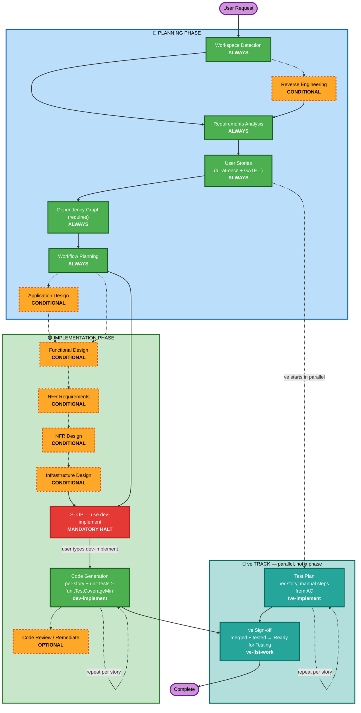

# aire Adaptive Workflow Overview

**Purpose**: Technical reference for AI model and developers to understand complete workflow structure.

**Note**: Similar content exists in welcome-message.md (user welcome message) and README.md (documentation). This duplication is INTENTIONAL - each file serves a different purpose:
- **This file**: Detailed technical reference with Mermaid diagram for AI model context loading
- **welcome-message.md**: User-facing welcome message with ASCII diagram
- **README.md**: Human-readable documentation for repository

## The Two-Phase Lifecycle:
• **PLANNING PHASE**: Planning and architecture (Workspace Detection → Requirements → User Stories → Dependency Graph → Workflow Planning → Application Design)
• **IMPLEMENTATION PHASE**: System-level design →  STOP → per-story Code Generation via `dev-implement` (on a story branch cut from the Epic branch; code, then unit tests to `unitTestCoverageMin` coverage, then — when the story touches an API layer — the API & Contract Testing Gate) → optional Code Review & Remediate

**🧪 ve TRACK (parallel, NOT part of any phase)**: **Test Plan belongs to ve, not to Implementation** — neither at epic level nor at story level. ve runs **`/ve-implement`** per story, at the same time as development, to generate that story's manual test steps from its acceptance criteria (no code is read) into `spec/test-plans/<TICKET-ID>-<title>/`, and **`ve-list-work`** on the epic branch to move merged, tested stories to 🧪 Ready for Testing.

## The Adaptive Workflow:
• **Workspace Detection** (always; captures the Parent Epic link if provided, in whichever tracker was selected) → **Reverse Engineering** (brownfield only) → **Requirements Analysis** (always, adaptive depth) → **User Stories** (always; no team-size or creation-mode question — `team_size` is fixed at 2, all stories generated at once; the set requires explicit human approval — GATE 1 — then pushes to the configured tracker AUTOMATICALLY, linked to the Parent Epic) → **Dependency Graph** (always; assigns `requires`) → **Workflow Planning** (always) → **Application Design** (conditional) → **System-Level Design** (conditional; single pass) →  **STOP** → **Code Generation** (per-story, via `dev-implement`, on story branches cut from the Epic branch, with unit tests to `unitTestCoverageMin` coverage plus — when the story touches an API layer — the API & Contract Testing Gate, and NO approval gates) → **Code Review & Remediate** (automatic inside every implement workflow — review, auto-fix findings, re-review until clean; also invokable standalone, story-wise or all stories). Running alongside from the moment stories exist: the **ve track** — **`/ve-implement`** (Test Plan per story) and **`ve-list-work`**.

## How It Works:
• **AI analyzes** your request, workspace, and complexity to determine which stages are needed
• **These stages always execute**: Workspace Detection (incl. automatic Epic branch creation), Requirements Analysis (adaptive depth), User Stories (fixed team_size 2, all-at-once generation, GATE 1 human approval, then automatic push to the configured tracker), Dependency Graph (`requires`), Workflow Planning, Code Generation (per-story via `dev-implement`, with unit tests to `unitTestCoverageMin` coverage, plus the API & Contract Testing Gate when the story touches an API layer)
• **All other stages are conditional**: Reverse Engineering, Application Design, system-level design stages (Functional Design, NFR Requirements, NFR Design, Infrastructure Design)
• **Optional, user-initiated**: Code Review and Remediate — independently invokable at any time for a specific story or all stories together (`code-review`, `remediate`)
• **ve-initiated, parallel to everything above**: `/ve-implement` (Test Plan, per story) and `ve-list-work` (merged, tested stories → Ready for Testing). Never auto-run — ve types them.
• **Mandatory STOP**: after the design stages and before any code generation, the workflow halts — code is generated per-story only when the user types `dev-implement`
• **No fixed sequences**: Stages execute in the order that makes sense for your specific task

## Your Team's Role:
• **Answer questions** in dedicated question files using [Answer]: tags with letter choices (A, B, C, D, E)
• **Option E available**: Choose "Other" and describe your custom response if provided options don't match
• **Work as a team** to review and approve each phase before proceeding
• **Collectively decide** on architectural approach when needed
• **Important**: This is a team effort - involve relevant stakeholders for each phase

## aire Two-Phase Workflow:

**Stage Descriptions:**

**🔵 PLANNING PHASE** - Planning and Architecture
- Workspace Detection: Analyze workspace state and project type (ALWAYS)
- Reverse Engineering: Analyze existing codebase (CONDITIONAL - Brownfield only)
- Requirements Analysis: Gather and validate requirements (ALWAYS - Adaptive depth)
- User Stories: Create user stories and personas (all in one pass, `team_size` fixed at 2 — neither is asked); populate the Story Tracker; the generated story set requires explicit human approval (GATE 1) before it pushes to the configured tracker, each story linked to the Parent Epic from `runtime-artifacts/aire-state.md` `## Tracker` (ALWAYS)
- Dependency Graph: Record each story's `requires` dependencies so independent stories can be developed in parallel; write dependency-graph.yml (ALWAYS — right after User Stories)
- Workflow Planning: Create execution plan (ALWAYS)
- Application Design: High-level component identification and service layer design (CONDITIONAL)

**🟢 IMPLEMENTATION PHASE** - Design and Implementation
- Functional Design: Detailed business logic design at the system level (CONDITIONAL, system-level)
- NFR Requirements: Determine NFRs and select tech stack (CONDITIONAL, system-level)
- NFR Design: Incorporate NFR patterns and logical components (CONDITIONAL, system-level)
- Infrastructure Design: Map to actual infrastructure services (CONDITIONAL, system-level)
- STOP: mandatory halt after the design stages, before any Code Generation
- Code Generation: Per-**story**, triggered by `dev-implement` only — Story Selection (by Tracker ID) → story branch cut from the Epic branch → Part 1 Planning → Part 2 Generation → unit tests generated + run to `unitTestCoverageMin` coverage (ALWAYS, per-story) → API & Contract Testing Gate (MANDATORY WHEN the story touches an API layer — automated tests against the real endpoints: functional, response-code validation, role-based authorization 401/403, error-response validation, request validation, response contract/schema validation) → Full Regression Gate
- Code Review: Review a story's code, or all stories together, read-only, produce a versioned report (OPTIONAL, `code-review`)
- Remediate: Fix issues from a review report (fix → unit test → green, running only the in-scope story's unit tests), annotate the report in place (OPTIONAL, `remediate`)

**🧪 ve TRACK** - Parallel to Implementation, owned by ve (NOT a Implementation stage at epic or story level)
- Test Plan: Per **story**, triggered by **`/ve-implement`** only — resolves one story, reads its acceptance criteria (the configured tracker / `stories.md`), requirements and design artifacts, and writes **manual test steps** for every applicable test plan (integration, E2E, API, contract, security, performance, accessibility — whichever apply; there is no build-verification artifact) into `spec/test-plans/<TICKET-ID>-<title>/`. **Never reads application source code** — it runs while the developer is still writing it. Manual test steps only: no test automation, no test execution; it DOES cut its own `ve/...` branch and raise its own PR to carry the docs (ve-initiated, per story)
- ve Sign-off: Triggered by **`ve-list-work`** on the cycle's integration branch (epic branch for epic cycles, bug/enhancement branch for those cycles) — pulls latest, reports which stories/tickets dev has merged (test these) vs still in development, then asks ve which merged-and-tested items to move to 🧪 Ready for Testing and moves exactly those in the Story Tracker and the configured tracker (ve-initiated)
- Playwright Test Automation (opt-in extension): Triggered by **`/playwright-implement`**, once a story's manual UI test steps exist and both its dev/ve PRs have merged — orchestrates Playwright's own Planner/Generator/Healer agents into executable **UI/browser-only** automation. Never touches Story Tracker or tracker status

**Key Principles:**
- Phases execute only when they add value
- Each phase independently evaluated
- PLANNING focuses on "what" and "why"
- IMPLEMENTATION focuses on "how" — Test Plan is ve's parallel track, not a Implementation stage
- Simple changes may skip conditional PLANNING stages
- Complex changes get full PLANNING and IMPLEMENTATION treatment
---

## Bug/Defect Flow (variant)

When `runtime-artifacts/aire-state.md` `## Tracker` records `Workflow Type: bug` (started via `ticket-implement <TICKET-ID>` routed to bug, or the direct keyword `bug-fix <TICKET-ID>`, on an existing Bug/Story ticket in whichever tracker is configured — JIRA/ADO/GITHUB, or LOCAL with no ID at all), the lifecycle is the TRIMMED variant defined in `workflows/bug-fix.md` + `workflows/bug-fix-implement.md` — ONE flow with a single break at design-done — the **ve Handoff Break** (`bug-fix.md` Step 9: analysis + design artifacts committed and pushed on the bug branch, the ve told to pull it and run `/ve-implement <TICKET-ID>`, then a yes/no that continues into the fix in the same session, no second keyword) — NOT the epic flow above:
• ONE branch `bug/<TICKET-ID>-<title>` from the base branch (no epic/story branches) • Impact Analysis + line-level AI-Origin Detection via `agents/defect-provenance-analyst.md` (traces each defective line to its introducing commit; may label the ticket `ai-generated-defect`; resolves the originating story/bug/enhancement ticket and links the bug to it as `is caused by` — automatic, no confirmation; JIRA resolves a typed link at runtime, ADO/GITHUB fall back to a comment, LOCAL notes it locally) • ONE story from the ticket, NO Dependency Graph, no tracker story push • no PR at requirements approval — a single `[BUG]` PR to the base branch at the end • baseline + full regression runs around the fix • ticket stays In Development after the PR — ve transitions it via `ve-list-work` Option B run **on the bug branch, before the archive** (never on the base branch; a cycle completes when its PR merges) • 🔴 **MANUAL archive** — the operator runs `archive-epic` (→ `aire-archives/bugs/<BUG-ID>-<name>/`) once the ve test-plan PR has merged into the bug branch, and before the `[BUG]` PR merges; the workflow NEVER auto-invokes it. archive-epic generates no RE delta and stitches nothing — the next cycle pulls fresh current-system truth from Atlas via the Helix MCP.
A resumed session MUST check `Workflow Type` FIRST and follow the bug workflow files when it is `bug`.
