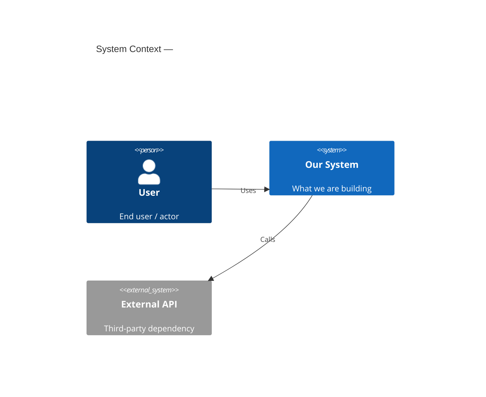
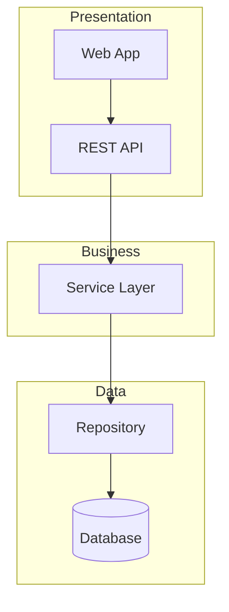
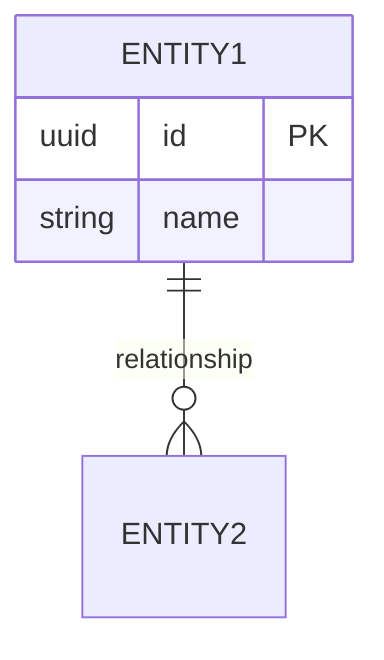

# `architecture.md` — The System Architecture Document

**Purpose**: one document that states how **this** system is built. It is written once, at the end of
the Implementation-phase design stages, and it becomes the source of truth for:

1. `tests/.evals/rubrics/architecture-rubric.json` — the **blocking** J1 judge gate,
2. every downstream code-generation and code-review decision about structure.

🔴 **Written ONCE per cycle — never per story.** A work unit gets no architecture document of its
own; it reads the relevant section of this one. One source, no copies, nothing to drift.

**Location**: `spec/plans/architecture.md`

**When**: STOP CHECKPOINT Step 1.4 — after Infrastructure Design completes (or after the design
stages are skipped), **before** the rubric is derived and before the design commit.

**Load this file when**: writing or updating `architecture.md`, or deriving the architecture rubric.

---

## 1. 🔴 It is ASSEMBLED from the design stages, not authored fresh

`architecture.md` consolidates decisions that have already been made and approved. It introduces no
new architecture. Its inputs, in precedence order:

1. **Atlas existing-system truth** (brownfield) — `common/helix-atlas-integration.md`. The existing
   architecture is the **starting state**; this document records the target state and the delta.
2. `spec/plans/functional-design.md`
3. `spec/plans/nfr.md` and `nfr-requirements/`
4. `spec/plans/infrastructure-design.md`
5. `spec/plans/application-design.md`
6. `## Design References` registered in `runtime-artifacts/aire-state.md`, and the `### Reconciliations` table (a point
   already decided there is settled — never reopen it)

**If a design stage was skipped**, the corresponding section says so explicitly and states what the
system does by default instead. 🔴 Never leave a section silently empty, and never invent a decision
to fill it — an invented constraint becomes a blocking rubric criterion that fails real code for no
reason.

---

## 2. Required structure

````markdown
# Architecture — <system name>

> **Version**: <semver> · **Generated**: <ISO 8601> · **AIRE**: v<N>
> **Derived from**: <list every source artifact path>
> **Existing-system baseline**: Atlas via Helix MCP <estate id> | none (greenfield)

## 1. System Context
<What the system does, who/what calls it, what it calls. One C4 context diagram + prose.
 🔴 Brownfield: annotate every element as existing / new / modified.>



## 2. Component Inventory
| Component | Responsibility | Status | Source |
|---|---|---|---|
| BillingService | Plan changes and proration | existing (modified) | Atlas atlas-deep-dive.md |
| ProrationEngine | Prorated amount calculation | new | functional-design/billing.md |

<One component diagram. Group components by layer with subgraphs.
 🔴 Brownfield: label each node existing / new / modified, matching the Status column above.>



## 3. Layering and Boundaries
<The layers, what may call what, and what is forbidden. State the rule, not the aspiration.>

## 4. Data Architecture
<Stores, ownership per component, schemas/models introduced or changed, migration approach,
 transaction boundaries. Include one ER diagram of the entities this system owns or changes.
 🔴 Brownfield: annotate entities/fields new vs existing.>



## 5. API and Integration Contracts
<Every externally reachable contract this system exposes or consumes: protocol, shape,
 error model, versioning, auth model.>

## 6. Cross-Cutting Decisions
<AuthN/AuthZ · error handling and error taxonomy · logging and redaction · configuration and
 secrets · observability · resilience patterns · concurrency and idempotency.>

## 7. Non-Functional Targets
| Concern | Target | Source | How it is verified |
|---|---|---|---|
| p95 latency, /upgrade | < 800 ms excl. provider call | nfr-requirements/perf.md | load test |

## 8. Infrastructure and Deployment
<Runtime topology, environments, deployment unit, scaling model, external dependencies.>

## 9. Delta from the Existing System   ← brownfield only
| Area | Before (Atlas) | After | Reason |
|---|---|---|---|

## 10.  Verifiable Constraints   ← MANDATORY. This section derives the rubric.
<See Section 3. Every entry is a constraint a reviewer can check against a diff and answer yes/no.>

## 11. Explicitly Out of Scope
<Architecture the system deliberately does NOT have, so nobody adds it speculatively.>
````

---

## 2.1 Diagrams — authored inline in architecture.md

Every `architecture.md` carries its **Mermaid** diagrams **inline, in the sections above — there is no
separate diagram file.** Use the scaffolds in Section 2 verbatim as the starting point and fill them
from the design artifacts; never invent a diagram a design stage did not establish.

**Diagram types and where each lives:**

| # | Type | Mermaid dialect | Section | When |
|---|---|---|---|---|
| 1 | System Context | `C4Context` | Section 1 | ALWAYS |
| 2 | Component Architecture | `flowchart TB` with layer `subgraph`s | Section 2 | ALWAYS |
| 3 | Data Model | `erDiagram` | Section 4 | when the work introduces or changes any store/schema |
| 4 | Key Flow(s) | `sequenceDiagram` | Section 5 or 6 | when a cross-component request path or integration needs to be made explicit |

🔴 **Brownfield annotation rule** — on any brownfield/migration cycle, EVERY diagram must mark each
element as **existing / new / modified** (e.g. `ModB[ModuleB — modified]`,
`System_Ext(newExt, "New Integration", "added for <feature>")`), and the labels must agree with the
Component Inventory `Status` column (Section 2) and the Delta table (Section 9). Greenfield diagrams
carry no such annotation.

🔴 Validate every diagram per `common/content-validation.md` (Mermaid syntax) BEFORE writing the file.

---

## 3. Section 10 Verifiable Constraints — the rubric contract

🔴 **This section is what makes the J1 gate fair.** J1 is blocking; it fails work units. A criterion
derived from vague prose ("the code should be clean and modular") cannot be judged consistently and
will fail good code at random. So `architecture.md` must state its binding decisions in a form that
is checkable against a diff.

**Every entry MUST have all five fields:**

| Field | Requirement |
|---|---|
| **ID** | `ARCH-NN`, stable across versions |
| **Constraint** | One sentence, imperative, about the code — not the intent |
| **Verifiable as** | What a reviewer looks at in a diff to decide, and the exact condition that scores 0 |
| **Weight** | Relative importance; weights across the section sum to 1.0 |
| **Source** | The design artifact this decision came from |

```markdown
### ARCH-01 — Transaction safety
- **Constraint**: Multi-step money operations execute inside a single all-or-nothing transaction.
- **Verifiable as**: Any changed code path that both charges the provider and writes subscription
  state must be enclosed in one transaction. Score 0 if any step can commit independently.
- **Weight**: 0.40
- **Source**: spec/plans/functional-design.md (Billing section)

### ARCH-02 — Data access layering
- **Constraint**: All database access goes through the repository layer.
- **Verifiable as**: No raw query or ORM client call appears in a controller, handler or route file.
  Score 0 for any such occurrence in the diff.
- **Weight**: 0.35
- **Source**: spec/plans/application-design.md (Layering section)

### ARCH-03 — No secrets or PII in logs
- **Constraint**: Card numbers, tokens and personal data never reach a log statement.
- **Verifiable as**: No changed log call passes a payment payload, token, or PII field, directly or
  by serialising an object containing one. Score 0 on any occurrence.
- **Weight**: 0.25
- **Source**: spec/plans/nfr.md (Security section)
```

**Quality bar for the section as a whole:**
- **3–8 constraints.** Fewer and J1 measures nothing; more and every work unit fails something
  irrelevant to it.
- **Every constraint must be violable by ordinary code.** If no plausible implementation could break
  it, it is not measuring anything — drop it.
- **Scope it to what the code shows.** A constraint about deployment topology cannot be judged from a
  diff; it belongs in Section 8, not Section 10.
- **Weights sum to exactly 1.0.**

🔴 **If Section 10 cannot be populated** — no design stage ran and there is nothing to derive — say so
explicitly in the section, and the rubric derivation falls to the `common/eval-framework.md` Section 3
fallback chain. A `N/A` J1 is honest; a J1 scored against invented constraints is not.

---

## 4. Rubric derivation — mechanical, 1:1

`tests/.evals/rubrics/architecture-rubric.json` is generated **directly from Section 10**. One constraint → one
criterion. No additions, no re-weighting, no editorialising.

```json
{
  "rubricName": "Architectural Alignment — <system name>",
  "rubricVersion": "<architecture.md version>",
  "derivedFrom": ["spec/plans/architecture.md#10-verifiable-constraints"],
  "evalCriteria": [
    {
      "id": "ARCH-01",
      "metric": "Transaction safety",
      "weight": 0.40,
      "prompt": "<the Verifiable-as text, verbatim>",
      "source": "spec/plans/functional-design.md (Billing section)"
    }
  ]
}
```

- `rubricVersion` **equals** the `architecture.md` version. A rubric whose version does not match a
  real `architecture.md` version is not usable — regenerate it.
- Regenerate the rubric **whenever `architecture.md` changes**, and bump both versions together.
- 🔴 **Never hand-edit the rubric.** Edit Section 10 and regenerate. The rubric is a build artifact of
  `architecture.md`; a hand-edit makes the gate untraceable to any approved decision.

---

## 4.1 Security rubric derivation (for J2) — OWASP-based

`tests/.evals/rubrics/security-rubric.json` is generated at the same STOP CHECKPOINT as the architecture

🔴 **Create if missing, never regenerate**: if it already exists (inherited from base), use it AS-IS. If it is absent, **create it** — deterministically, from the OWASP template — and commit it on the cycle branch with the other STOP CHECKPOINT artifacts (`common/directory-structure.md` — Artifact Ownership). It reaches base when the cycle's PR merges. 🔴 Never skip it, never push it to base directly, and never halt the cycle because base lacks it.
rubric. Unlike J1, the security rubric is derived from the **OWASP Top 10:2025** mapped to the
detected stack, not from `architecture.md`.

**Derivation procedure:**

1. Detect the project's stack (language, framework, data stores, auth mechanisms) from the design
   artifacts and reverse-engineering output.
2. Select the OWASP Top 10:2025 categories applicable to that stack:

   | OWASP 2025 | Category | Applicable when |
   |---|---|---|
   | A01 | Broken Access Control | System has authenticated endpoints or resource ownership |
   | A02 | Security Misconfiguration | System has HTTP config, CORS, headers, environment modes |
   | A03 | Software Supply Chain Failures | System uses third-party packages or CI/CD pipelines |
   | A04 | Cryptographic Failures | System handles secrets, tokens, PII, or TLS |
   | A05 | Injection | System has a database, command execution, or template layer |
   | A06 | Insecure Design | System has business logic requiring threat-model controls |
   | A07 | Authentication Failures | System has login, session management, or credential flows |
   | A08 | Software or Data Integrity Failures | System deserializes data, receives updates, or has CI/CD |
   | A09 | Security Logging and Alerting Failures | System logs security events or handles sensitive data |
   | A10 | Mishandling of Exceptional Conditions | System has error handling paths that could disclose state |

3. For each applicable category, write one criterion with:
   - `id`: `SEC-NN` (sequential)
   - `owasp`: the OWASP category ID (A01:2025–A10:2025)
   - `metric`: the OWASP category name
   - `weight`: proportional to the stack's exposure, summing to 1.0
   - `prompt`: the exact code pattern that scores 0 in a diff — binary and citable, same standard
     as architecture constraints. Write this as an instruction to an LLM scoring agent, not as
     prose for a human reader.
   - `source`: the OWASP reference URL

**Example format** (the actual criteria, weights and prompts are derived per project):

```json
{
  "rubricName": "Security — OWASP Top 10:2025 — <system name>",
  "rubricVersion": "<architecture.md version>",
  "derivedFrom": ["OWASP Top 10:2025", "spec/plans/architecture.md"],
  "evalCriteria": [
    {
      "id": "SEC-01", "owasp": "A01:2025",
      "metric": "Broken access control",
      "weight": 0.20,
      "prompt": "Review every endpoint in the diff that reads or mutates user-owned data. Score 0 if any changed endpoint accesses a record by ID without verifying the caller owns that resource or holds the required role. Cite the file and line.",
      "source": "https://owasp.org/Top10/2025/A01_2025-Broken_Access_Control/"
    },
    {
      "id": "SEC-02", "owasp": "A05:2025",
      "metric": "Injection",
      "weight": 0.20,
      "prompt": "Check every path in the diff where user-supplied input reaches a query, command, or template engine. Score 0 if any changed path concatenates or interpolates external input into a query or command string without parameterisation or validated sanitisation. Cite the file and line.",
      "source": "https://owasp.org/Top10/2025/A05_2025-Injection/"
    }
  ]
}
```

- Categories the stack genuinely cannot exercise are excluded — never scored 0, never scored N/A
  with a weight that distorts the total.
- `rubricVersion` matches the `architecture.md` version (they are committed together).
- 🔴 **Never hand-edit the rubric.** Change the stack assessment or the weight rationale and
  regenerate.
- The `tests/.evals/config.json` threshold for J2 is `llmJudgeSecurityScoreMin` (0.85) and
  `securityVulnerabilitiesAllowed` is 0 — any vulnerability cited by the judge is a blocking
  finding.

---

## 5. Keeping it true over the cycle

`architecture.md` is living. When a work unit legitimately changes an architectural decision:

1. Update the relevant section **and** Section 10 if the change touches a constraint.
2. Bump the version (patch for clarification, minor for a new/changed constraint).
3. Regenerate `tests/.evals/rubrics/architecture-rubric.json` and bump `rubricVersion` to match.
4. Record the change in `runtime-artifacts/audit.md` under `## Architecture Amended (<work unit>)`, with what changed
   and why.
5. Announce it — a changed constraint re-scores every subsequent work unit against a different bar.

🔴 **Never amend `architecture.md` to make a failing J1 pass.** That is suppressing a gate rather than
fixing the code (SH-6), and it is forbidden. Amend it only when the *design decision itself* was
wrong or has genuinely moved, and say so plainly in the audit entry — with the reason, not the score.

---

## 6. Completion announcement

```
 Architecture document written — spec/plans/architecture.md v<version>
   Components: <n> (<x> new, <y> modified)   Sources: <n> design artifacts
   Verifiable constraints: <n> (weights sum 1.0)
   → tests/.evals/rubrics/architecture-rubric.json v<version> derived — <n> criteria
   → tests/.evals/rubrics/security-rubric.json v<version> derived — <n> OWASP criteria
   J1 architecture gate is BLOCKING at ≥ <llmJudgeArchitectureScoreMin> from tests/.evals/config.json
   J2 security gate is BLOCKING at ≥ <llmJudgeSecurityScoreMin> from tests/.evals/config.json
```

Log the same in `runtime-artifacts/audit.md`. Both files are committed with the design artifacts at the STOP CHECKPOINT.
