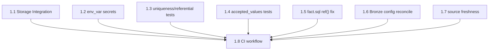

# aire State Tracking

## Project Information
- **Project Type**: Brownfield
- **Start Date**: 2026-09-14T08:02:22Z
- **Current Stage**: PLANNING - Requirements Analysis (pending)

## Workspace State
- **Existing Code**: Yes
- **Programming Languages**: SQL (Jinja/dbt), YAML
- **Build System**: dbt CLI (dbt-core >= 1.11.7, dbt-snowflake >= 1.11.3), Python env via uv (pyproject.toml / uv.lock)
- **Project Structure**: Single-module data pipeline (Medallion architecture: Bronze/Silver/Gold on Snowflake via dbt)
- **Workspace Root**: /Users/revanta.biswas/Desktop/Hospitality-Analytics-Pipeline-using-Snowflake-and-dbt-Medallion-Architecture
- **Reverse Engineering Needed**: No (Atlas deep dive doc pulled — see Existing-System Context below)

## Code Root
- **Root**: `src/` (dbt project at `src/dbt_code/`, Snowflake bootstrap scripts at `src/snowflake/`)
- **Note**: Moved from repo-root `dbt_code/` and `Snowflake/` in commit `c301415` (2026-09-14, prior to this AIRE cycle). dbt paths are relative to `dbt_project.yml` so the move required no internal config changes.

## Existing-System Context
- **Workspace type**: brownfield
- **Helix MCP**: connected
- **Source**: atlas
- **Components in scope**: whole estate (single-module pipeline — no scoping split needed)
- **Atlas deep dive doc**: spec/plans/atlas-deep-dive.md
- **Recorded**: 2026-09-14T07:59:53Z

## Helix MCP Binding
- **Server**: helix
- **Docs tool(s)**: mcp__helix__get_solution_document_tool, mcp__helix__list_solution_documents_tool — fetch/list solution documents (deep dive doc lives here)
- **Graph/Search tool(s)**: mcp__helix__codebase_agent_query (relationship/impact queries), mcp__helix__document_chatbot_query (doc/knowledge-base queries), mcp__helix__codebase_cypher_query, mcp__helix__graph_change_impact
- **Estate / workspace id**: solution_id 992 ("Hospitality-Analytics-Pipeline-using-Snowflake-and-dbt-Medallion-Architecture")
- **Resolved**: 2026-09-14T07:59:53Z

## Tracker
- **Type**: GITHUB
- **Org/Repo**: revanta-biswas/Hospitality-Analytics-Pipeline-using-Snowflake-and-dbt-Medallion-Architecture
- **Parent Epic**: Milestone #1 — "Epic: Harden Pipeline (Security & Data Quality)"
- **Epic URL**: https://github.com/revanta-biswas/Hospitality-Analytics-Pipeline-using-Snowflake-and-dbt-Medallion-Architecture/milestone/1

## Epic Intent (no external Epic provided)
- **Summary**: Harden the pipeline — address Atlas-identified Priority 1/2 findings: hard-coded/plaintext
  credentials (Snowflake COPY scripts, dbt profiles.yml), zero data tests, `fact.sql` bypassing `ref()`
  for dimension joins, and related data-quality/config-consistency debt.
- **Source**: User-directed epic intent captured in chat during Workspace Detection (no tracker Epic existed to fetch).

## Branching
- Base Branch: main
- Epic Branch: epic/harden-pipeline-security-and-data-quality (pushed to origin)
- Epic PR: (not raised — raised manually at cycle end via pr-generator)

## Context Project
- **Existing Knowledge**: No
- **Existing Knowledge Path(s)**: —
- **New References**: No
- **New Reference Path(s)**: —
- **Recorded**: 2026-09-14T08:02:22Z (clarified: "no" applies to both parts)

## Extension Configuration
- **Security Baseline**: Enabled = Yes (always mandatory)
- **Playwright Test Automation**: Enabled = Yes (always mandatory)

## team_size
- team_size: 2 (fixed default, never asked)
- story_creation_mode: all-at-once (fixed default, never asked)

## team_size
- team_size: 2 (fixed default, never asked)
- story_creation_mode: all-at-once (fixed default, never asked)
- target_story_count: 8

## Story Tracker

| Story | Title | Requires | Tracker ID | Status | PR | Merged | Start | End | Recorded |
|-------|-------|----------|------------|--------|----|--------|-------|-----|----------|
| 1.1 | Replace inline AWS credentials with a Snowflake Storage Integration | none | #1 | 🔵 In Development | [#11](https://github.com/revanta-biswas/Hospitality-Analytics-Pipeline-using-Snowflake-and-dbt-Medallion-Architecture/pull/11) | no | 2026-09-14 | | 2026-09-15 09:55 |
| 1.2 | Externalize dbt connection secrets via environment variables | none | #2 | 🟢 Ready for Development | — | — | | | 2026-09-14 08:34 |
| 1.3 | Add core data integrity tests (uniqueness, not-null, referential integrity) | none | #3 | 🟢 Ready for Development | — | — | | | 2026-09-14 08:34 |
| 1.4 | Add accepted-values tests for derived categorical columns | none | #4 | 🟢 Ready for Development | — | — | | | 2026-09-14 08:34 |
| 1.5 | Fix fact.sql to depend on dimension snapshots via ref() | none | #5 | 🟢 Ready for Development | — | — | | | 2026-09-14 08:34 |
| 1.6 | Reconcile the Bronze materialization configuration conflict | none | #6 | 🟢 Ready for Development | — | — | | | 2026-09-14 08:34 |
| 1.7 | Add source freshness checks to the staging source | none | #7 | 🟢 Ready for Development | — | — | | | 2026-09-14 08:34 |
| 1.8 | Add a static-validation CI workflow | 1.1, 1.2, 1.3, 1.4, 1.5, 1.6, 1.7 | #8 | 🟢 Ready for Development | — | — | | | 2026-09-14 08:34 |

## Dependency Graph

**Ready stories (no prerequisites, startable immediately)**: 1.1, 1.2, 1.3, 1.4, 1.5, 1.6, 1.7 (7 of 8)
**Blocked**: 1.8 — requires all of 1.1–1.7 (its AC-4 exercises `dbt compile` across the whole project,
including the new `ref()` calls from 1.5 and the new schema tests from 1.3/1.4 — a genuine
compile-time dependency, not narrative ordering).

**Edge justifications**:
- 1.8 requires 1.1 — CI's `dbt compile` step runs against the post-hardening `Stage.sql`/`Copy_Into.sql`; no compile-time need, but included so CI validates the final state of all stories together in one PR sequence (R5 parallelism target still holds since 1.1–1.7 remain independently startable).
- 1.8 requires 1.2 — same rationale (profiles.yml).
- 1.8 requires 1.3 — CI's `dbt compile`/`dbt parse` must resolve the new schema test YAML; if 1.3 doesn't exist yet, `dbt parse` has nothing new to validate for it (not a hard compile failure, but 1.8's own AC-4 explicitly says it exercises 1.3/1.4/1.5's changes).
- 1.8 requires 1.4 — same rationale (accepted_values tests).
- 1.8 requires 1.5 — genuine compile-time dependency: CI must validate `fact.sql`'s new `ref()` calls resolve; this is the strongest edge (R2 Contract rule).
- 1.8 requires 1.6 — CI validates the reconciled dbt_project.yml/properties.yml config loads cleanly.
- 1.8 requires 1.7 — CI validates the new sources.yml freshness blocks parse correctly.

team_size: 2 (target: ≥2 independent stories available at a time) — satisfied: 7 of 8 stories are
immediately parallelizable.

## Stage Progress
### 🔵 PLANNING PHASE
- [x] Workspace Detection
- [x] Reverse Engineering (skipped — Atlas deep dive doc reused)
- [x] Requirements Analysis (spec/plans/requirements.md — APPROVED 2026-09-14T08:11:00Z)
- [x] User Stories — COMPLETE (8 stories generated, GATE 1 approved, pushed to GitHub as issues #1-#8, linked to Milestone #1)
- [x] Dependency Graph — COMPLETE (spec/plans/dependency-graph.yml; 7/8 stories immediately startable)
- [x] Workflow Planning — COMPLETE (spec/plans/executions.md — Application Design SKIP; Functional/NFR Requirements/NFR Design/Infrastructure Design all SKIP; Code Generation EXECUTE)
- [ ] Application Design (SKIP per executions.md)

### 🟢 IMPLEMENTATION PHASE
- [ ] Functional Design (SKIP per executions.md)
- [ ] NFR Requirements (SKIP per executions.md)
- [ ] NFR Design (SKIP per executions.md)
- [ ] Infrastructure Design (SKIP per executions.md)
- [x] STOP CHECKPOINT — Design complete: architecture.md v1.0.0, behavior.feature, rubrics + config.json + CI pipeline generated, SonarQube wired (enabled=true, gates+=sonarqube)
- [ ] Code Generation (per-story via dev-implement) — EXECUTE, awaiting user's dev-implement trigger

## Current Status
- **Lifecycle Phase**: IMPLEMENTATION
- **Current Stage**: Design complete — awaiting dev-implement
- **Next Stage**: Code Generation (per-story, triggered by `dev-implement`)
- **Status**: Ready to proceed — 7 of 8 stories immediately startable (Story 1.8 last)
- **Epic-level smoke test**: PASSED 2026-09-14T11:47:41Z (run 34839696866, PR #10 merged)
