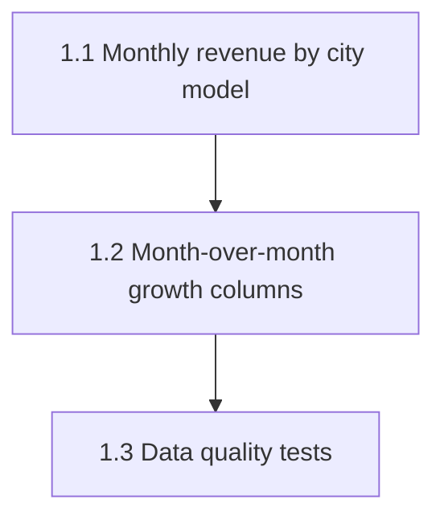

# aire State Tracking

## Project Information
- **Start Date**: 2026-10-09T09:38:05Z
- **Current Stage**: PLANNING - User Stories

## Tracker
- Type: LOCAL
- Parent Epic: none (LOCAL description captured in spec/plans/epic-brief.md)
- Epic URL: —
- Project Key / Repo / Org: —

## Stage Progress
- [x] Workspace Detection - state check, session identity, base branch sync, tracker selection
- [x] Workspace Detection - Parent Epic Capture, code scan, Helix gate (B), Code Root, Epic branch, Atlas sync opt-out, context opt-in
- [x] Reverse Engineering (local generation) - completed 2026-10-09T09:46:29Z, approved

## Workspace State
- **Existing Code**: Yes
- **Project Type**: Brownfield
- **Programming Languages**: SQL (Snowflake, dbt/Jinja), Python (pyproject.toml)
- **Build System**: dbt (dbt_code/dbt_project.yml), uv
- **Base Branch**: main
- **Workspace Root**: /Users/revanta.biswas/Desktop/Hospitality-Analytics-Pipeline-using-Snowflake-and-dbt-Medallion-Architecture

## Existing-System Context
- **Source**: local-generation (Atlas unavailable — user approved)
- **Helix MCP**: not connected in this session
- **Decision recorded**: 2026-10-09T09:40:19Z (option B at the Helix connect gate)
- **Banner for derived artifacts**: "Existing-system context derived locally; Atlas was not consulted."
- **Code Location Finding**: application code is at repo root (dbt_code/, Snowflake/); src/ contains only empty directories (src/dbt_code, src/snowflake)

## Code Root
- **Type**: single
- **Path(s)**: dbt_code/
- **Recorded**: 2026-10-09T09:43:47Z
- **Note**: user chose to skip restructuring into src/. Existing tree left in place; src/ semantics map to dbt_code/ for this repo. Snowflake/ holds ingestion DDL/COPY scripts (stage, file format, tables, copy-into) and stays as-is. src/ holds only empty placeholder dirs.

## Branching
- Base Branch: main
- Epic Branch: epic/monthly-revenue-aggregation
- Epic PR: (not raised — raised manually at cycle end via pr-generator)

## Atlas Artifact Sync
- Enabled: No
- Source: user opt-out

## Context Project
- **Existing Knowledge**: No
- **Existing Knowledge Path(s)**: —
- **New References**: No
- **New Reference Path(s)**: —

## Reverse Engineering Status
- [x] Reverse Engineering - Completed on 2026-10-09T09:46:29Z
- **Artifacts Location**: spec/plans/

## Extension Configuration
| Extension | Enabled | Decided At |
|---|---|---|
| Security Baseline | Yes | Workflow start (always mandatory) |
| Playwright Test Automation | Yes | Workflow start (always mandatory) |
| Resiliency Baseline | No | Requirements Analysis |
| Property-Based Testing | No | Requirements Analysis |

## Stage Progress
### PLANNING PHASE
- [x] Workspace Detection
- [x] Reverse Engineering
- [x] Requirements Analysis - generated 2026-10-09T09:51:05Z, approved

- [x] User Stories - GATE 1 approved

## Story Parameters
- team_size: 2 (framework default, not asked)
- story_creation_mode: all-at-once (framework default, not asked)
- target_story_count: 3 (user accepted recommended)

## Story Tracker
| Story | Title | Requires | Tracker ID | Status | PR | Merged | Start | End | Recorded |
|-------|-------|----------|------------|--------|----|--------|-------|-----|----------|
| 1.1 | Monthly revenue by city model | none | LOCAL | Ready for Development | — | — | | | 2026-10-09 09:58 |
| 1.2 | Month-over-month revenue growth columns | 1.1 | LOCAL | Ready for Development | — | — | | | 2026-10-09 09:58 |
| 1.3 | Data quality tests for agg_monthly_revenue | 1.2 | LOCAL | Ready for Development | — | — | | | 2026-10-09 09:58 |

## Dependency Graph

```mermaid
graph TD
    S11["1.1 Monthly revenue by city model"] --> S12["1.2 Month-over-month growth columns"]
    S12 --> S13["1.3 Data quality tests"]
```
- **Immediately startable**: 1.1
- **Blocked**: 1.2 (needs 1.1), 1.3 (needs 1.2)
- **Parallelism note**: the team_size target of 2 independent stories cannot be met; all three stories build on one model file.

- [x] Dependency Graph
- [x] Workflow Planning (spec/plans/executions.md)
- [x] Application Design - SKIPPED (no new components)
### IMPLEMENTATION PHASE
- [x] Functional Design - SKIPPED
- [x] NFR Requirements - SKIPPED
- [x] NFR Design - SKIPPED
- [x] Infrastructure Design - SKIPPED
Requirements coverage verified post-design: 11/11 REQ-IDs - 2026-10-09T09:59:44Z (all design stages skipped; coverage matrix in stories.md unchanged)

## CI/CD Configuration
- Enabled: No
- Source: user opt-out
- Recorded: 2026-10-09T10:00:22Z

## Design Artifacts (STOP CHECKPOINT)
- spec/behavior.feature written (1 cross-unit journey, 2 scenarios) - 2026-10-09T10:01:57Z
- spec/plans/architecture.md v1.0.0 written (5 verifiable constraints, weights 1.0) - 2026-10-09T10:01:57Z
- tests/.evals/rubrics/architecture-rubric.json v1.0.0 (5 criteria), security-rubric.json v1.0.0 (3 criteria), tests/.evals/config.json created
- spec/behavior/story-1.1.feature, story-1.2.feature, story-1.3.feature written

## Behaviour Specs & Test Plans
- **Work units covered**: 3
- **Behaviour contracts**: spec/behavior/ — 3 file(s), 24 scenarios
- **Manual test plans**: spec/test-plans/ — 3 folder(s), 20 test cases
- **AC coverage**: 15/15 (scenarios) · 15/15 (test cases)
- **Approved**: 2026-10-09T10:16:08Z

Design complete — awaiting dev-implement
