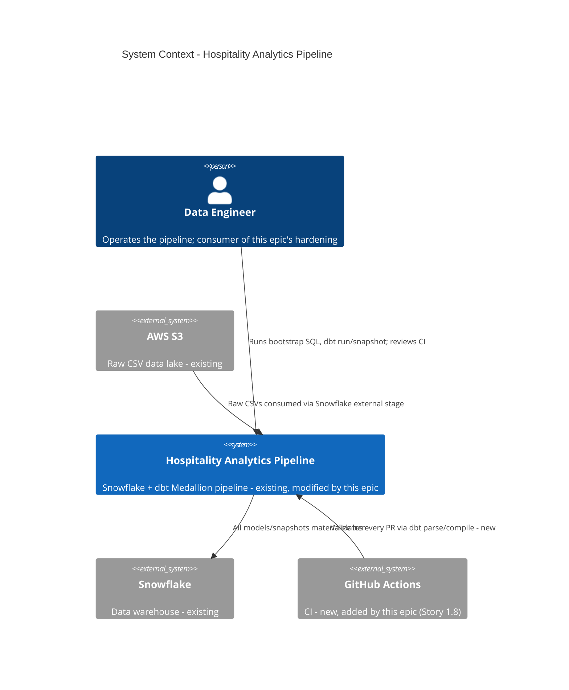
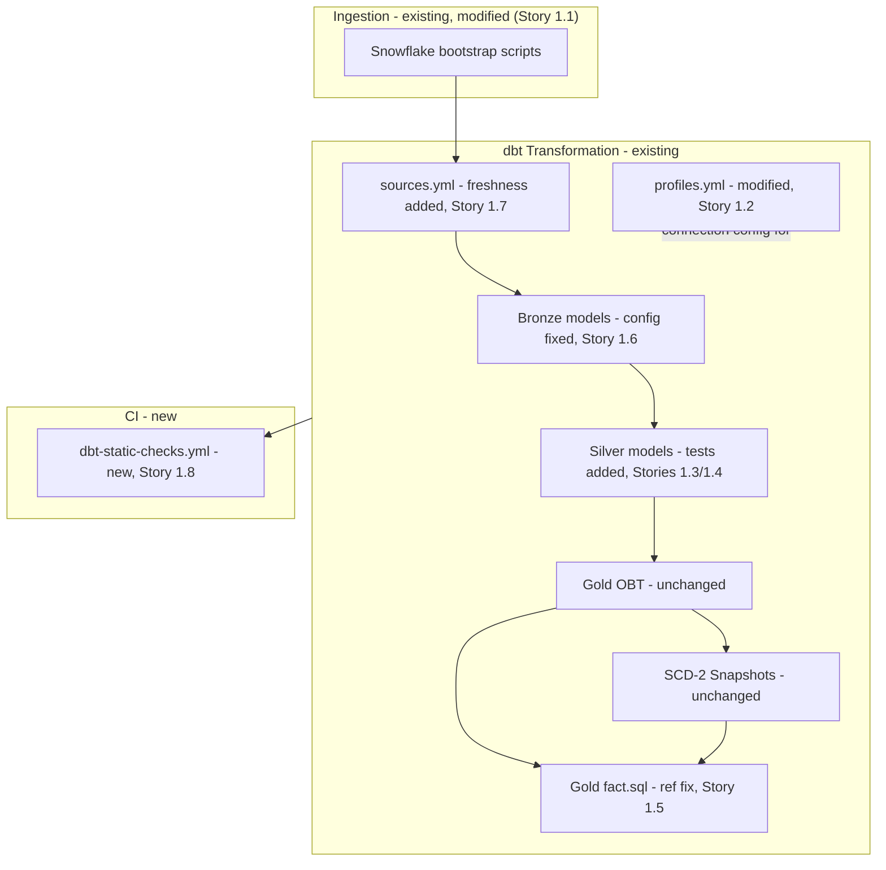
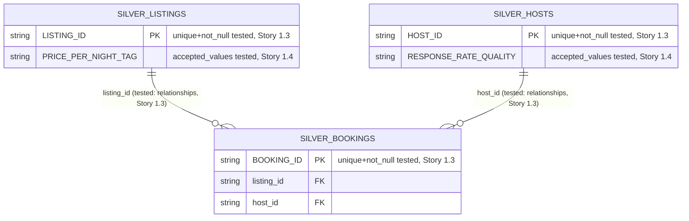

# Architecture — Hospitality Analytics Pipeline (Snowflake + dbt Medallion)

> **Version**: 1.0.0 · **Generated**: 2026-09-14T08:40:00Z · **AIRE**: v1.0
> **Derived from**: spec/plans/atlas-deep-dive.md, spec/plans/requirements.md, spec/plans/stories.md,
> spec/plans/executions.md (all system-level design stages — Application Design, Functional Design,
> NFR Requirements, NFR Design, Infrastructure Design — were SKIPPED per executions.md; this document
> is assembled from Atlas existing-system truth and the approved requirements/stories only)
> **Existing-system baseline**: Atlas via Helix MCP — solution_id 992
> ("Hospitality-Analytics-Pipeline-using-Snowflake-and-dbt-Medallion-Architecture")

## 1. System Context

A headless, single-tenant data pipeline. A **Data Engineer** operates it directly (no end-user-facing
surface). It ingests three Airbnb-style hospitality CSV datasets from an AWS S3 data lake, stages them
in Snowflake, and transforms them through a dbt-orchestrated Medallion architecture
(Bronze → Silver → Gold) into analytics-ready outputs (`GOLD.OBT`, `GOLD.FACT`) and SCD-2 dimension
history (`GOLD.DIM_LISTINGS`, `GOLD.DIM_HOSTS`, `GOLD.DIM_BOOKINGS`). No downstream consumer is
present in this repo (Atlas notes this as an unresolved knowledge gap). This epic changes **how
securely and reliably** the pipeline operates — it introduces no new external system and no new actor.

## 2. Component Inventory

| Component | Responsibility | Status | Source |
|---|---|---|---|
| Snowflake bootstrap scripts (`src/snowflake/*.sql`) | CSV file format, S3 external stage, raw table DDL, COPY INTO ingestion | existing (modified — Story 1.1 replaces inline credentials with a Storage Integration) | atlas-deep-dive.md |
| dbt connection profile (`src/dbt_code/profiles.yml`) | Snowflake connection config | existing (modified — Story 1.2 externalizes secrets via `env_var()`) | atlas-deep-dive.md |
| Bronze models (`src/dbt_code/models/bronze/`) | Incremental raw pass-through | existing (unchanged logic; config-conflict corrected — Story 1.6) | atlas-deep-dive.md |
| Silver models (`src/dbt_code/models/silver/`) | Clean/type/enrich | existing (modified — schema tests added, Stories 1.3/1.4; no logic change) | atlas-deep-dive.md |
| Gold OBT (`src/dbt_code/models/gold/obt.sql`) | Wide join of 3 Silver models | existing (unchanged) | atlas-deep-dive.md |
| Gold fact (`src/dbt_code/models/gold/fact.sql`) | Fact projection joining OBT + dimension snapshots | existing (modified — Story 1.5 fixes hard-coded refs to `ref()`) | atlas-deep-dive.md |
| Snapshots (`src/dbt_code/snapshots/*.yml`) | SCD-2 dimension history | existing (unchanged) | atlas-deep-dive.md |
| Source declarations (`src/dbt_code/models/sources/sources.yml`) | Declares the `staging` source | existing (modified — Story 1.7 adds freshness checks) | atlas-deep-dive.md |
| dbt project config (`src/dbt_code/dbt_project.yml`, `models/properties.yml`) | Layer materialization/schema config | existing (modified — Story 1.6 reconciles the Bronze conflict) | atlas-deep-dive.md |
| CI workflow (`.github/workflows/dbt-static-checks.yml`) | Static `dbt parse`/`dbt compile` validation on every PR | **new** — Story 1.8 | requirements.md REQ-F-09 |

## 3. Layering and Boundaries

Unchanged from the existing system (this epic does not restructure layering): each Medallion layer
(staging → bronze → silver → gold) lives in its own dbt folder and its own Snowflake schema, and may
only reference the layer directly upstream via `ref()`/`source()`. **New rule this epic enforces**:
`fact.sql` must resolve its dimension dependencies via `ref()`, not a hard-coded fully-qualified table
name (Story 1.5) — this closes the one place the existing system violated its own layering discipline.

## 4. Data Architecture

No new entities, schemas, or migrations. The three source entities (`listings`, `hosts`, `bookings`)
and their Bronze/Silver/Gold/snapshot representations are unchanged in shape and semantics (REQ-NF-03).
This epic adds **validation** over the existing schema (dbt tests: uniqueness, not-null, referential
integrity, accepted-values, source freshness) — it does not alter the entities themselves.

## 5. API and Integration Contracts

No API surface exists or is introduced. The two external integration points are unchanged in shape:
- **AWS S3 → Snowflake**: external stage read, now authenticated via a Storage Integration instead of
  inline keys (Story 1.1) — the data contract (CSV shape, file format) is unchanged.
- **dbt → Snowflake**: connection profile, now secret-free via `env_var()` (Story 1.2) — the
  connection contract (account/warehouse/role/schema) is unchanged.

## 6. Cross-Cutting Decisions

- **Secrets management**: no credential (real or placeholder) may appear in plaintext in any committed
  file. AWS access is via a Snowflake Storage Integration (Story 1.1); dbt connection secrets are via
  `env_var()` (Story 1.2). This is the epic's central cross-cutting decision (REQ-NF-01).
- **Data quality enforcement**: dbt schema tests (`unique`, `not_null`, `relationships`,
  `accepted_values`) are the enforcement mechanism for data integrity — not application-level
  validation, since there is no application layer (Stories 1.3, 1.4).
- **Dependency correctness**: dbt's own `ref()`/`source()` mechanism is the single source of truth for
  build ordering — no model may depend on another via a hard-coded fully-qualified name (Story 1.5).
- **Verification strategy**: every change in this epic is verified **statically** (`dbt parse`/
  `dbt compile`) because no live Snowflake account exists in this environment (REQ-NF-02) — this is a
  hard environmental constraint, not a design preference, and it shapes every story's "done" definition
  and the new CI workflow (Story 1.8).
- **Configuration consistency**: exactly one place declares each model's materialization strategy —
  the model-level config wins; surrounding project/properties YAML must agree with it, never contradict
  it (Story 1.6).

## 7. Non-Functional Targets

| Concern | Target | Source | How it is verified |
|---|---|---|---|
| Credential hygiene | Zero plaintext/hard-coded secrets in any committed file | REQ-NF-01 | Repo-wide grep for credential patterns (Stories 1.1, 1.2 ACs) |
| Static verifiability | Every change passes `dbt parse`/`dbt compile` with no live warehouse | REQ-NF-02 | Story 1.8 CI workflow; manual static review during dev-implement |
| Behavioral stability | No change to OBT/fact/dimension output shape or values | REQ-NF-03 | `fact.sql`/Bronze config diffs reviewed against "selected columns/join logic unchanged" ACs (Stories 1.5, 1.6) |
| CI cost/dependency boundary | No secret, credential, or paid service required to run CI | REQ-NF-04 | Story 1.8 workflow YAML review — no `secrets.*` reference, no paid action |

## 8. Infrastructure and Deployment

No infrastructure or deployment topology change. Snowflake objects (storage integration, external
stage, tables, schemas) are managed via the existing plain-SQL-script model (`src/snowflake/`) — Story
1.1 changes the *authentication mechanism* of the existing stage object, not the deployment model. The
one new piece of infrastructure is the GitHub Actions CI workflow (Story 1.8), which runs on
GitHub-hosted runners with no external service dependency.

## 9. Delta from the Existing System

| Area | Before (Atlas) | After | Reason |
|---|---|---|---|
| S3 authentication | Inline `aws_key_id`/`aws_secret_key` in `Copy_Into.sql` | Snowflake Storage Integration | REQ-F-01, REQ-NF-01 |
| dbt connection secrets | Plaintext placeholder values in `profiles.yml` | `env_var()` references | REQ-F-02, REQ-NF-01 |
| Data tests | None (`tests/` empty, no schema tests) | `unique`/`not_null`/`relationships`/`accepted_values` on Silver models | REQ-F-03, REQ-F-04, REQ-F-05 |
| `fact.sql` dependency | Hard-coded `AIRBNB.GOLD.DIM_LISTINGS`/`DIM_HOSTS` | `ref('dim_listings')`/`ref('dim_hosts')` | REQ-F-06 |
| Bronze materialization config | `dbt_project.yml`/`properties.yml` say `table`; models override to `incremental` (contradiction) | Single consistent source of truth | REQ-F-07 |
| Source freshness | None declared on `sources.yml` | `loaded_at_field` + `freshness` per table | REQ-F-08 |
| CI/CD | None | GitHub Actions workflow running `dbt parse`/`dbt compile` on every PR | REQ-F-09 |

## 10. Verifiable Constraints

### ARCH-01 — No plaintext or hard-coded credentials
- **Constraint**: No committed file may contain a real or placeholder AWS/Snowflake credential value
  (access key, secret key, password) outside of an `env_var()` reference or a Storage Integration
  object reference.
- **Verifiable as**: Any changed `.sql`/`.yml` file in the diff containing a literal
  `aws_key_id=`/`aws_secret_key=`/a literal `password:` value that is not `{{ env_var(...) }}` scores 0.
- **Weight**: 0.30
- **Source**: requirements.md REQ-F-01, REQ-F-02, REQ-NF-01

### ARCH-02 — dbt dependencies resolved via `ref()`/`source()`, never hard-coded table names
- **Constraint**: Any dbt model that depends on another model or snapshot in this project must express
  that dependency via `ref()`; a dependency on a declared source must use `source()`.
- **Verifiable as**: Any changed `.sql` model file in `src/dbt_code/models/` containing a literal
  fully-qualified table reference (e.g. `AIRBNB.GOLD.DIM_LISTINGS`) to another in-project model scores 0.
- **Weight**: 0.20
- **Source**: requirements.md REQ-F-06; atlas-deep-dive.md Dependency Health section

### ARCH-03 — No behavioral or schema change to existing Gold outputs
- **Constraint**: `obt.sql`, `fact.sql`'s selected columns/join semantics, and the three snapshot
  dimension schemas must remain unchanged in shape and value — only their dependency-declaration
  mechanism or surrounding config may change.
- **Verifiable as**: A diff to `fact.sql`/`obt.sql`/`snapshots/*.yml` that adds, removes, or renames a
  selected column, changes a join type, or changes a computed value's logic (outside of the `ref()`
  mechanism fix itself) scores 0.
- **Weight**: 0.20
- **Source**: requirements.md REQ-NF-03

### ARCH-04 — Every new dbt test is statically valid and resolves to a real model/column
- **Constraint**: Every new schema test (`unique`, `not_null`, `relationships`, `accepted_values`,
  `freshness`) declared for this epic must reference a model/column that actually exists in the project.
- **Verifiable as**: A new/changed YAML test block whose `model:`/`column_name:`/`field:` does not
  match a real model or column defined elsewhere in the diff or existing codebase scores 0.
- **Weight**: 0.15
- **Source**: requirements.md REQ-F-03, REQ-F-04, REQ-F-05, REQ-F-08

### ARCH-05 — CI workflow requires no secret or paid service
- **Constraint**: The new GitHub Actions workflow must not reference `secrets.*`, a paid third-party
  action, or any credential to execute `dbt parse`/`dbt compile`.
- **Verifiable as**: Any `secrets.` reference, or a step requiring network credentials to a live
  Snowflake account, in `.github/workflows/dbt-static-checks.yml` scores 0.
- **Weight**: 0.15
- **Source**: requirements.md REQ-F-09, REQ-NF-04

**Weights**: 0.30 + 0.20 + 0.20 + 0.15 + 0.15 = 1.00

## 11. Explicitly Out of Scope

- No new business logic, data model, or Gold-layer output — this is a hardening epic only.
- No live-warehouse execution or validation of any kind (no live Snowflake account exists in this
  environment) — `dbt run`/`dbt test`/`dbt snapshot`/`dbt source freshness` against a real warehouse
  are explicitly out of scope for every story (REQ-NF-02).
- No orchestration/scheduling layer (Airflow, dbt Cloud jobs, cron) — Atlas Recommendation Priority 4
  item #9 beyond the CI workflow itself is out of scope (per Q4=B, only functional/data-quality items
  were selected; orchestration was not one of them).
- No fix for the typo/documentation-only findings (`NIGHTS_BOOKING` typo, `expolore.sql` filename,
  boilerplate `dbt_code/README.md`, root README's "e-commerce" wording) — explicitly excluded per the
  user's Q4=B answer in requirements.md.
