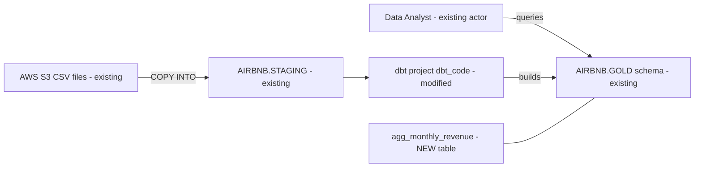
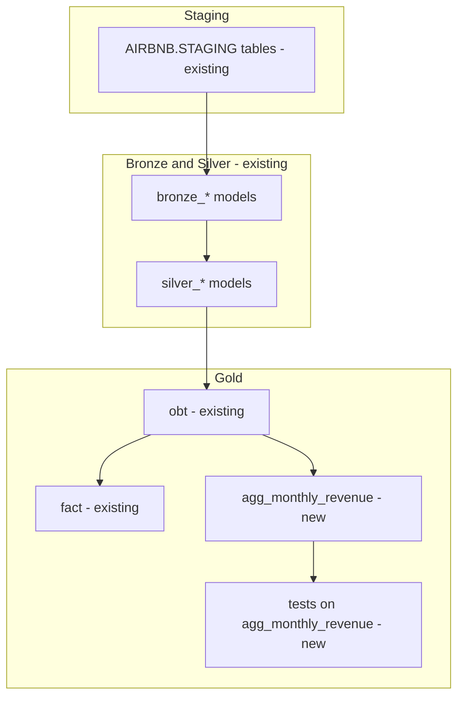
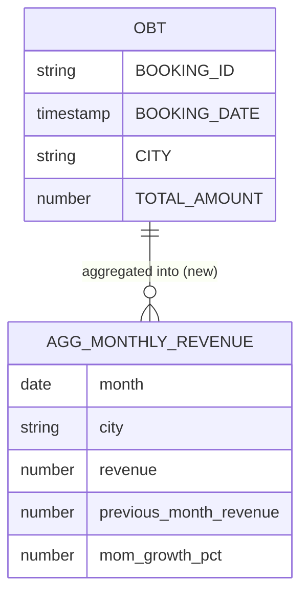

# Architecture — Hospitality Analytics Pipeline (dbt on Snowflake)

> **Version**: 1.0.0 · **Generated**: 2026-10-09T10:01:57Z · **AIRE**: v1.0
> **Derived from**: spec/plans/requirements.md, spec/plans/stories.md, spec/plans/executions.md, spec/plans/atlas-deep-dive.md (locally derived), spec/plans/component-inventory.md
> **Existing-system baseline**: none from Atlas (Atlas unavailable, user approved local generation); existing system described by the locally derived reverse-engineering artifacts.
> All design stages (Application, Functional, NFR Requirements, NFR Design, Infrastructure) were skipped for this cycle; sections below say what the system does by default.

## 1. System Context
Analysts query gold-layer tables in Snowflake database `AIRBNB`. Raw CSVs reach Snowflake staging through S3; dbt transforms them. This cycle adds one new gold table. Existing elements are unchanged except the one new table.

```mermaid
flowchart LR
    ANALYST["Data Analyst - existing actor"] -->|queries| GOLD["AIRBNB.GOLD schema - existing"]
    S3["AWS S3 CSV files - existing"] -->|COPY INTO| STG["AIRBNB.STAGING - existing"]
    DBT["dbt project dbt_code - modified"] -->|builds| GOLD
    STG --> DBT
    NEW["agg_monthly_revenue - NEW table"] --- GOLD
```

## 2. Component Inventory
| Component | Responsibility | Status | Source |
|---|---|---|---|
| gold.obt | One big table: bookings joined with listings and hosts | existing (unchanged) | atlas-deep-dive.md |
| gold.agg_monthly_revenue | Monthly revenue per city with previous-month revenue and growth percentage | new | requirements.md REQ-F-01..06 |
| agg_monthly_revenue schema yml and singular tests | Data quality checks for the new model | new | requirements.md REQ-F-07 |
| bronze, silver, snapshots, macros, Snowflake scripts | Existing pipeline | existing (unchanged) | atlas-deep-dive.md |

```mermaid
flowchart TB
    subgraph Staging
        STG["AIRBNB.STAGING tables - existing"]
    end
    subgraph Bronze_Silver["Bronze and Silver - existing"]
        BR["bronze_* models"]
        SI["silver_* models"]
    end
    subgraph Gold
        OBT["obt - existing"]
        FACT["fact - existing"]
        AGG["agg_monthly_revenue - new"]
        TST["tests on agg_monthly_revenue - new"]
    end
    STG --> BR --> SI --> OBT
    OBT --> FACT
    OBT --> AGG
    AGG --> TST
```

## 3. Layering and Boundaries
- Layers flow staging, bronze, silver, gold. A gold model may read other gold models or silver; it never reads staging sources directly.
- `agg_monthly_revenue` reads only `ref('obt')`.
- Models reference upstream relations with `ref()` or `source()`, never hardcoded `AIRBNB.*` names (existing `obt.sql` and `fact.sql` violate this; they are not changed in this cycle).
- Nothing reads from `agg_monthly_revenue` yet; it is a leaf model.

## 4. Data Architecture
One new table in schema `gold`, grain one row per (month, city). Source: `gold.obt`, one row per booking.

```mermaid
erDiagram
    OBT ||--o{ AGG_MONTHLY_REVENUE : "aggregated into (new)"
    OBT {
        string BOOKING_ID
        timestamp BOOKING_DATE
        string CITY
        number TOTAL_AMOUNT
    }
    AGG_MONTHLY_REVENUE {
        date month
        string city
        number revenue
        number previous_month_revenue
        number mom_growth_pct
    }
```

## 5. API and Integration Contracts
No APIs. The only contract is the table schema above. Default for skipped Application Design: none needed.

## 6. Cross-Cutting Decisions
- **Secrets**: none in the repo; `dbt_code/profiles.yml` keeps placeholders only.
- **Errors**: division by zero is avoided in SQL (NULL growth when previous revenue is missing or zero).
- **Observability, resilience, concurrency**: not applicable to a batch SQL model (Resiliency Baseline is off).

## 7. Non-Functional Targets
| Concern | Target | Source | How it is verified |
|---|---|---|---|
| Verification without warehouse | model and tests pass `dbt parse` and `dbt compile` | REQ-NF-02 | command output |
| Maintainability | `ref()` for all upstream relations | REQ-NF-01 | diff review (ARCH-01) |
| Security | no credentials added | REQ-NF-03 | secret scan and diff review (ARCH-04) |
| Correctness | no double counting | REQ-NF-04 | behaviour scenarios, growth test |

## 8. Infrastructure and Deployment
No change. dbt runs from a developer machine or scheduler against Snowflake; no orchestration or CI in the repo (CI/CD pipeline opt-out). Default for skipped Infrastructure Design: existing Snowflake database and `gold` schema.

## 9. Delta from the Existing System
| Area | Before | After | Reason |
|---|---|---|---|
| Gold layer | obt, fact, ephemeral models, 3 snapshots | plus agg_monthly_revenue table | monthly revenue analytics |
| dbt tests | none | schema yml tests and singular tests for the new model | REQ-F-07 |
| Everything else | as described in atlas-deep-dive.md | unchanged | out of scope |

## 10. Verifiable Constraints

### ARCH-01 — Upstream references use ref()
- **Constraint**: New or changed dbt models reference upstream relations only through `ref()` or `source()`.
- **Verifiable as**: In every added or changed model file in the diff, any table or view name in a FROM or JOIN must be written as `{{ ref(...) }}` or `{{ source(...) }}`. Score 0 if any added line contains a hardcoded schema-qualified name such as `AIRBNB.GOLD.OBT`.
- **Weight**: 0.30
- **Source**: spec/plans/requirements.md (REQ-NF-01)

### ARCH-02 — Gold model reads only from gold
- **Constraint**: `agg_monthly_revenue` selects only from the `obt` model.
- **Verifiable as**: The model's FROM clause must be `{{ ref('obt') }}` and no other relation (no bronze, silver, staging source or snapshot). Score 0 if any other relation is referenced.
- **Weight**: 0.20
- **Source**: spec/plans/architecture.md Section 3 (layering)

### ARCH-03 — Folder config is inherited
- **Constraint**: The new model does not override materialization or schema.
- **Verifiable as**: The model file's config block, if any, must not set `materialized`, `schema`, `database` or `alias`. Score 0 if any of these is set.
- **Weight**: 0.15
- **Source**: spec/plans/requirements.md (REQ-F-06)

### ARCH-04 — No secrets or connection details in the diff
- **Constraint**: No credentials, keys or account identifiers are added, and `profiles.yml` is unchanged.
- **Verifiable as**: No added line in the diff contains a password, token, access key, or real account/user identifier, and `dbt_code/profiles.yml` has no change. Score 0 on any occurrence.
- **Weight**: 0.20
- **Source**: spec/plans/requirements.md (REQ-NF-03)

### ARCH-05 — Aggregation does not fan out
- **Constraint**: The revenue aggregate is computed directly from `obt` without joins.
- **Verifiable as**: The model contains no JOIN and sums `TOTAL_AMOUNT` once per (month, city) group. Score 0 if the diff adds any JOIN to the model or sums a column after a join that could repeat bookings.
- **Weight**: 0.15
- **Source**: spec/plans/requirements.md (REQ-NF-04)

## 11. Explicitly Out of Scope
- Country in the grain, status filtering and filled calendar months (requirements assumptions).
- Fixing hardcoded relation names in `obt.sql` and `fact.sql`, or other existing technical debt.
- CI/CD pipeline, orchestration, new snapshots or dashboards.
- A `dbt_utils` dependency.
