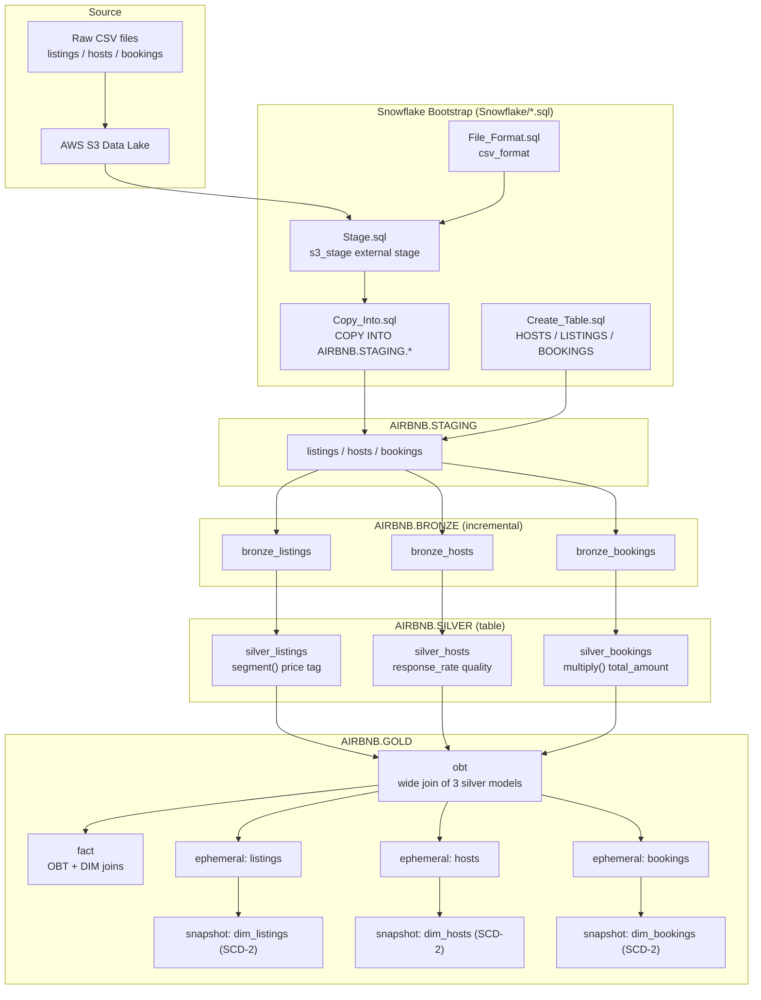

> **Source**: Atlas via Helix MCP
> **Server / tool**: helix · get_solution_document_tool (document_id 3968)
> **Estate**: Hospitality-Analytics-Pipeline-using-Snowflake-and-dbt-Medallion-Architecture (solution_id 992)
> **Scope pulled**: Whole estate — single-repo, single-module data pipeline (dbt + Snowflake); no scoping split needed
> **Fetched**: 2026-09-14T07:59:53Z
> **Freshness**: Atlas document version 16, last updated 2026-09-14T07:43:38Z (Atlas's own `updated_at`); repo last ingested at commit `fce17662d7a630ccb5c37df2b93111ab98b6ba9d`

> **Note on drift since this document was generated**: this Atlas document refers to source paths as
> `dbt_code/` and `Snowflake/` at the repo root. As of commit `c301415` (after this document was
> generated) those directories were moved to `src/dbt_code/` and `src/snowflake/` respectively, per
> AIRE's directory-structure convention. Per `common/helix-atlas-integration.md` Section 5.3, Atlas
> content is a read-only input and is reproduced verbatim below, uncorrected. Treat every `dbt_code/`
> and `Snowflake/` path reference below as now living under `src/`.

---

# System Exploration: Hospitality-Analytics-Pipeline-using-Snowflake-and-dbt-Medallion-Architecture

**Created:** 2026-09-14
**For:** Revanta
**Exploration Depth:** Deep
**Status:** COMPLETE
**Steps Completed:** 10 of 10

> **Purpose:** Comprehensive system exploration providing deep understanding of architecture, flows, dependencies, components, and actionable recommendations.

---

## Executive Summary

This is a **compact, well-structured reference/demonstration data pipeline** that implements the **Medallion Architecture (Bronze → Silver → Gold)** on **Snowflake** using **dbt** as the transformation layer. It ingests three raw CSV datasets from an AWS S3 data lake — `listings`, `hosts`, and `bookings` (an Airbnb-style hospitality domain) — stages them in Snowflake, then transforms them through progressively refined dbt layers into an analytics-ready One-Big-Table (OBT), dimensional models, and SCD-Type-2 history snapshots.

The codebase is small (~30 source files, ~450 lines of SQL + YAML) and highly idiomatic dbt. It is best understood as a **learning/portfolio project** that showcases the full breadth of dbt features — sources, refs, incremental models, ephemeral models, custom macros, snapshots, the OBT pattern, and Jinja control flow — rather than a production system with tests, CI, or hardened secrets management.

**Overall health:** Architecturally clean and easy to follow. The main risks are **hard-coded credentials in the Snowflake COPY scripts**, **zero data tests**, and a few **naming/consistency gaps** (e.g., `NIGHTS_BOOKING` vs `NIGHTS_BOOKED`). These are documented in the Technical Debt and Recommendations sections below.

---

## System at a Glance

**What it is:** A dbt-on-Snowflake analytics pipeline that ingests raw Airbnb-style hospitality CSVs (listings, hosts, bookings) from S3 and refines them through Bronze → Silver → Gold Medallion layers into analytics-ready models and SCD-2 snapshots.

**Technology Stack:**

- **Primary Language:** SQL (Jinja-templated dbt models) — 22 `.sql` files, ~333 LOC
- **Framework:** dbt (Data Build Tool) — `dbt-core >= 1.11.7`, `dbt-snowflake >= 1.11.3`
- **Database / Warehouse:** Snowflake (database `AIRBNB`, schemas `staging` / `bronze` / `silver` / `gold`)
- **Build Tool:** dbt CLI; Python env managed via `uv` (`pyproject.toml` + `uv.lock`, Python >= 3.12)
- **Cloud Storage:** AWS S3 (raw CSV data lake, loaded via Snowflake external stage)

**Architecture Style:** Medallion Architecture (Bronze → Silver → Gold) — a layered ELT data-transformation pattern, not an application/service architecture.

**Quick Stats:**

| Metric | Value |
|--------|-------|
| Total Files (excl. `.git`) | ~30 |
| Lines of Code (graph: SQL + YAML) | ~448 (333 SQL + 115 YAML) |
| Test Files | 0 (empty `tests/` dir with `.gitkeep`; no dbt data tests defined) |
| Configuration Files | ~8 (`dbt_project.yml`, `profiles.yml`, `sources.yml`, `properties.yml`, 3 snapshot YMLs, `pyproject.toml`) |
| Documentation Files | 2 (root `README.md`, `dbt_code/README.md` boilerplate) + 1 architecture diagram (`Fig/Architecture.png`) |

**Entry Points:**

- **Pipeline ingestion:** `Snowflake/` scripts run in order — `File_Format.sql` → `Stage.sql` → `Create_Table.sql` → `Copy_Into.sql`
- **Transformation:** `dbt run` against `dbt_code/` (models resolve Bronze → Silver → Gold via `ref()`)
- **History capture:** `dbt snapshot` (SCD-2 dims in `dbt_code/snapshots/`)

---

## Architecture Analysis

### Architectural Style

**Medallion Architecture (multi-hop ELT).** Data flows in one direction through progressively cleaner layers, each materialized as its own Snowflake schema. dbt orchestrates the lineage: every model declares upstream dependencies with `ref()` / `source()`, so dbt builds a DAG and executes models in dependency order. Layer materialization strategy is centrally configured in `dbt_project.yml`:

- **Bronze** → `+materialized: table`, schema `bronze` (models individually overridden to `incremental`)
- **Silver** → `+materialized: table`, schema `silver`
- **Gold** → `+materialized: table`, schema `gold`; the `gold/ephemeral/` subfolder → `+materialized: ephemeral`

### Core Components

| Component | Location | Role |
|-----------|----------|------|
| **Snowflake bootstrap scripts** | `Snowflake/*.sql` | One-time DDL/ingestion: create CSV file format, S3 external stage, raw tables, and `COPY INTO` staging |
| **dbt sources** | `dbt_code/models/sources/sources.yml` | Declares `staging` source (database `AIRBNB`) with 3 tables: `listings`, `hosts`, `bookings` |
| **Bronze models** | `dbt_code/models/bronze/` | `bronze_listings`, `bronze_hosts`, `bronze_bookings` — pass-through from staging with incremental `created_at` watermark |
| **Silver models** | `dbt_code/models/silver/` | `silver_listings`, `silver_hosts`, `silver_bookings` — typed, cleaned, enriched (segment tags, response-rate quality, computed totals) |
| **Gold OBT** | `dbt_code/models/gold/obt.sql` | Joins all three Silver models into a wide One-Big-Table (`AIRBNB.GOLD.OBT`) |
| **Gold fact** | `dbt_code/models/gold/fact.sql` | Fact-style projection joining OBT to `DIM_LISTINGS` / `DIM_HOSTS` |
| **Ephemeral dimensions** | `dbt_code/models/gold/ephemeral/` | `listings`, `hosts`, `bookings` — ephemeral CTEs that slice OBT into dimension shapes feeding the snapshots |
| **Snapshots (SCD-2)** | `dbt_code/snapshots/*.yml` | `dim_listings`, `dim_hosts`, `dim_bookings` — timestamp-strategy history tables in schema `gold` |
| **Macros** | `dbt_code/macros/` | Reusable Jinja: `segment`, `multiply`, `proper_name` (trim), `generate_schema_name` (schema-naming override) |
| **Analyses** | `dbt_code/analyses/` | Ad-hoc/learning queries (`explore`, `loop`, `if_else`) — not part of the build graph |

### Architectural Layers

```
S3 (CSV) ──▶ Snowflake STAGING (raw tables) ──▶ BRONZE (incremental pass-through)
   ──▶ SILVER (clean/type/enrich) ──▶ GOLD.OBT (wide join) ──▶ GOLD.FACT + ephemeral dims
   ──▶ SNAPSHOTS (SCD-2 dim history)
```

Separation is clean and enforced by dbt schema config: each layer lives in its own folder, its own Snowflake schema, and references only the layer directly upstream (Silver refs Bronze, OBT refs Silver, ephemeral refs OBT, snapshots ref ephemeral).

### Architecture Diagram



---

## Critical System Flows

### Flow 1 — Raw Ingestion (S3 → Snowflake Staging)

One-time / batch bootstrap executed via the `Snowflake/` scripts, in order:

1. `File_Format.sql` — creates `csv_format` (comma-delimited, skip 1 header row, `NULL`/`null` → NULL, empty → NULL).
2. `Stage.sql` — creates external stage `s3_stage` pointing at an S3 bucket URL (placeholder `your_s3_bucket_path`), using `csv_format`.
3. `Create_Table.sql` — DDL for raw `HOSTS`, `LISTINGS`, `BOOKINGS` tables with primary keys.
4. `Copy_Into.sql` — `COPY INTO AIRBNB.STAGING.{BOOKINGS,HOSTS,LISTINGS}` from the stage, one `FILES=(...)` per table.

> ⚠️ Credentials are inlined in `COPY INTO` (`aws_key_id`/`aws_secret_key` placeholders). See Technical Debt.

### Flow 2 — Bronze (incremental capture)

Each `bronze_*` model is `materialized = 'incremental'` and does `SELECT * FROM {{ source('staging', <table>) }}`. On incremental runs it filters `where created_at >= (select coalesce(max(created_at),'2020-01-01') from {{ this }})` — a high-watermark pattern that only pulls new/changed rows after the first full load.

> Note: `dbt_project.yml` sets Bronze `+materialized: table` and `properties.yml` also declares the bronze models as `table`, but each model file overrides to `incremental`. The model-level config wins — worth noting as a mild config inconsistency.

### Flow 3 — Silver (clean / type / enrich)

- `silver_listings` — projects typed columns and adds `PRICE_PER_NIGHT_TAG` via the `segment()` macro (Budget / Mid-range / Luxury). Materialized `table`, `unique_key = LISTING_ID`.
- `silver_hosts` — normalizes `HOST_NAME` (`REPLACE(' ','_')`) and derives `RESPONSE_RATE_QUALITY` (VERY GOOD / GOOD / FAIR / POOR from `RESPONSE_RATE`). `unique_key = HOST_ID`.
- `silver_bookings` — computes `TOTAL_AMOUNT` via the `multiply()` macro (`round(NIGHTS_BOOKED * BOOKING_AMOUNT, 2)`). `unique_key = BOOKING_ID`.

### Flow 4 — Gold OBT & Fact

- `obt.sql` — Jinja-driven `LEFT JOIN` chain: `SILVER_BOOKINGS` → `SILVER_LISTINGS` (on `listing_id`) → `SILVER_HOSTS` (on `host_id`), producing wide `AIRBNB.GOLD.OBT`.
- `fact.sql` — selects OBT measure/key columns and `LEFT JOIN`s `GOLD.DIM_LISTINGS` and `GOLD.DIM_HOSTS` (the snapshot outputs), forming a star-style fact projection.

### Flow 5 — Dimension History (SCD-2 snapshots)

- Ephemeral `gold/ephemeral/{listings,hosts,bookings}.sql` slice OBT into per-entity dimension shapes (compiled inline, never persisted as tables).
- Snapshots `dim_listings` / `dim_hosts` / `dim_bookings` (`snapshots/*.yml`) capture history with `strategy: timestamp`, `updated_at` = the respective created-at column, `dbt_valid_to_current = to_date('9999-12-31')`, materialized into schema `gold`, database `AIRBNB`.

**End-to-end command sequence:** Snowflake bootstrap scripts → `dbt run` (bronze→silver→gold) → `dbt snapshot` (dims) → re-`dbt run` if `fact` needs refreshed dims.

---

## Dependency Analysis

### Key Dependencies

| Dependency | Purpose | Version | Status |
|------------|---------|---------|--------|
| `dbt-core` | Transformation framework / DAG orchestration | `>= 1.11.7` | Current (declared in `pyproject.toml`) |
| `dbt-snowflake` | Snowflake adapter for dbt | `>= 1.11.3` | Current |
| Python | Runtime for dbt CLI | `>= 3.12` | Current |
| `uv` | Python env & lockfile manager | (via `uv.lock`) | Current |

Dependency surface is intentionally tiny — just dbt-core and the Snowflake adapter. No dbt packages (`packages.yml`) are used; all reusable logic is hand-rolled in local macros.

### External Services

- **Snowflake** — the compute + storage warehouse; all models materialize here (database `AIRBNB`). Connection config in `dbt_code/profiles.yml` (all placeholder values — account, user, password, role, schema, warehouse).
- **AWS S3** — raw-data landing zone, read through a Snowflake external stage (`s3_stage`). Bucket URL and AWS credentials are placeholders in the `Snowflake/` scripts.

### Dependency Health

- ✅ **Lean and modern:** current dbt (1.11.x) and Python 3.12; minimal blast radius for upgrades.
- ⚠️ **Internal `ref()` dependency chain is the real coupling:** the build DAG is Bronze → Silver → OBT → ephemeral → snapshots → fact. `fact.sql` depends on snapshot outputs (`DIM_LISTINGS`, `DIM_HOSTS`) by **hard-coded table name** (`AIRBNB.GOLD.DIM_LISTINGS`) rather than `ref()`, so dbt does not model that edge in its DAG — a run-ordering hazard (fact can be built before dims exist).
- ⚠️ **No `packages.yml` / no dbt_utils** — fine at this size, but common test/utility macros are absent.

---

## Component Inventory

### Business Logic Components (dbt transformation models)

| Component | Location | Responsibility | Complexity | Documentation |
|-----------|----------|----------------|------------|---------------|
| `bronze_listings` | `dbt_code/models/bronze/bronze_listings.sql` | Incremental raw pass-through of staging listings | S | None (no model docs/tests) |
| `bronze_hosts` | `dbt_code/models/bronze/bronze_hosts.sql` | Incremental raw pass-through of staging hosts | S | None |
| `bronze_bookings` | `dbt_code/models/bronze/bronze_bookings.sql` | Incremental raw pass-through of staging bookings | S | None |
| `silver_listings` | `dbt_code/models/silver/silver_listings.sql` | Type/clean listings + `segment()` price tag | S | None |
| `silver_hosts` | `dbt_code/models/silver/silver_hosts.sql` | Normalize host name + derive response-rate quality | S | None |
| `silver_bookings` | `dbt_code/models/silver/silver_bookings.sql` | Compute `TOTAL_AMOUNT` via `multiply()` | S | None |
| `obt` | `dbt_code/models/gold/obt.sql` | Wide LEFT-JOIN of 3 silver models → OBT | M (Jinja config-loop join) | None |
| `fact` | `dbt_code/models/gold/fact.sql` | Fact projection joining OBT to DIM snapshots | M (hard-coded table refs) | None |

### Data Access Components (sources, snapshots, ingestion)

| Component | Location | Responsibility |
|-----------|----------|----------------|
| `sources.yml` | `dbt_code/models/sources/sources.yml` | Declares `staging` source (db `AIRBNB`): listings, hosts, bookings |
| `dim_listings` / `dim_hosts` / `dim_bookings` | `dbt_code/snapshots/*.yml` | SCD-2 history via timestamp strategy → schema `gold` |
| `Create_Table.sql` | `Snowflake/Create_Table.sql` | Raw table DDL (HOSTS/LISTINGS/BOOKINGS + PKs) |
| `Copy_Into.sql` | `Snowflake/Copy_Into.sql` | `COPY INTO` staging from S3 stage |

### UI/Presentation Components

None. This is a headless data pipeline — no application UI, API, or dashboard code in the repo. Reporting/BI (mentioned in the README) is downstream and out of scope.

### Infrastructure / Utilities

| Component | Location | Responsibility |
|-----------|----------|----------------|
| `segment` macro | `dbt_code/macros/segment.sql` | Price bucketing: Budget / Mid-range / Luxury |
| `multiply` macro | `dbt_code/macros/multiply.sql` | `round(x*y, 2)` helper (used for booking totals) |
| `proper_name` macro | `dbt_code/macros/trim.sql` | Trim + uppercase a column (defined; usage not observed in models) |
| `generate_schema_name` macro | `dbt_code/macros/generate_schema_name.sql` | Overrides dbt schema naming to use the custom schema name verbatim (drives the bronze/silver/gold schema split) |
| `File_Format.sql` / `Stage.sql` | `Snowflake/` | CSV format + S3 external stage bootstrap |
| `dbt_project.yml` / `profiles.yml` | `dbt_code/` | Project config + Snowflake connection profile |
| `pyproject.toml` / `uv.lock` | repo root | Python env + pinned deps |

### Integration / API Components

No REST/RPC/service APIs. The only integration boundaries are **infrastructure integrations**: Snowflake (warehouse) and AWS S3 (data lake via external stage). There are no documented API endpoints in this codebase.

### Analyses (non-build, learning artifacts)

`dbt_code/analyses/` contains `expolore.sql` (sic — simple select), `loop.sql` (Jinja `for`-loop column list demo), and `if_else.sql` (Jinja conditional demo). These are compiled but not part of the build DAG — clearly exploratory/learning scaffolding.

---

## Code Quality & Technical Debt

**Overall:** Clean, readable, idiomatic dbt. The debt here is mostly about production-readiness, testing, and consistency — not structural rot. Ranked by severity:

### 🔴 High

1. **Hard-coded / plaintext credentials.** `Snowflake/Copy_Into.sql` inlines `aws_key_id`/`aws_secret_key` (placeholder values), and `dbt_code/profiles.yml` stores `password` in plaintext. Even as placeholders, this is an anti-pattern that invites real secrets being committed. Use a Snowflake **STORAGE INTEGRATION** (not inline keys) and env-var/secret-manager-based dbt profiles.
2. **Zero data tests.** `tests/` is empty (`.gitkeep` only) and no schema tests (`not_null`, `unique`, `relationships`, `accepted_values`) are declared in any YAML — despite obvious candidates (PK uniqueness on `LISTING_ID`/`HOST_ID`/`BOOKING_ID`, FK `listing_id`→listings, `host_id`→hosts). No safety net against data-quality regressions.

### 🟠 Medium

3. **`fact.sql` bypasses `ref()`.** It joins snapshot dims by literal name (`AIRBNB.GOLD.DIM_LISTINGS`, `AIRBNB.GOLD.DIM_HOSTS`) instead of `ref('dim_listings')`. dbt therefore doesn't know fact depends on the snapshots, so run ordering isn't guaranteed and lineage/docs are incomplete.
4. **Column-name inconsistency / likely bug.** `dbt_code/analyses/loop.sql` references `NIGHTS_BOOKING` while the actual DDL column (and `dbt_code/analyses/if_else.sql`) is `NIGHTS_BOOKED`. Harmless in an analysis file, but signals copy-paste drift.
5. **Materialization config conflict for Bronze.** `dbt_project.yml` (`+materialized: table`) and `properties.yml` (`materialized: table`) both say table, but each bronze model file overrides to `incremental`. Works (model config wins) but is confusing; the YAML config is misleading.
6. **No source freshness / no `loaded_at_field`.** `sources.yml` declares tables with no freshness checks, so stale staging data would pass silently.

### 🟡 Low

7. **Typo in filename** `dbt_code/analyses/expolore.sql` (should be `explore`).
8. **Boilerplate `dbt_code/README.md`.** Still the default dbt starter README — no project-specific run instructions.
9. **`proper_name` macro (trim.sql) appears unused** — dead code, or intended for a transformation not yet wired in.
10. **Root README describes source as "transactional e-commerce data"** while the actual domain is Airbnb hospitality (listings/hosts/bookings) — minor documentation drift.
11. **No CI/CD, no `dbt build`/`dbt test` automation, no orchestration** (Airflow/dbt Cloud/cron). Pipeline is run manually.

### ✅ Strengths

- Consistent, layer-per-schema Medallion structure that's easy to navigate.
- Good use of dbt idioms: incremental watermarks, ephemeral models, custom macros, snapshots for SCD-2.
- Small, single-responsibility models; sensible `unique_key` declarations on silver models.

---

## Knowledge Gaps & Recommendations

### Critical Knowledge Gaps

- **Snapshot invocation & scheduling.** How and when is `dbt snapshot` run relative to `dbt run`? Because `fact.sql` depends on snapshot outputs by literal name, the intended run order is undocumented tribal knowledge.
- **Source data provenance.** Where do the `listings.csv` / `hosts.csv` / `bookings.csv` originate, how often do they land in S3, and what guarantees `created_at` correctness (the incremental watermark relies on it)?
- **Real environment config.** Every value in `profiles.yml` and the S3 URL/credentials are placeholders — the actual Snowflake account, warehouse sizing, role/grants model, and S3 storage integration are unknown from the repo.
- **Downstream consumers.** README mentions reporting/dashboards/KPIs, but no BI layer or consumer is in-repo — unclear who reads `GOLD.OBT` / `FACT` / dims.
- **Intended use of `fact` vs `obt`.** Both are wide gold tables with overlapping content; the semantic distinction and which one is "the" serving table isn't documented.

### Recommendations

**Priority 1 — Security & correctness**
1. Replace inline AWS keys in `Copy_Into.sql` with a Snowflake **STORAGE INTEGRATION**; move `profiles.yml` secrets to environment variables (`{{ env_var(...) }}`).
2. Add dbt tests: `unique` + `not_null` on the three PKs, `relationships` for `listing_id`→listings and `host_id`→hosts, `accepted_values` for `BOOKING_STATUS` / segment tags.

**Priority 2 — DAG integrity**
3. Convert `fact.sql`'s literal dim references to `ref('dim_listings')` / `ref('dim_hosts')` so dbt models the dependency and orders runs correctly.
4. Reconcile the Bronze materialization config (pick incremental in one place; remove the misleading `table` declarations in `dbt_project.yml`/`properties.yml`).

**Priority 3 — Hygiene & docs**
5. Add source freshness (`loaded_at_field` + `freshness`) to `sources.yml`.
6. Fix `NIGHTS_BOOKING` → `NIGHTS_BOOKED` and rename `expolore.sql` → `explore.sql`.
7. Flesh out `dbt_code/README.md` with the real run sequence; correct the root README's "e-commerce" wording to hospitality.
8. Remove or wire in the unused `proper_name` macro.

**Priority 4 — Operationalization**
9. Introduce orchestration (dbt Cloud jobs, Airflow, or a scheduled `dbt build`) and CI (`dbt build` + `dbt test` on PRs).

### Follow-Up Workflows

- **[MDF] Map Data Flow** — visualize the column-level lineage from staging → OBT → fact/dims.
- **[DA] Document APIs / DAR Document Architecture** — formalize the pipeline architecture and the Snowflake object model.
- **[CR] Create Runbooks** — capture the exact bootstrap + `dbt run`/`dbt snapshot` operational sequence.
- **[ATD] Assess Tech Debt** — deepen the security/testing debt analysis into a tracked backlog.
- **[CD] Capture Decisions** — record ADRs for the Medallion layering, OBT-vs-star choice, and incremental strategy.

---

## Getting Started

### To Run Locally:

```bash
# 1. Set up Python env (uv) and install dbt + Snowflake adapter
uv sync

# 2. Configure Snowflake connection
#    Edit dbt_code/profiles.yml with real account/user/password/role/warehouse
#    (currently all placeholder values)

# 3. One-time Snowflake bootstrap (run in a Snowflake worksheet, in order):
#    Snowflake/File_Format.sql  -> Snowflake/Stage.sql
#    -> Snowflake/Create_Table.sql -> Snowflake/Copy_Into.sql

# 4. Build the transformation layers (from dbt_code/)
cd dbt_code
dbt run            # bronze -> silver -> gold (obt, fact, ephemeral)
dbt snapshot       # dim_listings / dim_hosts / dim_bookings (SCD-2)
```

### Configuration:

- **Main config:** `dbt_code/dbt_project.yml` (layer materializations & schemas), `dbt_code/models/sources/sources.yml` (staging source)
- **Connection:** `dbt_code/profiles.yml` (Snowflake profile `dbt_code`, target `dev`) — all values are placeholders
- **Environment:** Python deps via `pyproject.toml` + `uv.lock`. Secrets are currently inline placeholders; recommended to move to `env_var()` + Snowflake storage integration.

### Testing:

- **Run tests:** `dbt test` — but **no tests are currently defined**
- **Test location:** `dbt_code/tests/` (empty except `.gitkeep`)

---

## Quick Reference Card

**Entry Points:**

- Ingestion: `Snowflake/` (File_Format → Stage → Create_Table → Copy_Into)
- Transformation: `dbt_code/` via `dbt run`
- History: `dbt snapshot` (`dbt_code/snapshots/`)
- Tests: `dbt_code/tests/` (empty)

**Key Files:**

- Project config: `dbt_code/dbt_project.yml`
- Connection profile: `dbt_code/profiles.yml`
- Source defs: `dbt_code/models/sources/sources.yml`
- Gold serving model: `dbt_code/models/gold/obt.sql`
- Dependencies: `pyproject.toml` / `uv.lock`
- Build/orchestration: dbt CLI (no external orchestrator)

---

## Referenced Paths

> Drift detection manifest: paths categorized by how much a change would invalidate this document.

### High Relevance

- `dbt_code/dbt_project.yml` - Central layer/materialization/schema config that defines the Medallion structure
- `dbt_code/models/sources/sources.yml` - Source declaration for the staging entry point
- `dbt_code/models/bronze/bronze_listings.sql` - Bronze incremental pattern (representative of all bronze models)
- `dbt_code/models/bronze/bronze_hosts.sql` - Bronze incremental model
- `dbt_code/models/bronze/bronze_bookings.sql` - Bronze incremental model
- `dbt_code/models/silver/silver_listings.sql` - Silver clean/enrich logic + segment() usage
- `dbt_code/models/silver/silver_hosts.sql` - Silver host normalization + response-rate quality
- `dbt_code/models/silver/silver_bookings.sql` - Silver multiply() total-amount computation
- `dbt_code/models/gold/obt.sql` - Gold One-Big-Table wide join (core serving model)
- `dbt_code/models/gold/fact.sql` - Gold fact projection; documents the hard-coded dim-ref debt
- `Snowflake/Copy_Into.sql` - Ingestion + the inline-credentials security finding
- `dbt_code/profiles.yml` - Snowflake connection config + plaintext-secret finding

### Medium Relevance

- `dbt_code/models/gold/ephemeral/listings.sql` - Ephemeral dimension feeding dim_listings snapshot
- `dbt_code/models/gold/ephemeral/hosts.sql` - Ephemeral dimension feeding dim_hosts snapshot
- `dbt_code/models/gold/ephemeral/bookings.sql` - Ephemeral dimension feeding dim_bookings snapshot
- `dbt_code/snapshots/dim_listings.yml` - SCD-2 snapshot config
- `dbt_code/snapshots/dim_hosts.yml` - SCD-2 snapshot config
- `dbt_code/snapshots/dim_bookings.yml` - SCD-2 snapshot config
- `dbt_code/macros/segment.sql` - Price-bucketing macro used in silver_listings
- `dbt_code/macros/multiply.sql` - Total-amount macro used in silver_bookings
- `dbt_code/macros/generate_schema_name.sql` - Schema-naming override driving layer schema split
- `Snowflake/Create_Table.sql` - Raw table DDL / canonical column names
- `Snowflake/Stage.sql` - S3 external stage bootstrap
- `Snowflake/File_Format.sql` - CSV file format bootstrap
- `dbt_code/models/properties.yml` - Bronze materialization declarations (config-conflict finding)
- `pyproject.toml` - Dependency + Python version manifest
- `README.md` - Project overview / tech stack / domain description

### Low Relevance

- `dbt_code/macros/trim.sql` - Unused proper_name macro (dead-code finding)
- `dbt_code/analyses/expolore.sql` - Learning/ad-hoc analysis (typo finding)
- `dbt_code/analyses/loop.sql` - Jinja loop demo (NIGHTS_BOOKING inconsistency finding)
- `dbt_code/analyses/if_else.sql` - Jinja conditional demo
- `dbt_code/README.md` - Default dbt boilerplate readme
- `uv.lock` - Pinned dependency lockfile
- `Fig/Architecture.png` - Architecture diagram image

---

*Generated by Helix Intelligent Modernization — Software Archaeology Module*
