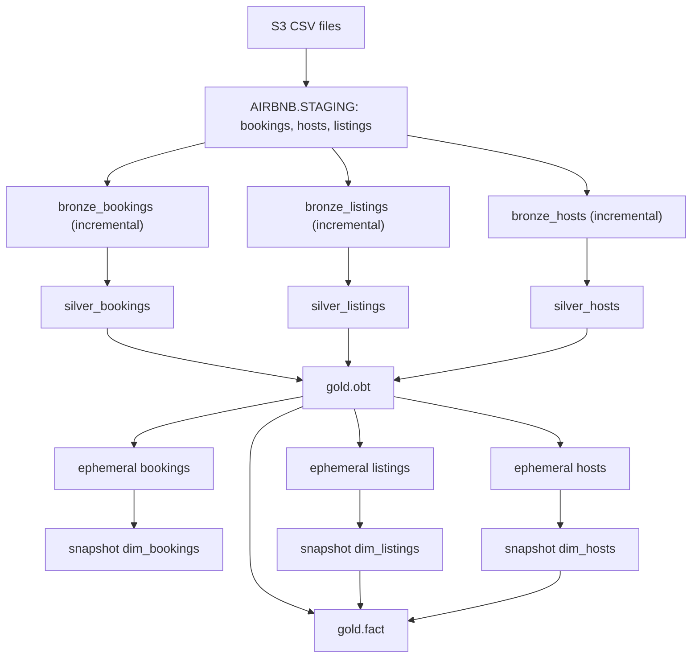
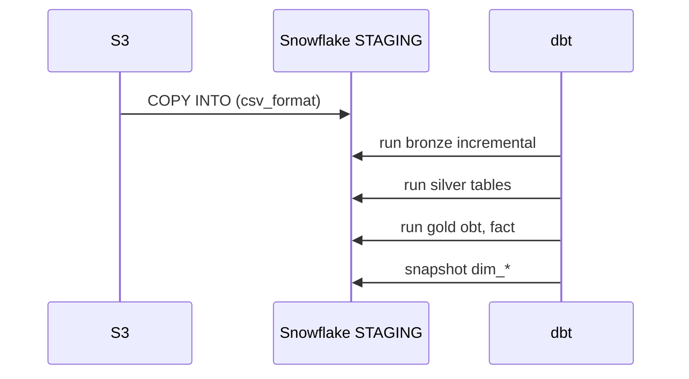

# System Architecture

> Existing-system context derived locally; Atlas was not consulted.

## System Overview
A dbt-core + dbt-snowflake project (Python >=3.12, managed by uv) implementing a medallion architecture over the Snowflake database `AIRBNB`. Schemas: STAGING (raw loads), BRONZE, SILVER, GOLD. Schema naming is controlled by the `generate_schema_name` macro, which uses the custom schema name verbatim (no target-schema prefix).

## Architecture Diagram

```mermaid
flowchart TD
    S3["S3 CSV files"] --> ST["AIRBNB.STAGING: bookings, hosts, listings"]
    ST --> BB["bronze_bookings (incremental)"]
    ST --> BH["bronze_hosts (incremental)"]
    ST --> BL["bronze_listings (incremental)"]
    BB --> SB["silver_bookings"]
    BH --> SH["silver_hosts"]
    BL --> SL["silver_listings"]
    SB --> OBT["gold.obt"]
    SL --> OBT
    SH --> OBT
    OBT --> EB["ephemeral bookings"]
    OBT --> EH["ephemeral hosts"]
    OBT --> EL["ephemeral listings"]
    EB --> DB["snapshot dim_bookings"]
    EH --> DH["snapshot dim_hosts"]
    EL --> DL["snapshot dim_listings"]
    OBT --> FACT["gold.fact"]
    DL --> FACT
    DH --> FACT
```

## Component Descriptions
### Bronze models (dbt_code/models/bronze)
- **Purpose**: `SELECT *` from sources; incremental on `created_at >= max(created_at)` (default 2020-01-01). Schema `bronze`, table materialization at folder level, incremental in model config.
### Silver models (dbt_code/models/silver)
- **silver_bookings**: BOOKING_ID, LISTING_ID, BOOKING_DATE, TOTAL_AMOUNT = round(NIGHTS_BOOKED * BOOKING_AMOUNT, 2) via `multiply` macro, fees, status, CREATED_AT.
- **silver_hosts**: HOST_NAME spaces replaced by underscores; RESPONSE_RATE_QUALITY buckets (>95 VERY GOOD, >80 GOOD, >60 FAIR, else POOR).
- **silver_listings**: attributes incl. CITY, COUNTRY, PRICE_PER_NIGHT and PRICE_PER_NIGHT_TAG via `segment` macro (Budget <100, Mid-range <200, else Luxury).
### Gold models (dbt_code/models/gold)
- **obt**: Jinja-config-driven LEFT JOIN of SILVER_BOOKINGS, SILVER_LISTINGS, SILVER_HOSTS using hardcoded `AIRBNB.SILVER.*` names (not `ref()`). Exposes BOOKING_DATE, CITY, COUNTRY, TOTAL_AMOUNT and others.
- **fact**: selects booking measures from `AIRBNB.GOLD.OBT`, LEFT JOINs `AIRBNB.GOLD.DIM_LISTINGS` and `DIM_HOSTS` (hardcoded names).
- **ephemeral/{bookings,hosts,listings}**: column projections of `ref('obt')`, feeding snapshots.
### Snapshots (dbt_code/snapshots)
- dim_bookings, dim_hosts, dim_listings: timestamp strategy, `dbt_valid_to_current = to_date('9999-12-31')`, schema gold, database AIRBNB.

## Data Flow

```mermaid
sequenceDiagram
    participant S as S3
    participant SF as Snowflake STAGING
    participant D as dbt
    S->>SF: COPY INTO (csv_format)
    D->>SF: run bronze incremental
    D->>SF: run silver tables
    D->>SF: run gold obt, fact
    D->>SF: snapshot dim_*
```

## Integration Points
- **External APIs**: none
- **Databases**: Snowflake database AIRBNB (STAGING, BRONZE, SILVER, GOLD)
- **Third-party Services**: AWS S3 (stage `s3_stage`)

## Infrastructure Components
- **Deployment Model**: dbt CLI run by a developer against Snowflake; no CI/CD, no orchestration in repo
- **Networking**: not applicable / not defined

## Workspace Layout Note
A `spec/context-project/existing-knowledge/` folder is present and is used as human-curated context input to the AIRE workflow; it is not application source.
