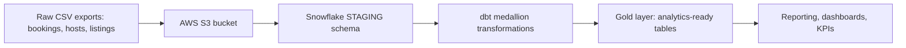

# Business Overview

> Existing-system context derived locally; Atlas was not consulted.

## Business Context Diagram

## Business Description
- **Business Description**: Hospitality (Airbnb-style) analytics pipeline. Raw booking, host and listing CSVs are loaded into Snowflake and refined through Bronze, Silver and Gold layers into analytics-ready data. Database name is `AIRBNB`.
- **Business Transactions**: (1) Ingest CSVs from S3 into Snowflake staging; (2) Incrementally land raw data in Bronze; (3) Clean and enrich into Silver (total booking amount, host response quality, price tier); (4) Join into a One Big Table (OBT) in Gold; (5) Build a fact projection and SCD2 dimension snapshots (bookings, hosts, listings).
- **Business Dictionary**: Booking = a stay reservation with nights, amount and fees. Host = property owner, with superhost flag and response rate. Listing = a rentable property in a city/country with price per night. OBT = denormalised join of bookings, listings and hosts.

## Component Level Business Descriptions
### Snowflake/ (ingestion scripts)
- **Purpose**: Create staging tables, file format, S3 stage and load CSVs.
- **Responsibilities**: DDL for HOSTS, LISTINGS, BOOKINGS; COPY INTO statements.
### dbt_code/ (transformation project)
- **Purpose**: Turn staged raw data into trusted, analytics-ready models.
- **Responsibilities**: Bronze incremental load, Silver cleansing, Gold OBT/fact, snapshot dimensions.
