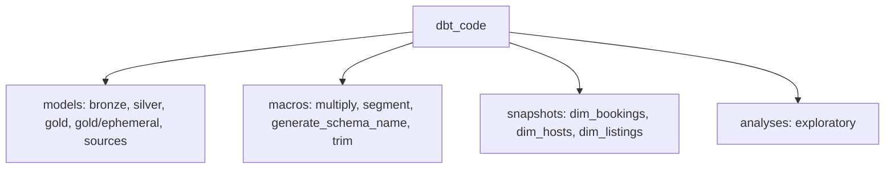

# Code Structure

> Existing-system context derived locally; Atlas was not consulted.

## Build System
- **Type**: dbt (dbt-core >=1.11.7, dbt-snowflake >=1.11.3), uv for Python deps (pyproject.toml, uv.lock)
- **Configuration**: dbt_code/dbt_project.yml (folder-level schema and materialization), dbt_code/profiles.yml (placeholder credentials)
- **Code Root**: dbt_code/ (src/ holds only empty dirs; see runtime-artifacts/aire-state.md Code Root)

## Key Classes/Modules

### Existing Files Inventory
- `Snowflake/Create_Table.sql` - DDL for HOSTS, LISTINGS, BOOKINGS
- `Snowflake/File_Format.sql` - csv_format
- `Snowflake/Stage.sql` - s3_stage
- `Snowflake/Copy_Into.sql` - COPY INTO staging tables
- `dbt_code/models/sources/sources.yml` - source AIRBNB.staging (listings, hosts, bookings)
- `dbt_code/models/properties.yml` - bronze models config
- `dbt_code/models/bronze/bronze_{bookings,hosts,listings}.sql` - incremental raw landing
- `dbt_code/models/silver/silver_{bookings,hosts,listings}.sql` - cleaned models
- `dbt_code/models/gold/obt.sql` - One Big Table (candidate for reuse by new gold aggregates)
- `dbt_code/models/gold/fact.sql` - fact projection
- `dbt_code/models/gold/ephemeral/{bookings,hosts,listings}.sql` - snapshot inputs
- `dbt_code/macros/*.sql` - multiply, segment, generate_schema_name, proper_name (file trim.sql)
- `dbt_code/snapshots/dim_*.yml` - SCD2 snapshots
- `dbt_code/analyses/*.sql` - exploratory (loop, if_else, expolore)

## Design Patterns
### Config-driven Jinja joins
- **Location**: gold/obt.sql, gold/fact.sql
- **Purpose**: build joins from a list of table/column/join dicts
- **Implementation**: `` and loops
### Layer-level config
- **Location**: dbt_project.yml
- **Purpose**: schema and materialization per layer

## Critical Dependencies
### dbt-core / dbt-snowflake
- **Version**: >=1.11.7 / >=1.11.3
- **Usage**: all transformations
- **Purpose**: build and snapshot models
