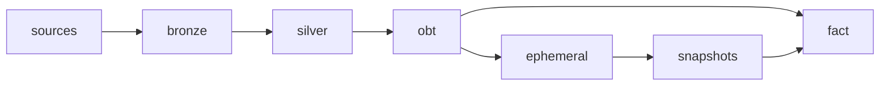

# Dependencies

> Existing-system context derived locally; Atlas was not consulted.

## Internal Dependencies

### gold.fact depends on gold.obt and snapshots dim_listings, dim_hosts
- **Type**: Runtime
- **Reason**: joins by hardcoded names; dbt cannot infer ordering, so run order matters (snapshots before fact)
### silver and gold.obt
- **Note**: obt uses hardcoded AIRBNB.SILVER.* names, not ref(), so dbt lineage does not link obt to silver models

## External Dependencies
### dbt-core
- **Version**: >=1.11.7
- **Purpose**: transformation engine
- **License**: Apache-2.0
### dbt-snowflake
- **Version**: >=1.11.3
- **Purpose**: Snowflake adapter
- **License**: Apache-2.0
