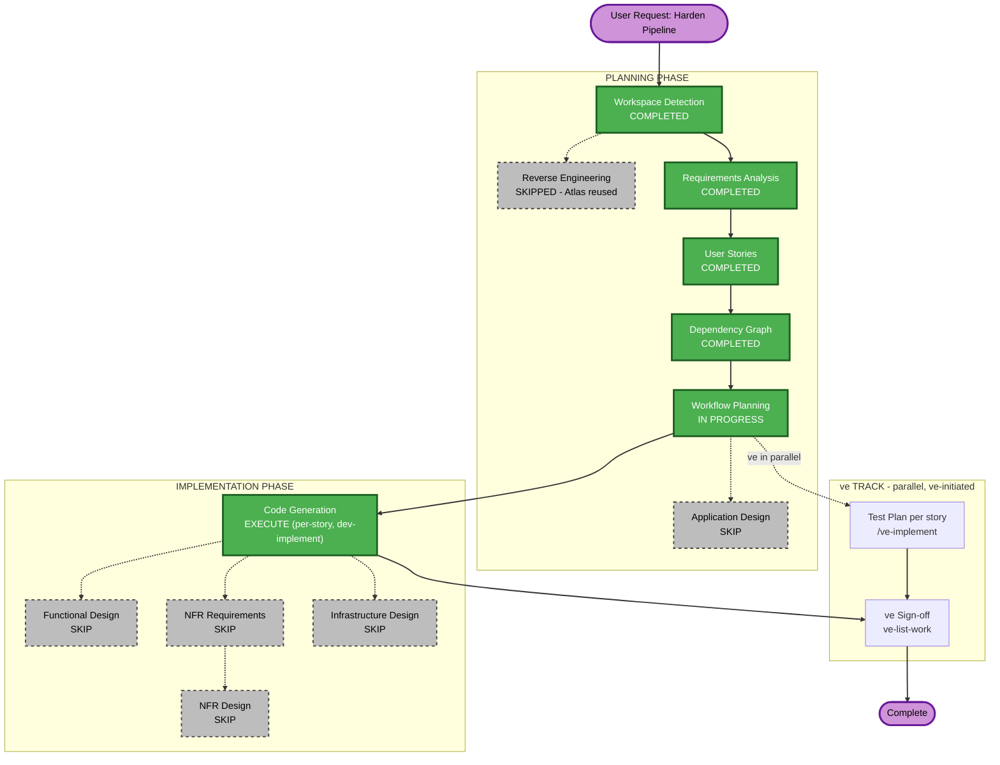

# Execution Plan — Epic: Harden Pipeline (Security & Data Quality)

## Detailed Analysis Summary

### Transformation Scope (Brownfield)
- **Transformation Type**: Single component change (hardening within existing component boundaries —
  no new services, no new architectural layer, no deployment-model change)
- **Primary Changes**: Credential handling (Snowflake bootstrap SQL + dbt profile), dbt schema-test
  additions, one SQL join's dependency mechanism (`ref()` vs hard-coded name), two config-consistency
  fixes, one new CI workflow file
- **Related Components**: `src/snowflake/*.sql`, `src/dbt_code/profiles.yml`, `src/dbt_code/models/**`,
  `src/dbt_code/dbt_project.yml`, `src/dbt_code/models/properties.yml`,
  `src/dbt_code/models/sources/sources.yml`, `.github/workflows/` (new)

### Change Impact Assessment
- **User-facing changes**: No — headless data pipeline, no UI/API consumers to affect
- **Structural changes**: No — Medallion layering (Bronze→Silver→Gold) is unchanged; only the
  *mechanism* of one dependency (`fact.sql`) changes, not the DAG's shape
- **Data model changes**: No — REQ-NF-03 explicitly requires no change to OBT/fact/dimension output
  shapes or values
- **API changes**: N/A — no API surface in this codebase
- **NFR impact**: Yes — this IS an NFR-driven epic (security: credential handling; reliability: data
  tests, freshness checks, DAG integrity; the NFRs are already fully captured as REQ-NF-01..04 in
  `requirements.md` and expressed as ACs on every story — no separate NFR design artifact would add
  information beyond what's already decided)

### Component Relationships (Brownfield)
- **Primary Component**: the dbt project (`src/dbt_code/`) and its Snowflake bootstrap scripts
  (`src/snowflake/`)
- **Infrastructure Components**: none (no CDK/Terraform in this repo — Snowflake objects are managed
  via plain SQL scripts, which Stories 1.1/1.6/1.7 touch directly)
- **Shared Components**: none touched by more than one story (see `dependency-graph.yml`
  `shared_files: []`)
- **Dependent Components**: none — this is a terminal data pipeline with no known downstream
  consumers in-repo (Atlas notes this as a Knowledge Gap: "Downstream consumers... unclear who reads
  GOLD.OBT/FACT/dims")
- **Supporting Components**: the new CI workflow (Story 1.8) is the only new supporting component

### Risk Assessment
- **Risk Level**: Low — every change is either a config/SQL edit with no live-execution requirement
  (per REQ-NF-02) or a net-new, additive schema-test/CI file; nothing removes existing behavior
- **Rollback Complexity**: Easy — each story is an independent, small git diff on its own PR
- **Testing Complexity**: Simple — static verification only (`dbt parse`/`dbt compile`), no live
  warehouse dependency to orchestrate

## Workflow Visualization

## Phases to Execute

### PLANNING PHASE
- [x] Workspace Detection (COMPLETED)
- [x] Reverse Engineering (SKIPPED — Atlas deep dive doc reused, `spec/plans/atlas-deep-dive.md`)
- [x] Requirements Analysis (COMPLETED — `spec/plans/requirements.md`)
- [x] User Stories (COMPLETED — `spec/plans/stories.md`, 8 stories pushed to GitHub)
- [x] Dependency Graph (COMPLETED — `spec/plans/dependency-graph.yml`)
- [x] Workflow Planning (IN PROGRESS — this document)
- [ ] Application Design — **SKIP**
  - **Rationale**: No new components or services are introduced; every story edits an existing file's
    content/config within its existing role (Snowflake bootstrap SQL, dbt profile, dbt models, dbt
    project config, a new but structurally simple CI YAML file). No component boundaries, methods, or
    service-layer design need defining.

### IMPLEMENTATION PHASE
- [ ] Functional Design — **SKIP**
  - **Rationale**: No new data models, schemas, or business logic. `fact.sql`'s join logic is
    unchanged (REQ-NF-03) — only its dependency-declaration mechanism changes. Schema tests (1.3, 1.4)
    are additive validation, not new business rules.
- [ ] NFR Requirements — **SKIP**
  - **Rationale**: The NFRs this epic addresses (credential security, data-quality guarantees, DAG
    integrity, CI cost/dependency boundaries) are already fully specified as REQ-NF-01..04 in
    `requirements.md`, driven directly by the Atlas findings and the answered clarifying questions.
    Tech stack is unchanged (dbt-core/dbt-snowflake versions untouched). A separate NFR Requirements
    pass would re-derive what Requirements Analysis already decided.
- [ ] NFR Design — **SKIP**
  - **Rationale**: Skipped because NFR Requirements was skipped (dependency) — and because the "design"
    for each NFR here is small enough to be fully expressed in each story's own ACs (e.g., "use
    `env_var()`", "use a STORAGE INTEGRATION", "add `unique`/`not_null`/`relationships`/`accepted_values`
    tests") rather than needing a separate patterns/component document.
- [ ] Infrastructure Design — **SKIP**
  - **Rationale**: No infrastructure changes — no new Snowflake warehouse/role/deployment topology, no
    new cloud resources. The Storage Integration (Story 1.1) is a security-mechanism change to an
    *existing* stage object, not new infrastructure to design.
- [ ] Code Generation — **EXECUTE (ALWAYS)**
  - **Rationale**: Per-story implementation via `dev-implement`, once the user triggers it after the
    STOP CHECKPOINT.

### ve TRACK (parallel — ve-initiated, NOT planned or executed by this workflow)
- Test Plan — run per story by ve with **`/ve-implement`**, in parallel with development
- ve Sign-off — run by ve with **`ve-list-work`** on the epic branch once story PRs merge
  - **Rationale**: Test Plan is not an Implementation stage at epic or story level; not scheduled here.

## Package Change Sequence

Not applicable — single-module repo, no multi-package coordination needed. Story-level sequencing is
fully captured in `dependency-graph.yml` (7 of 8 stories parallelizable; Story 1.8 last).

## Estimated Timeline
- **Total Stages Executed in Planning**: 5 (Workspace Detection, Requirements Analysis, User Stories,
  Dependency Graph, Workflow Planning) + 1 skipped (Reverse Engineering, replaced by Atlas reuse)
- **Total Stages Skipped in Implementation Design**: 4 (Application Design, Functional Design, NFR
  Requirements, NFR Design, Infrastructure Design)
- **Estimated Duration**: 8 small, independent story PRs; 7 developable in parallel, 1 sequenced last

## Success Criteria
- **Primary Goal**: Eliminate the Atlas-identified Priority 1/2 debt (credentials, data tests, DAG
  integrity) without changing pipeline behavior or output shape, verified entirely statically
- **Key Deliverables**: 8 merged story PRs, all `dbt parse`/`dbt compile`-clean, new CI workflow green
- **Quality Gates**: Per-story unit/static checks (Code Generation), D1–D7 static gates, automated code
  review including diff-scoped Security Baseline review (mandatory per CLAUDE.md)
- **Integration Testing**: `dbt parse`/`dbt compile` across the full project (Story 1.8's CI) confirms
  all 8 stories compose cleanly
- **Operational Readiness**: N/A beyond CI — no new monitoring/alerting surface introduced by this epic
