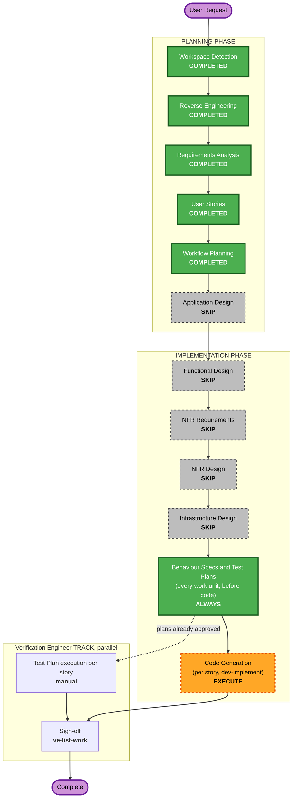

# Execution Plan

## Detailed Analysis Summary

### Transformation Scope (Brownfield Only)
- **Transformation Type**: Single component (one new gold-layer dbt model plus tests)
- **Primary Changes**: add `dbt_code/models/gold/agg_monthly_revenue.sql`, a schema yml entry and singular tests in `dbt_code/tests/`
- **Related Components**: `gold.obt` (read-only upstream via `ref('obt')`); no changes to bronze, silver, snapshots, macros or Snowflake scripts

### Change Impact Assessment
- **User-facing changes**: No UI. A new table for analysts in schema `gold`.
- **Structural changes**: No
- **Data model changes**: Yes, one new gold table (month, city, revenue, previous_month_revenue, mom_growth_pct); no change to existing tables
- **API changes**: No
- **NFR impact**: No performance, scalability or security impact expected (small aggregate over `obt`)

### Component Relationships (Brownfield Only)
- **Primary Component**: dbt_code (gold layer)
- **Infrastructure Components**: none changed
- **Shared Components**: `gold.obt` (consumed)
- **Dependent Components**: none (new leaf model)
- **Supporting Components**: dbt_code/tests

### Risk Assessment
- **Risk Level**: Low
- **Rollback Complexity**: Easy (delete the model and its tests)
- **Testing Complexity**: Simple (no Snowflake connection assumed; compile-level verification)

## Workflow Visualization

```mermaid
flowchart TD
    Start(["User Request"])

    subgraph PLANNING["PLANNING PHASE"]
        WD["Workspace Detection<br/><b>COMPLETED</b>"]
        RE["Reverse Engineering<br/><b>COMPLETED</b>"]
        RA["Requirements Analysis<br/><b>COMPLETED</b>"]
        US["User Stories<br/><b>COMPLETED</b>"]
        WP["Workflow Planning<br/><b>COMPLETED</b>"]
        AD["Application Design<br/><b>SKIP</b>"]
    end

    subgraph IMPLEMENTATION["IMPLEMENTATION PHASE"]
        FD["Functional Design<br/><b>SKIP</b>"]
        NFRA["NFR Requirements<br/><b>SKIP</b>"]
        NFRD["NFR Design<br/><b>SKIP</b>"]
        ID["Infrastructure Design<br/><b>SKIP</b>"]
        SPECS["Behaviour Specs and Test Plans<br/>(every work unit, before code)<br/><b>ALWAYS</b>"]
        CG["Code Generation<br/>(per story, dev-implement)<br/><b>EXECUTE</b>"]
    end

    subgraph VETRACK["Verification Engineer TRACK, parallel"]
        BT["Test Plan execution per story<br/><b>manual</b>"]
        QS["Sign-off<br/><b>ve-list-work</b>"]
    end

    Start --> WD --> RE --> RA --> US --> WP
    WP --> AD
    AD --> FD --> NFRA --> NFRD --> ID --> SPECS
    SPECS --> CG
    SPECS -.->|plans already approved| BT
    BT --> QS
    CG --> QS
    QS --> End(["Complete"])

    style WD fill:#4CAF50,stroke:#1B5E20,stroke-width:3px,color:#fff
    style RE fill:#4CAF50,stroke:#1B5E20,stroke-width:3px,color:#fff
    style RA fill:#4CAF50,stroke:#1B5E20,stroke-width:3px,color:#fff
    style US fill:#4CAF50,stroke:#1B5E20,stroke-width:3px,color:#fff
    style WP fill:#4CAF50,stroke:#1B5E20,stroke-width:3px,color:#fff
    style AD fill:#BDBDBD,stroke:#424242,stroke-width:2px,stroke-dasharray: 5 5,color:#000
    style FD fill:#BDBDBD,stroke:#424242,stroke-width:2px,stroke-dasharray: 5 5,color:#000
    style NFRA fill:#BDBDBD,stroke:#424242,stroke-width:2px,stroke-dasharray: 5 5,color:#000
    style NFRD fill:#BDBDBD,stroke:#424242,stroke-width:2px,stroke-dasharray: 5 5,color:#000
    style ID fill:#BDBDBD,stroke:#424242,stroke-width:2px,stroke-dasharray: 5 5,color:#000
    style SPECS fill:#4CAF50,stroke:#1B5E20,stroke-width:3px,color:#fff
    style CG fill:#FFA726,stroke:#E65100,stroke-width:3px,stroke-dasharray: 5 5,color:#000
    style Start fill:#CE93D8,stroke:#6A1B9A,stroke-width:3px,color:#000
    style End fill:#CE93D8,stroke:#6A1B9A,stroke-width:3px,color:#000
    linkStyle default stroke:#333,stroke-width:2px
```

Text alternative: Planning stages complete, then the four design stages are skipped, then Behaviour Specs and Test Plans, then per-story Code Generation, with the Verification Engineer track running in parallel.

## Phases to Execute

### PLANNING PHASE
- [x] Workspace Detection (COMPLETED)
- [x] Reverse Engineering (COMPLETED, local generation)
- [x] Requirements Analysis (COMPLETED)
- [x] User Stories (COMPLETED)
- [x] Dependency Graph (COMPLETED)
- [x] Execution Plan (COMPLETED)
- [ ] Application Design - SKIP
  - **Rationale**: one new leaf model inside the existing gold layer; no new components, services or business-rule definitions

### IMPLEMENTATION PHASE
- [ ] Functional Design - SKIP
  - **Rationale**: grain, columns, revenue definition and growth rules are fully specified in REQ-F-01..07; no further data-model design is needed
- [ ] NFR Requirements - SKIP
  - **Rationale**: no performance, scalability or security needs beyond the requirements already captured (REQ-NF-01..04); stack is fixed
- [ ] NFR Design - SKIP
  - **Rationale**: NFR Requirements skipped
- [ ] Infrastructure Design - SKIP
  - **Rationale**: no infrastructure changes; the model uses the existing Snowflake database and gold schema
- [ ] Behaviour Specs & Test Plans - EXECUTE (ALWAYS, at the STOP CHECKPOINT, ONE approval)
  - **Rationale**: every work unit's `.feature` contract and manual test plan are written and approved before any code is generated
- [ ] Code Generation - EXECUTE (ALWAYS)
  - **Rationale**: three stories built one at a time via `dev-implement`, in order 1.1, 1.2, 1.3

### Verification Engineer TRACK (parallel, NOT planned or executed by this workflow)
- Test plans are authored at the STOP CHECKPOINT; the Verification Engineer executes them once each story's PR merges and signs off with `ve-list-work`

## Package Change Sequence (Brownfield Only)
Single package (dbt_code). Story order is strictly sequential: 1.1 then 1.2 then 1.3 (see `spec/plans/dependency-graph.yml`).

## Estimated Timeline
- **Total Phases**: 3 active implementation steps (specs and test plans, then three stories)
- **Estimated Duration**: small; hours rather than days

## Success Criteria
- **Primary Goal**: monthly revenue by city with month-over-month growth available in the gold layer
- **Key Deliverables**: `agg_monthly_revenue.sql`, schema yml, singular tests, approved specs and test plans
